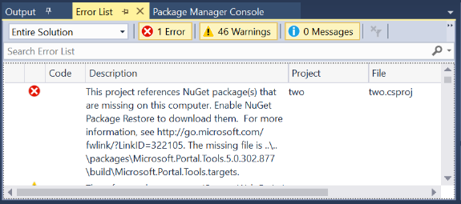
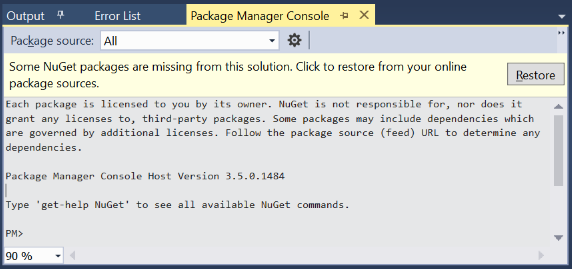
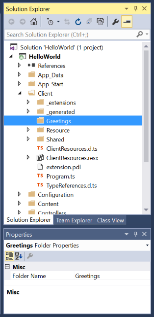
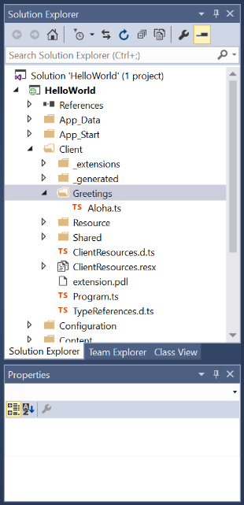
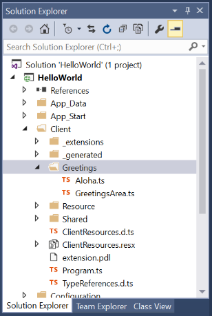

<a name="introduction"></a>
# Introduction
 
Blades are the main unit of the user experience (UX) that can be built using the Azure SDK. They are pages that can be loaded in the Portal.

Blades are components that are developed as part of the extension, and can be rendered at specific locations in the Portal UI. They are opened by using the `container.openContextPane(...)` API, as specified in the `MsPortalFx.d.ts` file of the project.

<a name="introduction-create-a-blank-extension"></a>
## Create a blank extension

This process validates that your development environment is set up correctly to develop extensions and blades, by creating an empty extension.  It also validates that the local extension can be loaded in the Azure Portal. The empty extension that is created by this process can be modified later for actual development. For more information about developing and testing extensions, see [top-extensions-debugging.md](top-extensions-debugging.md).

1. Launch **Visual Studio 2015** and navigate to `File -> New -> Project`. In the new project dialog, select `Installed -> Visual C# -> Azure Portal`. Select the `Azure Portal Extension` project type, and give it a unique name.  The name of the project typically matches the solution name and the extension name. The location can be the same as any other **Visual Studio** project directory.  Then, click the checkbox next to ```Create directory for solution```.  Then, click the ```OK``` button, as described in the following image.

    

1. Use the F5 key to compile and run the new project extension in **IIS Express**.

1. On first run, a request to install a certificate for localhost for **IIS Express** may be displayed. Accept the certificate to continue, as in the following image.

    

1. The platform may display a "debugging not enabled" warning. You may enable or disable debugging.

    

1. The platform will sideload the application into a browser. For more information about sideloading extensions, see [top-extensions-sideloading.md](top-extensions-sideloading.md).

   If the  browser displays the message "Server Error in '/' Application" instead, it is likely that the **NuGet** packages are not yet associated with **Visual Studio**. The **Visual Studio** Error List dialog may display the error message that is in the following image.

   

   If this message is displayed, the missing packages can be installed by using the **Nuget Package Manager**. The **Package Manager** can be started by selecting `Tools`  -> `Nuget Package Manager` -> `Package Manager Console`, as in the following image.

   

   When the **Package Manager** console is displayed, click on the `Restore` button that is associated with the error, as in the following image.
     
   

   You may want to validate that the **Content Unbundler** tool, which is a tool that ships with the VS Portal extension and that packages static files as zip file, was installed as one of the  **nuGet** packages.  Look for  `Microsoft.Portal.Tools.ContentUnbundler` in the `packages.config` file, as in the following image.
   
   

   Click on the F5 button to rebuild the application. When the build is successful, **Visual Studio** will sideload the application into the production Portal.

1. The Portal will prompt you to allow the sideloaded extension. Click the ```Allow``` button, as in the following image.

    

<a name="introduction-create-a-hello-world-extension"></a>
## Create a hello world extension

Now that you have developed a blank extension, you can use it to develop a "Hello World" blade. You and your team will decide on the types of blades that can be grouped together into an area.  Because these blades will probably share data, the area is also known as a `DataContext` that is meaningfully named. 

In the following "Hello World" example, the data context for blades is named `Greetings`, and the blade that is being developed is named `Aloha`. Remember to remove the angle brackets when substituting the name of the `DataContext` group for the parameter name `<AreaName>`.

**NOTE**: In this example, the name of the solution and the extension is "HelloWorld".

1. Add a folder for the group of blades within the `Client` folder of the project. It should be named the same as the area.

    

1. Add a file for the new blade to the folder. The file should be named the same as the blade. In the following image, the name of the blade is `Aloha`.

    

1. Also add a file that describes the area to the area folder.  The name of the file should be the name of the group, concatenated with the word ‘Area’. This is also known as the  `DataContext`.

    

1. Within the `GreetingsArea.ts` file that was just created, add the following code.

    ```cs
    export class DataContext {
    }
    ```

1. There are some basic sections that are required in the `Aloha.ts` blade file.  The first section  is the import statements, as in the following example.

    ```cs
    import * as TemplateBlade from "Fx/Composition/TemplateBlade";
    import { DataContext } from "./<AreaName>Area"; // todo – substitute the name of the area, and remove the angle brackets 
    ```

1.	The second code section  is the template blade decorator. This lets the framework discover the blade. It is also where the html template is defined.

    The following example shows the first part of a simple text data-binding. The corresponding data-binding code is in the next example.

    ```js
    @TemplateBlade.Decorator({
        htmlTemplate: `<div data-bind='text: helloWrldMsg'></div>`
    })

    export class <BladeName> // todo – substitute the name of the blade, and remove the angle brackets 
    {

    }
    ```

1.	The following code implements the class for the new blade. In this instance the code sets the title, subtitle, and binds the string 'Hello world!' to the UI. This code should be added to the class in the TemplateBlade decorator from the preceding step.

    **NOTE**: the text from the `data-bind` statement is named the same as the message, thereby completing the binding.

    ```cs
        public title = "My blade title";
        public subtitle = "My blade subtitle";
        public context: TemplateBlade.Context<void, DataContext>; // there are useful framework APIs that hang off of here
        public helloWrldMsg = ko.observable("Hello world!"); // this is bound in the div statement in the previous example 

        public onInitialize()
        {
        // initialization code should be inserted here
           return Q();   // if the extension will load data then return a loading promise here
        }
    ```

1. The extension can now be compiled.

    **NOTE**:  The blade title in the browser is not the same as the blade name as displayed in Visual Studio.

1. Test the new extension by using a link in the following format in the address bar of the browser.

    ```
    <PORTAL URI>#blade/<extensionName>/<bladeName>
    ```
  
    where

    **#blade**: a literal

    **extensionName**: The name of the extension that contains the blade

    **bladeName**: The name of the blade that is being developed


    One example is as follows.
    ```json
    https://portal.azure.com#blade/HelloWorld/Aloha 
    ```

    Keep in mind that there may be parameters to pass to Azure that affect the loading of the Portal.  In the following case, the parameters are included in the URL previous to the name of the blade.

    ```json
    https://portal.azure.com/?feature.customportal=false&feature.canmodifyextensions=true#blade/HelloWorld/Aloha
    ```

    Also, test extensions may be added to the URI after the name of the blade that was just added, as in the following example.

    ```json
    https://portal.azure.com/?feature.customportal=false&feature.canmodifyextensions=true#blade/HelloWorld/Aloha?testExtensions={"HelloWorld":"https://localhost:44300/"}
    ```
    **NOTE**: While the extension is being developed, it is a test extension and therefore requires the use of the **testExtensions** parameter that includes the name of the extension and address of the localhost.
    
    When the site is properly accessed, the blade from this example should resemble the following image.

    


<!--
gitdown": "include-file", "file": "../templates/portalfx-extensions-glossary-create-first-extension.md"}
-->

