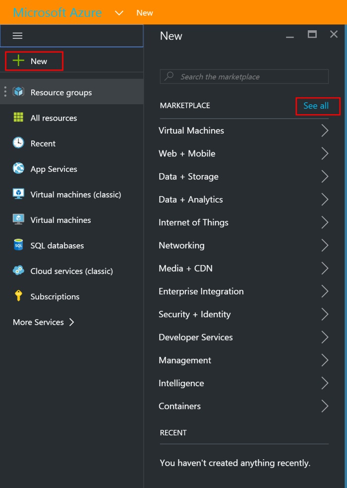
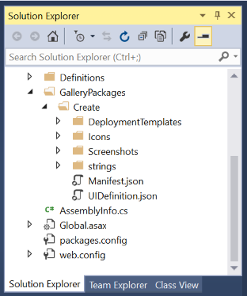

<a name="key-components-of-an-extension"></a>
# Key Components of an Extension


<a name="key-components-of-an-extension-overview"></a>
## Overview

The Visual Studio project template for Azure Portal extensions implements many of the key components of an extension. Some of them are as follows:

* Marketplace Gallery Integration 

    How people create resources

* Browse Experience

    How people browse resources that have been created

* Resource Menu Blade
    How people use and manage resources they have created

This document describes the key components of an extension: the Marketplace Gallery, the Browse experience, and the Create experience.


<a name="key-components-of-an-extension-marketplace-gallery-integration-and-create-experience"></a>
## Marketplace Gallery Integration and Create Experience

If your business intends to sell Portal resources, then you may want to integrate them into the Azure Marketplace. The Marketplace offers users a consistent way to browse and search items that they can create or purchase.

You can integrate an extension or a resource into the Marketplace by building and publishing a package to the Marketplace service. This section describes the basic pieces of the Marketplace.

1. In the running Portal, go to the Marketplace by clicking the ```+New```  button and then the ```See all``` button, as in the following image.

    

<!-- Determine whether only one is displayed in the blade.  -->

1. Then click the ```Local Development ``` category. The name of the Marketplace item that is  displayed in the ```Local Development ``` blade matches the name that was selected when creating its Visual Studio project. Click the gallery item to launch the item details blade.

    
 
1. The gallery package contains all the categories, content, and images that have been displayed so far.  The code that defines the gallery package is located in the GalleryPackages directory.

    

 1. Click the ```Create``` button in the item details blade, as in the following image.

    

    The portal will open the blade that is defined in VS as ``` GalleryPackages/Create/UIDefinition.json```, as in the following image.

    

    The portal displays a basic ```Create``` form that asks the user to specify the common Azure Resource properties, as in the following image.

       

    The code that implements the ```Create``` blade is located in the VS ```Client/Resource/Create``` directory, as in the following image.

    

    **NOTE**  The name "CreateBlade" in the ```Create.pdl``` file matches the name in the ``` UIDefinition.json```  file.
 
1. Return to the Portal and enter the common resource properties in the ``` Create ``` form, then  click the ```Create``` button  to create the resource.

<!-- TODO:  Locate a gallery doc that describes the common resource properties. -->
For more information on creating gallery packages and ```Create``` forms, see the    document in the gallery documentation.
<!-- TODO:  The previous sentence was:
For more information on creating gallery packages and create forms see the [gallery documentation](/gallery-sdk/generated/index-gallery.md#Marketplace-Gallery-Integration-and-Create-Experience).
Determine what the content was, and whether it has been included in the key components document.
-->

For more information about creating Portal experiences, see     [top-extensions-create.md#building-custom-create-forms](top-extensions-create.md#building-custom-create-forms).


<a name="key-components-of-an-extension-browse-experience"></a>
## Browse Experience
This section describes how to display an extension in the Azure Portal.

The Portal's common navigation menu is the `Browse` menu, and it displays a list of all the different services and resource types that the Portal offers.

The Portal can be navigated by using the  ``` Browse ``` menu to the left.  Click on the ```My services ``` arrow to display Azure services, and scroll to the  ``` My Resources ``` service and click on it, as in the following image.

   

The Portal will display the extension's item in a list, as in the following image.

   

If you have not yet created any items, the Portal will display a "No My Resources to display" message.
When you can create a gallery item as specified in  [portalfx-extensions-key-components-mgCreate.md](portalfx-extensions-key-components-mgCreate.md), it will be displayed in this list.

The code for the browse implementation is located in the ```Browse.pdl``` file in the  ```Client/Browse``` folder in Visual Studio (VS), as in the following image.


When the  ```resourceType ``` name "Microsoft.PortalSdk/rootResources" is replaced with your production Resource Provider (RP) type,  your resources will be displayed in the list after the F5 button is clicked. 

For more information on the Browse experience, see the document located at [top-extensions-browse.md](top-extensions-browse.md).

For more information about Resource Providers (RP) and other ARM support, see the Microsoft internal ARM wiki, located at [http://sharepoint/sites/AzureUX/Sparta/SpartaWiki/Sparta%20Wiki.aspx](http://sharepoint/sites/AzureUX/Sparta/SpartaWiki/Sparta%20Wiki.aspx).


<a name="key-components-of-an-extension-resource-menu"></a>
## Resource Menu

If you are building an extension for an Azure service, then you probably built a resource provider that displays a top-level resource, like a  Virtual Machine or a  Storage account.

If that's the case, then the ```Resource``` menu blade is a great starting point. When the user selects a specific resource from the ``` Browse ``` experience, the menu blade that is displayed contains a mixture of standard resource features and service-specific features. Some standard resource features are activity logs, role based access controls, and Support.  Service-specific features are items like tables in a storage account. The following image displays a ```Browse``` experience Menu blade that contains features.


Click on your resource from within the ```Browse``` list to open the resource menu. Many of the standard Azure experiences such as tags, locks, and access controls have been automatically injected into the menu.

The code for the resource menu blade is located in the ``` AssetTypeViewModel ``` file in the ``` Browse/ViewModels ``` folder in the associated Visual Studio project. The menu can be extended by modifying the ```getMenuConfig ``` function, as in the following image.


<!-- TODO:  Locate a gallery doc that describes the common resource properties.  [Resource menu blade documentation](/gallery-sdk/generated/index-gallery.md#resource-management-resource-menu).-->

For more information on the Resource Menu,  see [top-blades-resourcemenu.md](top-blades-resourcemenu.md).


<!--
gitdown": "include-file", "file": "../templates/portalfx-extensions-glossary-key-components.md"}
-->