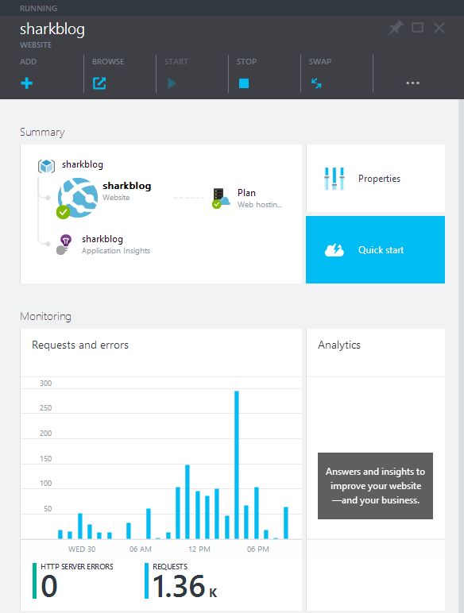

<a name="development-procedures"></a>
## Development Procedures
   
The items that are being developed extend functionality to an Azure Portal, and therefore are named extensions.  Some examples are in the following image.

 

Perform the following tasks to become part of Azure Portal extension developer community.

1. [Schedule Kickoff Meetings](#schedule-kickoff-meetings)

1. [Onboard with related teams](top-external-onboarding.md)

1. [Join DLs and request permissions](#join-dls-and-request-permissions) 

1. [Get the developers started](top-extensions-getting-started.md)
 
You can ask developer community questions on Stackoverflow with the tag [ibiza-onboarding](https://stackoverflow.microsoft.com/questions/tagged/ibiza-onboarding).

<a name="development-procedures-schedule-kickoff-meetings"></a>
### Schedule Kickoff Meetings
 
Reach out to the <a href="mailto:ibiza-onboarding-kick@microsoft.com?subject=Kickoff Meeting Request&body=My team would like to meet with you to learn about the Azure onboarding process.">Portal team</a> and request a kickoff meeting. A team representative will deliver a 30-minute overview of the onboarding process. We can direct you to the latest patterns and practices, talk about the relationship between our teams,  and answer questions.  

<!--TODO: Are the business model review and the feasibility study previous to or a  part of the kickoff meetings?  they are in the step-by-step named Develop and deploy the extension, and they seem to occur after the team is onboard but before the extension is developed. -->

Make sure the extension that will be developed has passed the business model review and is feasible previous to the kickoff meetings. For more information about business model reviews and feasibility studies, see .

Schedule and attend the kickoff meeting(s) hosted by your PM or Dev Lead. These meetings will touch on the following points.

* Whether the service will target public Azure, on-premises, or both
* What is the name of the service
* Summary of the service and target scenarios

If you are planning to build a first party application, i.e., you are a part of Microsoft, the meeting agenda will also include:
* VP, PM, and engineering owners
* Timelines (preview, GA)

When these meetings have concluded, your team will be ready to build extensions.

<a name="development-procedures-join-dls-and-request-permissions"></a>
### Join DLs and request permissions

Request the following permissions to stay current on product roadmaps, get news on latest features, and read workshop announcements.

* PMs and Developer Leads need to join the `ibizapartners PM`  group by clicking on this link: [http://igroup/join/ibizapartners-pm](http://igroup/join/ibizapartners-pm). 

* Developers should join the  `ibizapartners DEV` group by clicking on this  link:  [http://igroup/join/ibizapartners-dev](http://igroup/join/ibizapartners-dev). 

* Developers should join the appropriate group listed on [http://aka.ms/standardaccess](http://aka.ms/standardaccess) to get access to portal telemetry. All groups on this page receive access. 

* Developers should join the  `Azure Portal Core Team - 15003(15003)` group by using this link: [http://ramweb](http://ramweb).

* PMs, Developers, and Developer Leads should subscribe to the partner request process by joining the ```Uservoice ``` group at this link:  [https://aka.ms/portalfx/uservoice](https://aka.ms/portalfx/uservoice). For more information about the partner request process, see [portalfx-extension-partner-request-process.md](portalfx-extension-partner-request-process.md).

* PMs, Developers, and Developer Leads should receive notifications on breaking changes by joining the ```ibizabreak ``` group at  this  link:  [http://igroup/join/ibizabreak](http://igroup/join/ibizabreak).

* PMs, Developers, and Developer Leads  should join Stackoverflow Forums that are located at [https://stackoverflow.microsoft.com](https://stackoverflow.microsoft.com)  to let us know if you have any questions. Remember to tag questions with ```ibiza``` or related tag.

* Developers who want to contribute to the Azure documentation or test framework should join groups from the site located at [http://aka.ms/azuregithub](http://aka.ms/azuregithub).

