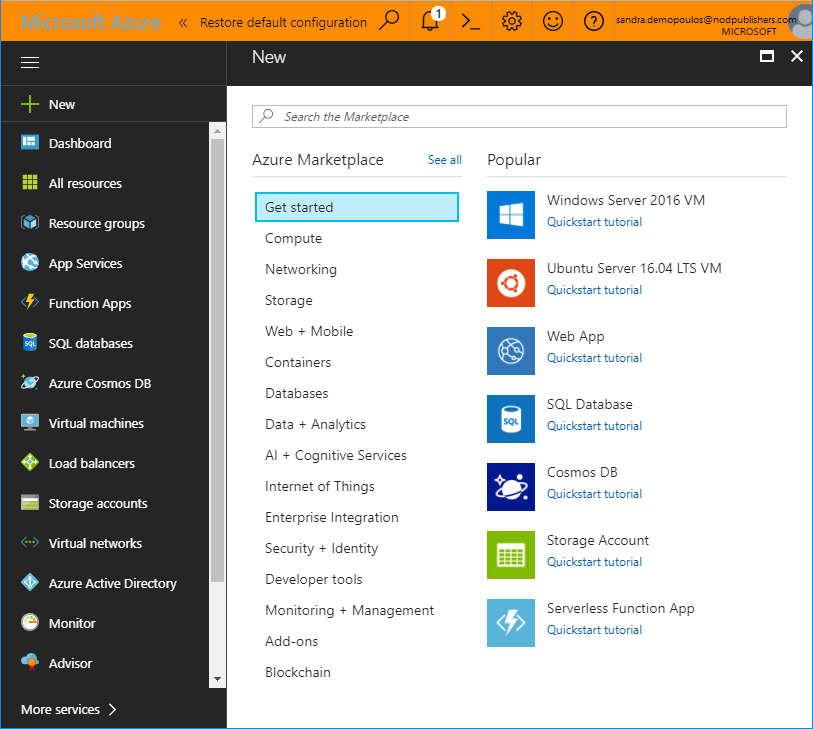
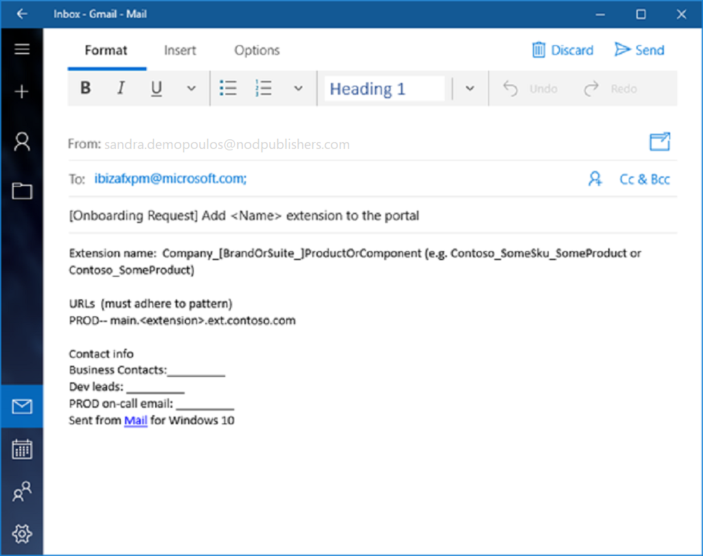

<a name="portal-development-phase-3-deployment"></a>
# Portal development phase 3: deployment

<a name="portal-development-phase-3-deployment-deployment-procedures"></a>
## Deployment Procedures

1. [Deploy the extension](#deploy-the-extension)

1. [Register the extension](#register-the-extension)

You can ask developer community questions on Stackoverflow with the tag [ibiza-onboarding](https://stackoverflow.microsoft.com/questions/tagged/ibiza-onboarding).

<a name="portal-development-phase-3-deployment-deployment-procedures-deploy-the-extension"></a>
### Deploy the extension

1. When you are confident that the development of the extension is complete, you should execute the following process so the specific work required for the Azure Fundamental tenets appears in Service360, as specified in [Azure Fundamentals](https://microsoft.sharepoint.com/teams/WAG/EngSys/Shared%20Documents/Argon/Azure%20Fundamentals%20Proposal/Azure%20Fundamentals%20Proposal.docx?d=wf5b821bc31c44042adb55ebf4d8b408d). 
    * Add the service to ServiceTree, which is located at [https://servicetree.msftcloudes.com](https://servicetree.msftcloudes.com)
    * Make the service be "Active" in ServiceTree
    * Complete metadata in ServiceTree to enable the automation for various Service360 Action Items
    * Complete the Action Items identified in Service360, which is located at [http://aka.ms/s360](http://aka.ms/s360)

1. 	Integrate the extension into the Marketplace. 

    In the following images, each icon in the Azure Portal Marketplace is referred to as a Gallery item. Gallery items take the form of a file with the .azpkg extension. This is a  zip file which contains all assets for the gallery item: icons, screenshots, descriptions.

    

    * **PROD:** The Marketplace team accepts fully finished .azkpg files from your team and uploads them to Production to onboard the gallery package. Send the following email to 1store@microsoft.com.  The subject line should contain “Marketplace Onboarding Request” and the *.azpkg file should be attached to the email, as in the following image.

      

    * **DOGFOOD:** Use AzureGallery.exe to upload items to DOGFOOD using the following command:

      ```AzureGallery.exe upload -p ..\path\to\package.azpkg -h [optional hide key]```

    In order to use the gallery loader, there are some values to set in the AzureGallery.exe.config file. For more information, see the Gallery Item Specifications document that is located at      [https://github.com/Azure/portaldocs/blob/master/gallery-sdk/generated/index-gallery.md#gallery-item-specificiations](https://github.com/Azure/portaldocs/blob/master/gallery-sdk/generated/index-gallery.md#gallery-item-specificiations).  

    For more dev/test scenarios, see [https://github.com/Azure/portaldocs/blob/master/gallery-sdk/generated/index-gallery.md#gallery-package-development-and-debugging-testing-in-production](https://github.com/Azure/portaldocs/blob/master/gallery-sdk/generated/index-gallery.md#gallery-package-development-and-debugging-testing-in-production).


<a name="portal-development-phase-3-deployment-deployment-procedures-register-the-extension"></a>
### Register the extension

Once the name of the extension or service name is finalized, request to have the extension registered in all environments. Registering an extension in Portal requires deployment so it can take almost 10 days in the Production environment. Please plan accordingly.

* For internal partners, the request to register an extension is a pull request, as specified in [portalfx-extensions-publishing.md](portalfx-extensions-publishing.md).
 
* External teams can submit their requests by sending an email that resembles the following image.

  
 
* After deploying the extension to the DOGFOOD (DF) environment, contact the Fx team to request that they enable the extension, if applicable. Every extension  meets required exit criteria / quality metrics before it will be enabled. The  extension will be enabled in production once all exit criteria have been met.

   Extension names must use standard extension name format, as in the example located at [portalfx-extensions-configuration-overview.md#name](portalfx-extensions-configuration-overview.md#name).

* Extension URLs must use a standard CNAME pattern. For more information about CNAMES, see [portalfx-extensions-cnames.md](portalfx-extensions-cnames.md).

 
<a name="portal-development-phase-3-deployment-status-codes-and-error-messages"></a>
## Status Codes and Error Messages
Status codes or error messages that are encountered while developing an extension may be dependent on the type of extension that is being created, or the development phase in which the message is encountered.  Terms that are encountered in the error messages may be defined in the [Glossary](portalfx-extensions-glossary-status-codes.md).
<!-- TODO:  Find at least one status code for each of these conditions. -->

<a name="portal-development-phase-3-deployment-status-codes-and-error-messages-console-error-messages"></a>
### Console Error Messages

***Console error messages in F12 developer tools***

Some console and HTTP error messages are located at[https://msdn.microsoft.com/en-us/library/dn423949(v=vs.85).aspx](https://msdn.microsoft.com/en-us/library/dn423949(v=vs.85).aspx).

* * *

<a name="portal-development-phase-3-deployment-status-codes-and-error-messages-err_connection_reset"></a>
### ERR_CONNECTION_RESET

***Cannot load `localhost` Ibiza extension with ERR_CONNECTION_RESET***

ERROR: The Storage Area Network (SAN) is missing in the certificate.

SOLUTION: [https://stackoverflow.microsoft.com/questions/48581/cannot-load-localhost-ibiza-extension-with-err-connection-reset/49595#49595](https://stackoverflow.microsoft.com/questions/48581/cannot-load-localhost-ibiza-extension-with-err-connection-reset/49595#49595)

* * * 

<a name="portal-development-phase-3-deployment-status-codes-and-error-messages-err_insecure_response"></a>
### ERR_INSECURE_RESPONSE

ERR_INSECURE_RESPONSE in the browser console

***My Extension fails to sideload and I get an ERR_INSECURE_RESPONSE in the browser console***.
   


ERROR: the browser is trying to load the extension but the SSL certificate from localhost is not trusted.

SOLUTION: Install and trust the certificate.

* * *

<a name="portal-development-phase-3-deployment-status-codes-and-error-messages-failed-to-initialize"></a>
### Failed To Initialize

ERROR: The extension failed to initialize. One or more calls to methods on the extension's entry point class failing.

SOLUTION: Scan all the relevant error messages during the timeframe of the failure. These errors should have information about what exactly failed while trying to initialize the extension, e.g. the initialize endpoint, the getDefinition endpoint, etc.

* * * 

<a name="portal-development-phase-3-deployment-status-codes-and-error-messages-first-response-not-received"></a>
### First Response Not Received

ERROR: The shell loaded the extension URL obtained from the config into an IFrame; however there wasn't any response from the extension.

SOLUTION: 

1. Verify that the extension is correctly hosted and accessible from the browser.

1. The extension should have code injected in the  `layout.cshtml` which includes a postMessage call. Verify that this code gets executed.

* * * 

<a name="portal-development-phase-3-deployment-status-codes-and-error-messages-invalid-definition"></a>
### Invalid Definition

ERROR: The definition that was received from an extension had validation errors.

SOLUTION: Scan the error logs for all the validation errors in the extension definition and fix them.

* * * 

<a name="portal-development-phase-3-deployment-status-codes-and-error-messages-invalid-extension-name"></a>
### Invalid Extension Name

ERROR: The name of the extension as specified in the `extensions.json` configuration file doesn't match the name of the extension in the extension manifest.

SOLUTION: Verify what the correct name of the extension should be, and if the name in config is incorrect, update it.

If the name in the manifest is incorrect, contact the relevant extension team to update the  `<Extension>` tag in the PDL file with the right extension name and recompile.

* * * 

<a name="portal-development-phase-3-deployment-status-codes-and-error-messages-invalid-indicate-loaded"></a>
### Invalid Indicate Loaded

ERROR: The manifest for an extension was received at an invalid time. e.g. if the manifest was already obtained or the extension was already loaded.

SOLUTION: Report this issue to the framework team for investigation.

* * * 

<a name="portal-development-phase-3-deployment-status-codes-and-error-messages-invalid-manifest"></a>
### Invalid Manifest

ERROR: The manifest that was received from an extension had validation errors.

SOLUTION: Scan the error logs for all the validation errors in the extension manifest and fix them.

* * * 

<a name="portal-development-phase-3-deployment-status-codes-and-error-messages-manifest-not-received"></a>
### Manifest Not Received

ERROR: The bootstrap logic was completed, however the extension did not return a manifest to the shell. The shell waits for a period of time (currently 40 seconds as of 2014/10/06) and then times out.

SOLUTION:
1. Verify that the extension is correctly hosted and accessible from the browser.

1. If the extension is using AMD modules, verify that the `manifest.js` file is accessible from the browser. Under default settings it should be present at `/Content/Scripts/_generated/manifest.js`.

* * * 

<a name="portal-development-phase-3-deployment-status-codes-and-error-messages-portal-error-520"></a>
### Portal Error 520

***The Portal encountered a part it cannot render***

ERROR: The Portal displays a 520 error, as in the following image.


The Web server is returning an unknown error. 

SOLUTION: Use the following troubleshooting steps.

* Check the browser console, and look for errors that describe the error condition in more detail. 
* Click on the failed part. With some types of errors, this will add a stack trace to the browser console.
* Double check the Knockout template for correct syntax.
* Ensure that all variables that are used in the template are public properties on the corresponding view model class.
* Reset the desktop state.
* Enable first chance exceptions in the JavaScript debugger.
* Set break points inside the viewModel constructor to ensure no errors are thrown.

* * *

<a name="portal-development-phase-3-deployment-status-codes-and-error-messages-sandboxed-iframe-security"></a>
### Sandboxed iframe security

***Error: 'Security of a sandboxed iframe is potentially compromised by allowing script and same origin access'.***
 
The Azure Portal should frame the extension URL, as specified in [portalfx-extensions-getting-started-procedure.md](portalfx-extensions-getting-started-procedure.md) and [portalfx-extensions-key-components.md](portalfx-extensions-key-components.md).  Also see [#console-error-messages](#console-error-messages).

* * *

<a name="portal-development-phase-3-deployment-status-codes-and-error-messages-timed-out"></a>
### Timed Out

ERROR: The extension failed to load after the predefined timeout, which is currently 40 seconds.

SOLUTION: Scan the errors to see if there are any other relevant error messages during the time frame of the failure.

* * * 

<a name="portal-development-phase-3-deployment-status-codes-and-error-messages-too-many-bootgets"></a>
### Too Many BootGets

ERROR: The extension tried to send the bootGet message to request for Fx scripts multiple times. The error should specify the number of times it refreshed before the extension was disabled.

SOLUTION:  Scan the errors to see if there are any other relevant error messages during the time frame of the failure.

* * * 

<a name="portal-development-phase-3-deployment-status-codes-and-error-messages-too-many-refreshes"></a>
### Too Many Refreshes

ERROR: The extension tried  to reload itself within the IFrame multiple times. The error should specify the number of times it refreshed before the extension was disabled.

SOLUTION: Scan the errors to see if there are any other relevant error messages during the time frame of the failure.

* * * 


<a name="portal-development-phase-3-deployment-best-practices"></a>
## Best Practices
   
Portal development patterns or architectures that are recommended based on customer feedback and usability studies are located in the topic for the blade that is being developed. For more information, see [portalfx-blades-best-practices.md](portalfx-blades-best-practices.md).

<a name="portal-development-phase-3-deployment-best-practices-performance"></a>
### Performance

There are practices that can improve the performance of the extension.  For more information, see [portalfx-performance-bestpractices.md](portalfx-performance-bestpractices.md).


<a name="portal-development-phase-3-deployment-best-practices-productivity-tip"></a>
### Productivity Tip

Install Chrome that is located at [http://google.com/dir](http://google.com/dir) to leverage the debugger tools while developing an extension.

<a name="portal-development-phase-3-deployment-frequently-asked-questions"></a>
## Frequently asked questions

<a name="portal-development-phase-3-deployment-frequently-asked-questions-onboarding-faq"></a>
### Onboarding FAQ

***Where are the onboarding FAQs for Sparta (ARM/CSM-RP)?***

The SharePoint Sparta Onboarding FAQ is located at [http://sharepoint/sites/AzureUX/Sparta/SpartaWiki/Sparta%20Onboarding%20FAQ.aspx](http://sharepoint/sites/AzureUX/Sparta/SpartaWiki/Sparta%20Onboarding%20FAQ.aspx).

* * *

<a name="portal-development-phase-3-deployment-frequently-asked-questions-ssl-certs"></a>
### SSL Certs
   
   <!-- TODO:  FAQ Format is ###Link, ***title***, Description, Solution, 3 Asterisks -->
   
***How do I use SSL certs?***
 
 SSL Certs are relevant only for teams that host their own extensions.  Azure Portal ONLY supports loading extensions from HTTPS URLs. Use a wildcard SSL cert for each environment to simplify maintenance, for example,   ``` *.<extensionName>.onecloud-ext.azure-test.net  ``` or  ``` *.<extensionName>.ext.azure.com) ``` .    To simplify overall management when your team is building separate, independent extensions, you can also use  ``` <extensionName>.<team>.ext.azure.com ``` and create a wildcard SSL cert for  ``` *.<team>.ext.azure.com ```. Internal teams can create SSL certs for the DogFood environment using the SSL Administration Web page that is located at [http://ssladmin](http://ssladmin). 
 
  Production certs must follow your organization’s PROD cert process. 

 **NOTE** Do not use the SSL Admin site for production certs.

 * * *

 ### Compile on Save

**What is Compile on Save ?**

Compile on Save is a **TypeScript** option that   . To use it, make sure that **TypeScript** 2.0.3 was installed on your machine. The version can be verified by executing the following  command:

```bash
$>tsc -version
```
Then, verify that when a **TypeScript** file is saved, that the following text is displayed in the bottom left corner of your the **Visual Studio** application.


 * * *

<a name="portal-development-phase-3-deployment-frequently-asked-questions-other-onboarding-questions"></a>
### Other onboarding questions

***How can I ask questions about onboarding ?***

You can ask questions on Stackoverflow with the tag [onboarding](https://stackoverflow.microsoft.com/questions/tagged/onboarding).


