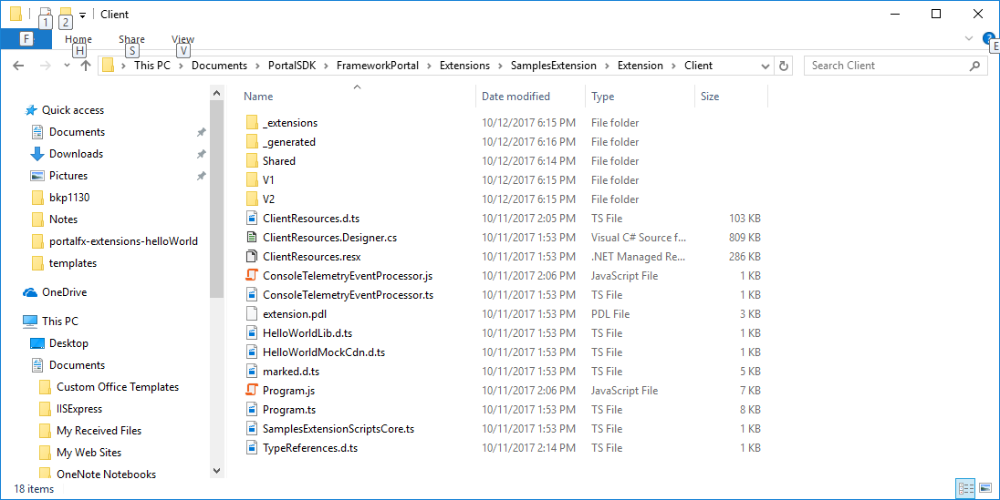

<a name="portal-extension-samples"></a>
# Portal Extension Samples

 ## Overview

One of the most productive ways to learn how to develop code is by reviewing program source.  The Azure portal team ships samples that extension developers can leverage.

All developers who install the Portal Framework SDK that is located at [http://aka.ms/portalfx/download](http://aka.ms/portalfx/download) also install the samples on their computers during the installation the process. The samples are located in the `...\Documents\PortalSDK\FrameworkPortal\Extensions\SamplesExtension` folder.

First-party extension developers, i.e. Microsoft employees, have access to the Dogfood environment, therefore they can view the samples that are located at [http://aka.ms/portalfx/samples#blade/SamplesExtension/SDKBlade](http://aka.ms/portalfx/samples#blade/SamplesExtension/SDKBlade).

<a name="portal-extension-samples-samples-extension"></a>
## Samples extension

The samples extension provides an individual sample for each feature available in the framework, as described in the following image.

 

After installing the Portal Framework SDK, the local instance of the portal will open with the samples extension pre-registered.  You can open the `SamplesExtension` solution file to experiment with samples in the IDE.

```bash
[My Documents]\PortalSDK\FrameworkPortal\Extensions\SamplesExtension\SamplesExtension.sln
```

The samples and the portal can be located with **IntelliMirror** in the following location.

```bash
%LOCALAPPDATA%\PortalSDK\FrameworkPortal\Extensions\SamplesExtension\SamplesExtension.sln
```

You can edit the samples and then refresh the portal to see the changes. Each sample demonstrates a single usage of the API.  It is great for detailed information on any one API.

For help other than documentation and samples, send an email to the Ibiza team on [Stackoverflow@MS](https://stackoverflow.microsoft.com/questions/tagged?tagnames=ibiza). For a list of topics and stackoverflow tags, see [portalfx-extensions-stackoverflow.md](portalfx-extensions-stackoverflow.md).

<!-- TODO: Determine whether there should be a list of samples and whether they are V1 or V2.   
The alternative is to let the list default to the contents of the SamplesExtension.sln project, and the reverse cross-reference that is created by documents like portalfx-blades-appblades.md. -->

<a name="portal-extension-samples-v1-versus-v2"></a>
## V1 versus V2

The samples are structured into two directories, **V1** and **V2**, as in the following example. 

 

<!--TODO: Can "meant" be changed to "will"  or "intended" ? -->

<a name="portal-extension-samples-v1-versus-v2-v2"></a>
### V2

The samples in the **V2** directories use the latest patterns. It contains the post-GA collection of new APIs that are meant to be the only set of APIs needed to develop an Ibiza extension.

The **V2** samples address the following API areas.

* New Blade variations TemplateBlade, FrameBlade, MenuBlade 

* Blade-opening/closing `container.openBlade`, et al

* no-PDL TypeScript decorators that define all recommended Blade/Part variations

* Forms that do not use **V1** EditScope. For more information about EditScope, see [portalfx-forms-edit-scope-faq.md](portalfx-forms-edit-scope-faq.md).

<a name="portal-extension-samples-v1-versus-v2-v1"></a>
### V1

Our **V1** APIs use APIs that support previous UX patterns, or  are becoming obsolete or are less commonly used.  The **V1** APIs are also more difficult to use than the new API, for both the UX design and  the associated APIs.

The following **V1** concepts should be avoided when **V2** APIs can be used instead.

* PDL
* EditScope
* ParameterCollector/ParameterProvider
* Blades containing Parts
* Non-full-screen Blades, i.e., ones that open with a fixed width
* **V1** Blade-opening -- Selectable/SelectableSet APIs
* **V1** Forms that use EditScope

**NOTE**: The **V2** space is not yet entirely built. In the meantime, use **V1** APIs in places, even the previously-listed **V1** concepts. For example, the source code for small, medium, and large blades is located in the `...\SamplesExtension\Extension\Client\V1\Blades\BladeWidth` directory.

**NOTE**: Sample source code is included in topics that discuss the various Azure SDK API items. The list of topics and samples is as follows.

<!-- | Topic | Version | Sample |  Experience | -->
<!-- | Topic | Document |  Version | Sample |  Experience | -->

| ----- | ------ | 
| [portalfx-debugging.md](portalfx-debugging.md) | N/A |
| [portalfx-testing-taking-screenshots.md](portalfx-testing-taking-screenshots.md) | N/A |
| [portalfx-blades-pinning.md](portalfx-blades-pinning.md) | N/A |
| [portalfx-icons.md](portalfx-icons.md) | V1 | .../Client/V1/UI/ViewModels/Blades/IconBladeViewModels.ts | | 
| [portalfx-forms-sections.md](portalfx-forms-sections.md) | V1 |
| [portalfx-forms-construction.md](portalfx-forms-construction.md) | V1 |
| [portalfx-extension-pricing-tier.md](portalfx-extension-pricing-tier.md) | V1 |
| [portalfx-data-projections.md](portalfx-data-projections.md) | V1 |
| [portalfx-data-overview.md](portalfx-data-overview.md) | V1 |
| [portalfx-controls-grid.md](portalfx-controls-grid.md) | V1 |
| [portalfx-blades-templateblade-reference.md](portalfx-blades-templateblade-reference.md) | V1 |
| [portalfx-blades-menublade.md](portalfx-blades-menublade.md) | V1 |
| [portalfx-parts.md](portalfx-parts.md) | V1 |
| [portalfx-forms-edit-scope-faq.md](portalfx-forms-edit-scope-faq.md) | V1 |
| [portalfx-data-refreshingdata.md](portalfx-data-refreshingdata.md) | V1 |
| [portalfx-data-masterdetailsbrowse.md](portalfx-data-masterdetailsbrowse.md) | V1 |
| [portalfx-create.md](portalfx-create.md) | V1 |
| [portalfx-controls-datetimerangepicker.md](portalfx-controls-datetimerangepicker.md) | V1 |
| [portalfx-controls-datetimepicker.md](portalfx-controls-datetimepicker.md) | V1 |
| [portalfx-blades-templateblade-advanced.md](portalfx-blades-templateblade-advanced.md) | V1 |
| [portalfx-blades-outputs.md](portalfx-blades-outputs.md) | V1 |
| [portalfx-blades-appblades.md](portalfx-blades-appblades.md) | V1 |
| [portalfx-parameter-collection-getting-started.md](portalfx-parameter-collection-getting-started.md) | V1 |
| [portalfx-hubsextension-pde.md](portalfx-hubsextension-pde.md) | V1 |
| [portalfx-extension-reference-obsolete-bundle.md](portalfx-extension-reference-obsolete-bundle.md) | V1 |
| [portalfx-create-engine-sample.md](portalfx-create-engine-sample.md) | V1 |
| [portalfx-create-robot-sample.md](portalfx-create-robot-sample.md) | V1 |
| [portalfx-faq.md](portalfx-faq.md) | V1 |
| [portalfx-data-virtualizedgriddata.md](portalfx-data-virtualizedgriddata.md) | V1 |
| [portalfx-blades-ui.md](portalfx-blades-ui.md) | V1 |
| [portalfx-no-pdl-programming.md](portalfx-no-pdl-programming.md) | V2 |
| [portalfx-controls-textbox.md](portalfx-controls-textbox.md) | V2 |
| [portalfx-controls-essentials.md](portalfx-controls-essentials.md) | V2 |
| [portalfx-controls-editor.md](portalfx-controls-editor.md) | V2 |


 ## Procedures for Portal Sample Source Code

After installing Visual Studio and the Portal Framework SDK, locate the samples in the `...\Documents\PortalSDK\FrameworkPortal\Extensions\SamplesExtension` folder.

Open the `SamplesExtension` solution file to experiment with samples in the IDE.

You can make changes to the samples as appropriate.

Click the F5 key to start debugging the sample extensions. This rebuilds the project, which will allow you to check for items like the most recent version of the SDK.

Sideload the extension. When it loads, click on the `More Services` option in the menu, as in the following example.

 

In the filter box, search for "Azure Portal SDK". You can use `Shift + Space` to mark it as a favorite site.

Make changes to the sample that best fits the needs of the development project, then refresh the portal to view the changes. 


 ## Glossary

This section contains a glossary of terms and acronyms that are used in this document. For common computing terms, see [https://techterms.com/](https://techterms.com/). For common acronyms, see [https://www.acronymfinder.com](https://www.acronymfinder.com).

| Term                  | Meaning | 
| ---                   | --- |
| EditScope             | An Azure SDK object that provides a standard way of managing edits over a collection of input fields, blades, and extensions. |
| ParameterCollector    | A collection of Parameter and Parameter-derived objects that are used by data source controls in advanced data-binding scenarios. |
