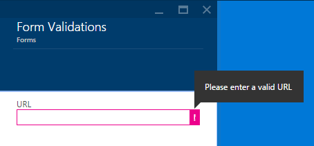

<a name="field-validation"></a>
## Field Validation

Validating input is one of the primary benefits of the **Forms** API. Many simple and complex validators are available out of the box:

  * Required
  * Contains
  * Not Contains
  * Contains Characters
  * Not Contains Characters
  * Has Digit
  * Has Letter
  * Has Upper Case Letter
  * Has Lower Case Letter
  * Has Punctuation
  * Equals
  * Length Range
  * Min Length
  * Max Length
  * Numeric
  * Range
  * Min Value
  * Max Value
  * RegEx
  * Custom
  * Continuous Update

Validators also provide automatic error messages inside of a balloon control, as in the following image.



In this discussion, `<dir>` is the `SamplesExtension\Extension\` directory and  `<dirParent>` is the `SamplesExtension\` directory. Links to the Dogfood environment will display working copies of the samples that were made available with the SDK.

For an example of each of these validators in action, view the sample file that is located at `<dir>\Client\V1\Forms\Samples\Validations\ViewModels\FormValidationsViewModels.ts`.

Validators are added to the form objects that are on the ViewModel, as in the following code.

```ts
var nameTextboxOptions  = <MsPortalFx.ViewModels.Forms.TextBox.Options>{
      label: ko.observable(ClientResources.required),
      validations: ko.observableArray([
          new MsPortalFx.ViewModels.RequiredValidation(ClientResources.pleaseEnterSomeText)
      ])
  };
  this.nameTextbox  = new MsPortalFx.ViewModels.Forms.TextBox.ViewModel(
      this._container, this, "requiredFieldValue", nameTextboxOptions );
```