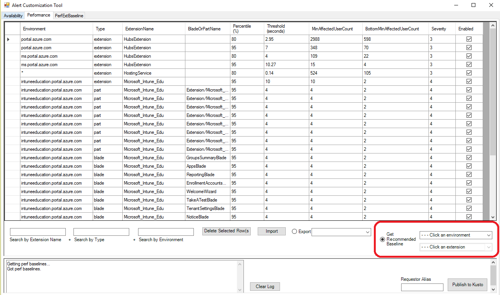
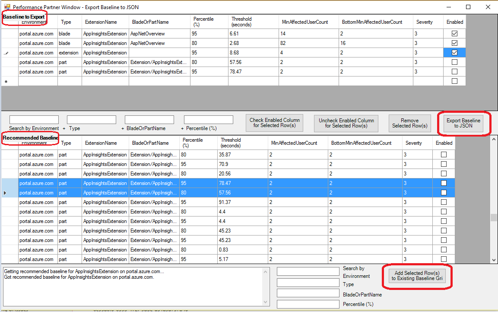

# Performance

The alerts can be configured for extension performance, blade performance and part performance.

<a name="configuration"></a>
## Configuration

At a high level you define;

1. An environment for the alerts to run against. See definition [below](#what-is-environment)
2. The performance configuration for the alerts within that environment

```json
{
    ...
    "environments": [
        {
            "environment": "portal.azure.com", 
            "performance": [
                {
                    "type": "extension", 
                    "criteria": [
                        {
                            ...
                        },
                        ...
                    ]
                },
                {
                    "type": "blade", 
                    "criteria": [
                        {
                            ...
                        },
                        ...
                    ]
                },
                {
                    "type": "part", 
                    "criteria": [
                        {
                            ...
                        },
                        ...
                    ]
                },
                ...
             ]
        },
        {
            "environment": "ms.portal.azure.com",
            "performance": [
                {
                    ...
                },
                ...
             ],
            ...
        }
    ]
    ...
}
```

Per each of those, you can define a set of criteria like the below.

> Only blade or part are required to have a bladeName or partName property.

<a name="what-is-environment" />
<a name="configuration-what-is-environment"></a>
### What is environment

Environment can be `*` or `portal.azure.com` or `ms.portal.azure.com` or `canary.portal.azure.com` or any other legit portal domain name. `*` represents all Azure Portal Production environments `*.portal.azure.com`

<a name="configuration-what-is-performance-configuration"></a>
### What is performance configuration

Performance configuration is an array of criteria to run against that environment, see below for further examples.

<a name="configuration-extension"></a>
### Extension

An example of an extension performance alert criteria

```json
[
    {
        "type": "extension",
        "criteria": [
            {
                "percentile": 80,
                "percentileThreshold": 4,
                "minAffectedUserCount": 270,
                "bottomMinAffectedUserCount": 54,
                "severity": 3,
                "enabled": true
            }
            ...
        ]
    }
    ...
]
```

<a name="configuration-blade"></a>
### Blade

An example of a blade performance alert criteria

```json
[
    {
        "type": "blade",
        "criteria": [
            {
                "percentile": 80,
                "percentileThreshold": 3.34,
                "minAffectedUserCount": 65,
                "bottomMinAffectedUserCount": 13,
                "bladeName": "ContainersBlade",
                "severity": 3,
                "enabled": true
            }
            ...
        ]
    }
    ...
]
```

<a name="configuration-part"></a>
### Part

An example of a part performance alert criteria

> partName value is part’s full name.

```json
[
    {
        "type": "part",
        "criteria": [
            {
                "percentile": 95,
                "percentileThreshold": 7.17,
                "minAffectedUserCount": 65,
                "bottomMinAffectedUserCount": 13,
                "bladeName": "Extension/Microsoft_Azure_Storage/PartType/StorageAccountPart",
                "severity": 3,
                "enabled": true
            }
            ...
        ]
    }
    ...
]
```

<a name="configuration-what-is-percentile"></a>
### What is percentile?

This is at which percentile you want to measure the performance. Today the only options are 80 or 95.

<a name="configuration-what-is-percentilethreshold"></a>
### What is percentileThreshold?

This is the minimum duration (in seconds) when {percentile}% of users is above the {percentileThreshold}.

<a name="configuration-what-is-minaffectedusercount"></a>
### What is minAffectedUserCount?

This is the minimum number of users whose load duration is above {percentileThreshold}.

<a name="configuration-what-is-bottomminaffectedusercount"></a>
### What is bottomMinAffectedUserCount?

This is used as a threshold to trigger an alert if the {percentile} defined is greater than or
equal to __double__ of the {percentileThreshold} defined.

> This is defaulted to 20% of {minAffectedUserCount}.

This is used to catch any unusual spikes on the weekends/low traffic periods.

<a name="configuration-when-do-the-alerts-trigger"></a>
### When do the alerts trigger?

Every 5 minutes, we get percentile load duration for the last 90 minutes. We get the most recent 6 sample points and calculate a weighted percentile load duration based on the following formula.

```
Weighted duration = 8/24 * {most recent percentile load duration} + 6/24 * {2nd most recent percentile load duration} + 4/24 * {3rd…} + 3/24 * {4th …} + 2/24 * {5th …} + 1/24 * {6th …}
```

Alerts will only trigger when one of the following criteria is met.

1. Weighted duration is above {percentileThreshold} and affected user count is above {minAffectedUserCount}
1. Weighted duration is above 2 * {percentileThreshold} and affected user count is above {bottomMinAffectedUserCount}

<a name="how-often-do-they-run"></a>
## How often do they run?

Currently performance alerts run every 5 minutes assessing the previous 90 minute of data.

<a name="how-do-i-onboard"></a>
## How do I onboard?

1.	Generate the desired per extension configuration

    - This can be done by either manually editing the performance JSON file or making use of [the tool][alerting-tool]  provided.

1.	Fill out the following work item [https://aka.ms/portalfx/alerting-onboarding][alerting-onboarding] and attach configuration JSON
1.	Set up correlation rules in ICM


| Field | Value |
| -----  | ----- |
| Routing ID | For all others 'AIMS://AZUREPORTAL\Portal\\{ExtensionName}' |
| Correlation ID | Specific to alert, use table below to map |
| Mode | Hit count (recommended) |
| Match Slice | Checked |
| Match Severity | Checked |
| Match Role | Checked |
| Match Instance/Cluster | Checked |


| Alert | Correlation ID |
| ----- | -------------- |
| Performance - Extension | ExtensionLoadPerformance |
| Performance - Blade | BladeLoadPerformance |
| Performance - Part | PartLoadPerformance|

<a name="how-do-i-use-the-tool-alerting-tool"></a>
## How do I use [the tool][alerting-tool]?
1. Go to performance tab. The grid shows the baselines for on-boarded extensions. Click 'Get Recommended Baseline' button and choose the environment and the extension you want to onboard

2. The performance partner window pops up. Give it a few seconds, it's getting the recommended baselines from Kusto. After the Recommended Baseline grid is populated, you can search by env, type, bladeOrPartName, or percentile. You can also sort on any columns. Once you decide the baselines you'd like to onboard, highlight them and click "Add Selected Rows(s).." button.

3. The baselines are added to 'Baseline to Export' grid. You can search, sort or select rows and check/uncheck 'Enabled' checkboxes. Or Remove the baseline(s) from the grid. You can also change the grid cell value by single clicking the grid cell. Once the baseline values are determined, export it to a JSON by clicking 'Export Baseline to JSON' button.


<a name="what-should-i-set-the-thresholds-at"></a>
## What should I set the thresholds at?

There are two ways advised to decide how to set your thresholds.

1. Use the out of box alert criteria determined by the [tool][alerting-tool].
1. Run one of the kusto functions below to determine what would cause your alerts to fire.
    - [Extension][alerting-performance-extension-function]) 
    - [Blade][alerting-performance-blade-function]) 
    - [Part][alerting-performance-part-function]) 

<a name="what-happens-if-i-need-to-update-them"></a>
## What happens if I need to update them?

1.	Contact [ibizafxhot](mailto:ibizafxhot@microsoft.com) and attached the updated configuration
1.	We will respond as soon as possible and apply the updates

<a name="how-do-i-know-my-extension-s-current-configuration"></a>
## How do I know my extension&#39;s current configuration?

Within kusto your configuration will be defined under a function. To find the function use the this [link][alerting-kusto-partner] and replace `PerfAlert_HubsExtension` with `PerfAlert_YOUR_EXTENSION_NAME`. The function will only exist once you have onboarded to the alerting infrastructure. Or visit the tool to view a read only version of your config, again this is only available once you have onboarded.


[alerting-onboarding]: https://aka.ms/portalfx/alerting-onboarding
[alerting-tool]: https://microsoft.sharepoint.com/teams/azureteams/docs/PortalFx/Alert/AlertCustomizationTool.zip
[alerting-kusto-partner]: https://ailoganalyticsportal-privatecluster.cloudapp.net/clusters/azportal.kusto.windows.net/databases/Partner?q=H4sIAAAAAAAEAAtILUpzzEktKon3KE0qdq0oSc0rzszP09AEAEY7dWMZAAAA
[alerting-performance-extension-function]: https://ailoganalyticsportal-privatecluster.cloudapp.net/clusters/azportal.kusto.windows.net/databases/Partner?q=H4sIAAAAAAAEAHNPLXGtKEnNK87Mz%2fPJT0wJSC1Kc8xJLSrxyCzRSEzP1zA0SdHUycsv19DUUfLNTC7KL85PK4l3rCotSo0PLskvSkxPVdJRKsgvKknM0UsECesl5%2bcq6Via6pibGhjomBroGBpoAgAN1%2f97ZwAAAA%3d%3d
[alerting-performance-blade-function]: https://ailoganalyticsportal-privatecluster.cloudapp.net/clusters/azportal.kusto.windows.net/databases/Partner?q=H4sIAAAAAAAEAC3MPQvCMBCA4f%2bSqYWjTaEdHCOIHSooDo4lpNd6NOYkuaD468WP8R3eZ4%2by9XbCge10xDgbj1F6ksIuXDTtVELgR1GC2j0FQyIO9YFc5MSzjOaVI45n4WgXrL9O%2fS%2fjHOfwsy8k11Mmtw4U1qRA3TmK9ZX97JXjm4JNB63WGhoNXfkGLCEvwJQAAAA%3d
[alerting-performance-part-function]: https://ailoganalyticsportal-privatecluster.cloudapp.net/clusters/azportal.kusto.windows.net/databases/Partner?q=H4sIAAAAAAAEAC2MywrCMBAA%2fyWnBJamBYtecxB7UCjovSzptgRqtmy3%2bPh6rXiYy8DMibRF0TNj35IMYSLRJqnFkW216x1kflgH5vhUykvi7C8pCi88aBfeq1B3VRYcyW%2bb22sm%2fxchRl7z727AzCyKU4FbUkS%2bGziUsK%2fLEqovtfsAn77k%2fogAAAA%3d