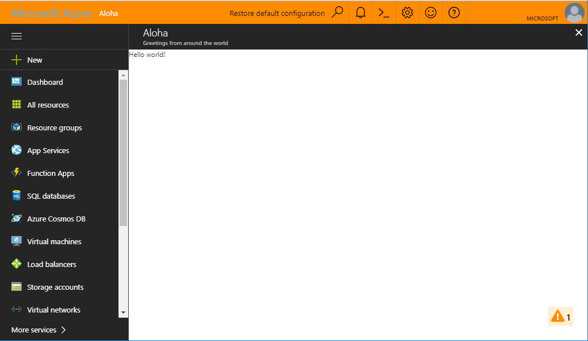

<a name="legacy-blades"></a>
## Legacy Blades

A blade is the vertical container that acts as the starting point for any journey. You can define multiple blades, each of which contains a collection of statically defined lenses and parts.

**NOTE**: Given the complexity associated with this model, extension authors are encouraged to use TemplateBlades instead, as specified in [top-blades-template.md](top-blades-template.md).

The following image contains a legacy blade.



**NOTE**: In this discussion, `<dir>` is the `SamplesExtension\Extension\` directory, and  `<dirParent>`  is the `SamplesExtension\` directory, based on where the samples were installed when the developer set up the SDK. If there is a working copy of the sample in the Dogfood environment, it is also included.

Blades can be created in any PDL file. They are aggregated at compile time into the extension definition, as in the code located at `<dir>\Client\V1\Blades\Locked\Locked.pdl`. The code is also in the following example.

```xml

<?xml version="1.0" encoding="utf-8" ?>
<Definition xmlns="http://schemas.microsoft.com/aux/2013/pdl"
            Area="V1/Blades">

  <!-- Sample of a blade that is locked -->
  <Blade Name="LockedBlade"
         ViewModel="{ViewModel Name=LockedBladeViewModel, Module=./Locked/ViewModels/LockedBladeViewModels}"
         Locked="True">
    <Lens Name="LockedBladeLens">

      <!-- Note that you cannot pin these parts, or move them -->
      <CustomPart Name="LockedPart1"
                  ViewModel="{ViewModel Name=LockedPart1ViewModel, Module=./Locked/ViewModels/LockedBladeViewModels}"
                  Template="{Html Source='.\\PartWithTitle.html'}" />

      <CustomPart Name="LockedPart2"
                  ViewModel="{ViewModel Name=LockedPart2ViewModel, Module=./Locked/ViewModels/LockedBladeViewModels}"
                  Template="{Html Source='.\\PartWithTitle.html'}" />
    </Lens>
  </Blade>

</Definition>


```

Blades use ViewModels to drive dynamic content, including titles, icons, and status.  The following is a list of legacy blade subtopics.

| Type                 | Document                                                       | Description |
| -------------------- | -------------------------------------------------------------- | ----------- |
| Controlling blade UI | [portalfx-blades-ui.md](portalfx-blades-ui.md)                 | Customizing blade behavior and experience | 
| Opening blades       | [portalfx-blades-opening.md](portalfx-blades-opening.md)       | How to open blades using the new container APIs or the legacy declarative APIs. | 
| Blade parameters     | [portalfx-blades-parameters.md](portalfx-blades-parameters.md) | Explicit declaration for parameters that blades are required to receive.    |  
| Blade properties     | [portalfx-blades-properties.md](portalfx-blades-properties.md) | Information sent to the blade as a `BladeParameter` is also sent to the blade ViewModel by using  a `<Property>` element. | 
| Blade outputs        | [portalfx-blades-outputs.md](portalfx-blades-outputs.md)       | A list of output properties that return data from a child blade back to the calling blade. | 
| Pinning blades       | [portalfx-blades-pinning.md](portalfx-blades-pinning.md)       | Pinning a blade creates a part on the currently active dashboard.    | 
| Closing blades       | [top-blades-opening-and-closing.md](top-blades-opening-and-closing.md)       | How to close the current blade that was called from a blade or a part container.  |
