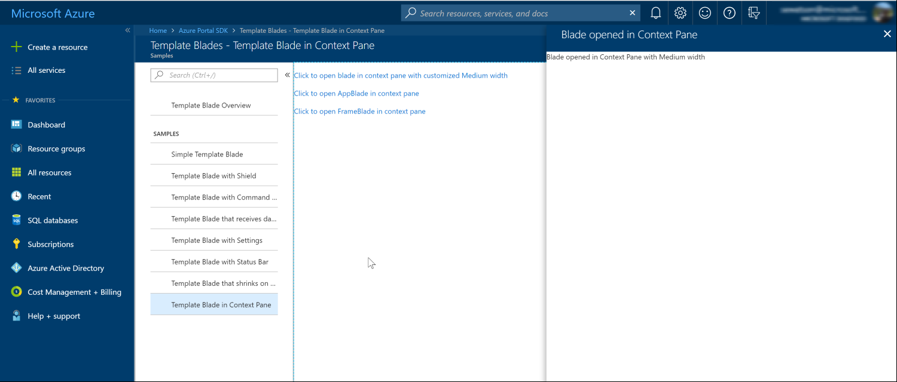

# Context blades

Context blades are a different visual representation of blades. The main difference is that they do not cause the screen to horizontally scroll when navigating to a context blade. Instead, the context blade  overlays on top of the current conten, beginning at  the right side of the screen, as in the following image.  This allows the user to interact with the context blade while retaining the context of the previous experience.

### When to use a context pane

Context blades are primarily used as leaf blades in your navigation experience. For example, if you want to present the user with properties that they can edit, or if you want to have the user create an entity, a single context blade is a good design choice.

### Examples of a context pane

An example of a context pane is in the following image.

### How to author a context blade

A context blade can be authored as a standard blade implementation. The extension can call a variant of the blade-opening APIs that will instruct the Portal to open the context blade at the location at which you want to open the blade. 
An example of using a context blade is located at `<dir>/Client/V1/Navigation/OpenAndCloseBladeApis/ViewModels/OpenBladeApiSamplesViewModel.ts`. It is also in the following code.

import * as FxCompositionBlade from "Fx/Composition/Pdl/Blade";
import { ViewModels as ViewModelDefinitions } from "../../../../_generated/ExtensionDefinition";
import { DataContext } from "../../NavigationArea";

// import references to blades that are opened by these samples
import * as Resources from "ClientResources";
import { ViewModel as HotspotViewModel } from "Fx/Controls/HotSpot";
import { AppBladeReference, ListViewChildBladeReference, OpenBladeApiChildBladeReference } from "../../../../_generated/BladeReferences";

import Def = ViewModelDefinitions.V1$Navigation.OpenBladeApiSamplesViewModel;
import BladeContainer = FxCompositionBlade.Container;

// Imports for the grid view sample
import Grid = MsPortalFx.ViewModels.Controls.Lists.Grid;
import QueryView = MsPortalFx.Data.QueryView;

// Data type used in the grid sample
export type Person = SamplesExtension.DataModels.Person;

export class OpenBladeApiSamplesViewModel
    extends MsPortalFx.ViewModels.Blade
    implements Def.Contract {

    private _container: BladeContainer;

    public bladeOpened = ko.observable(false);

    public contextBladeOpened = ko.observable(false);

    /**
     * Hotspot view model
     */
    public hotspot: HotspotViewModel;

    public grid: Grid.ViewModel<Person, Person>;

    private _view: QueryView<Person, string>;

    constructor(container: BladeContainer, initialState: void, dataContext: DataContext) {
        super();
        this.title(Resources.openBladeAPITitle);
        this.subtitle(Resources.navigationSamplesTitle);

        this._container = container;

        this._initializeHotSpotSample(container);

        this._initializeGridSample(container, dataContext);
    }

    /**
     * onInputsSet is invoked when the template blade receives new parameters
     */
    public onInputsSet(inputs: Def.InputsContract, settings: Def.SettingsContract): MsPortalFx.Base.Promise {
        // fetch data for the grid sample
        return this._view.fetch("");
    }

    public onOpenChildBladeLinkClick() {
        this._container.openBlade(new OpenBladeApiChildBladeReference());
    }

    public onButtonClick() {
        // this callback is invoked when the blade is closed
        const onBladeClosed = () => {
            // just for demonstration purposes we set a value that is displayed in the blade to false
            this.bladeOpened(false);
        };

        // The openBlade API returns a promise that is resolved after the blade is opened
        const openBladePromise = this._container.openBlade(new OpenBladeApiChildBladeReference(onBladeClosed));

        // If the promise result is true the blade was sucessfully opened.
        // If the promise is false the blade could not be opened.
        // This can happen for example if a different blade is open with edits and the user doesn't want to lose their changes
        openBladePromise.then((result) => {
            this.bladeOpened(result);
        });
    }

    public onContextBladeButtonClick() {
        // this callback is invoked when the blade is closed
        const onBladeClosed = () => {
            // just for demonstration purposes we set a value that is displayed in the blade to false
            this.contextBladeOpened(false);
        };

        const openContextBladePromise = this._container.openContextPane(new OpenBladeApiChildBladeReference(onBladeClosed));

        openContextBladePromise.then((result) => {
            this.contextBladeOpened(result);
        });
    }

    public onContextAppBladeButtonClick() {
        /* Opens an AppBlade in the context menu (additional sample) */
        this._container.openContextPane(new AppBladeReference());
    }

    public onRowClick(item: Person) {
        this._container.openBlade(new ListViewChildBladeReference({
            ssnId: item.ssnId(),
        }));
    }

    private _initializeHotSpotSample(container: BladeContainer) {
        this.hotspot = new HotspotViewModel(container, {
            onClick: () => {
                container.openBlade(new OpenBladeApiChildBladeReference());
            },
        });
    }

    private _initializeGridSample(container: BladeContainer, dataContext: DataContext) {
        this._view = dataContext.personData.peopleQuery.createView(container);

        const selectionOptions: Grid.SelectableRowExtensionOptions<Person, Person> = {
            selectableRow: {
                selectionMode: Grid.RowSelectionMode.Single,
            },
            onRowClicked: this.onRowClick.bind(this),
        };

        this.grid = new Grid.ViewModel<Person, Person>(container, this._view.items, Grid.Extensions.SelectableRow, selectionOptions);
        this.grid.columns([
            {
                itemKey: "ssnId",
            },
            {
                itemKey: "name",
            }]);
    }
}

    
For information about blade references, see [top-blades-opening-and-closing.md#open-blade-methods](top-blades-opening-and-closing.md#open-blade-methods).
