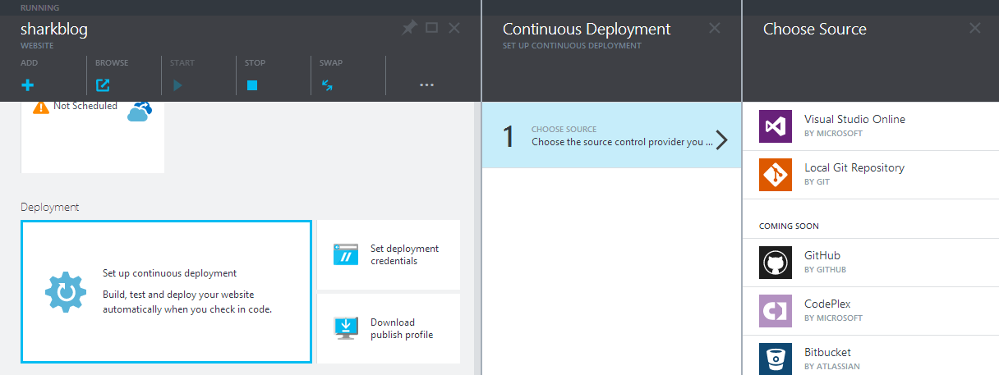

# Setting up for Azure Portal Development

## Get started

The following procedure specifies how to set up a developer computer for Azure extension development.
   
1. Install the pre-requisites as documented in [top-extensions-install-software.md](top-extensions-install-software.md).

1. Build an empty extension, and then transform it into a "Hello World" extension as specified in [portalfx-extensions-create-first-extension.md](portalfx-extensions-create-first-extension.md).

1. Samples are part of the downloaded SDK, and the  DOGFOOD (DF) environment displays working copies of the samples. Browse through the samples that are located at [top-extensions-samples.md](top-extensions-samples.md) to explore live examples of APIs.

For more information about key components of an extension, see [portalfx-extensions-key-components.md](portalfx-extensions-key-components.md).

For more information about building extensions with TypeScript decorators, watch the video that is located at [https://aka.ms/portalfx/typescriptdecorators](https://aka.ms/portalfx/typescriptdecorators).

## Develop the extension

1. Build the extension and sideload it for local testing. Sideloading allows the testing and debugging of the extension locally against any environment. This is the preferred method of testing. For more information about sideloading, see [top-extensions-sideloading.md](top-extensions-sideloading.md). 

1. Complete the development and unit testing of the extension. For more information on debugging, see [top-extensions-debugging.md](top-extensions-debugging.md) and [top-extensions-sideloading.md](top-extensions-sideloading.md).

1. Address the production-ready metrics criteria to meet previous to moving the extension to the next development phase. The production-ready metrics are located at [top-extensions-production-ready-metrics.md](top-extensions-production-ready-metrics.md).

1. Create configuration files for the extension as specified in [portalfx-extensions-configuration-overview.md](portalfx-extensions-configuration-overview.md).

## Exploit extensibility

One of the great things about the Azure portal is the ability for multiple services to blend together to form a cohesive user experience.  In many cases, extensions will want to share parts, share data, and kick off actions. There are a few examples where this is useful:

- The [Azure Websites](https://azure.microsoft.com/en-us/services/websites/) browse blade includes a part from [Visual Studio Team Services](https://www.visualstudio.com/team-services), as specified in [top-extensions-sharing-blades-and-parts.md](top-extensions-sharing-blades-and-parts.md), which sets up continuous deployment between a source code repository and a web site.

- After configuring continuous deployment, the Visual Studio Online extension informs the Azure Websites extension it is complete with an RPC callback.

To start learning more about parts, see [top-extensions-sharing-blades-and-parts.md](top-extensions-sharing-blades-and-parts.md). 

## Maintain development environment

Developers need to keep their development environments current while they are implementing extensions.  They should occasionally revisit the software that was installed as specified in [top-extensions-install-software.md](top-extensions-install-software.md) to ensure that their development platforms use the most recent software that is compatible with Azure Development.  For example, [http://aka.ms/portalfx/downloads](http://aka.ms/portalfx/downloads) specifies the most recent edition of the Azure Portal SDK.

 <!--TODO: Determine whether there  is a more direct way to make the following link:
    [/gallery-sdk/generated/gallery-items.md#Gallery Item Specificiations](/gallery-sdk/generated/gallery-items.md#gallery-item-specificiations) -->

    
 <!--TODO: Determine whether there  is a more direct way to make the following link:
    [/gallery-sdk/generated/index-gallery.md#gallery-package-development-and-debugging-testing-in-production](gallery-sdk/generated/index-gallery.md#gallery-package-development-and-debugging-testing-in-production)
    -->

## Frequently Asked Questions

   <!-- TODO:  FAQ Format is ###Link, ***title***, Description, Solution, 3 Asterisks -->

### Getting Started

***Q: I want to create a new extension. How do I start?***

SOLUTION: To contribute an extension to the Portal, you can build an extension in its own source tree instead of cloning the a Portal repository.

You can write an extension by following the instructions in using the [portalfx-extensions-create-first-extension.md](portalfx-extensions-create-first-extension.md), deploy it to your own machine, and load it into the Portal at runtime.

When you are ready to register the extension in the preview or production environments, make sure you have the right environment as specified in  [top-extensions-developmentPhases.md](top-extensions-developmentPhases.md). Then publish it to the environment as specified in [top-extensions-publishing.md](top-extensions-publishing.md).

For more information about Portal architecture, see [top-extensions-architecture.md](top-extensions-architecture.md).

### Getting Help

***Q: I'm stuck. Where can I find help?***

SOLUTION: There are a few ways to get help.

* Read the documentation located at [https://github.com/Azure/portaldocs/tree/master/portal-sdk/](https://github.com/Azure/portaldocs/tree/master/portal-sdk/).

* Read and experiment with the samples that are shipped with the SDK. They are located at `\My Documents\PortalSDK\FrameworkPortal\Extensions\SamplesExtension`   directory. If there is a working copy of the sample in the Dogfood environment, it is located at [http://aka.ms/portalfx/samples](http://aka.ms/portalfx/samples). Sections, tabs, and other controls can be found in the playground located at [https://aka.ms/portalfx/playground](https://aka.ms/portalfx/playground).

* Read the debugging guide located at [top-extensions-debugging.md](top-extensions-debugging.md).

* If you are unable to find an answer, reach out to the Ibiza team at  [Stackoverflow Ibiza](https://stackoverflow.microsoft.com/questions/tagged?tagnames=ibiza).  For a list of topics and stackoverflow tags, see [portalfx-stackoverflow.md](portalfx-stackoverflow.md).

### Broswer Support

***Q: Which browsers are supported?***

SOLUTION: Currently the Portal supports the latest version of Edge, Firefox, Chrome, and Safari, and it also supports Internet Explorer Version 11.

### Blade Commands

***Q: How do I show different commands for a blade based on the parameters passed to that blade?***

SOLUTION:

This is not possible with PDL-based Commands, but is possible with TypeScript-based commands.
The **Toolbar** APIs allow an extension to call `commandBar.setItems([...])` to supply the list of commands at run-time. For more information, see `<dir>\Client\V1\Blades\Toolbar\Toolbar.pdl`, where  `<dir>` is the `SamplesExtension\Extension\` directory, based on where the samples were installed when the developer set up the SDK.

<!--
gitdown": "include-file", "file": "../templates/portalfx-extensions-glossary-getting-started.md"}
-->