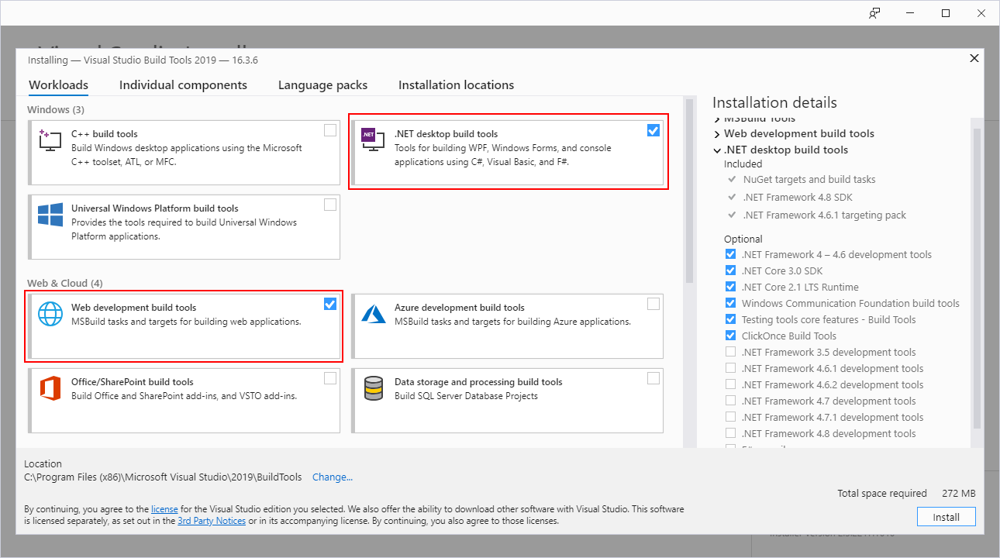
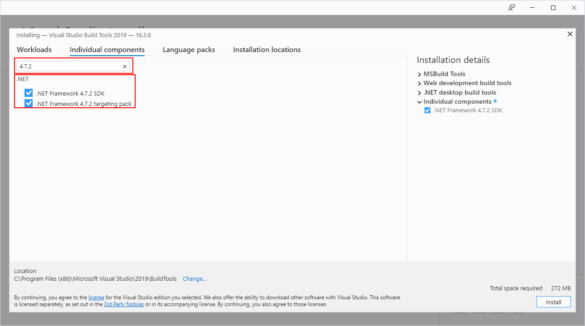
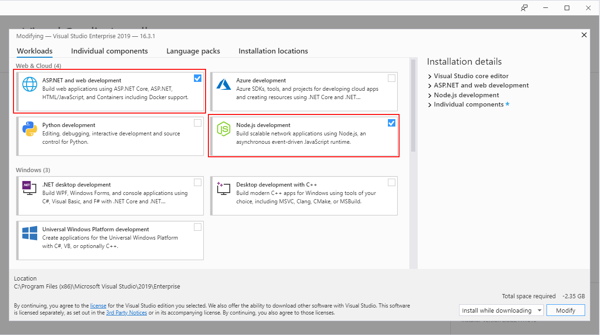
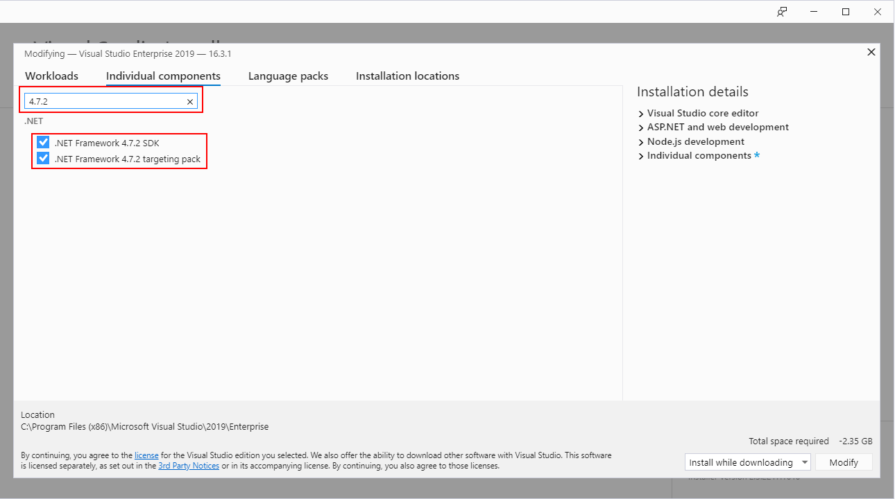

# Install prerequisite Software for Extension Development

Install the following software. Your team should be aware of the most current download locations so that you can complete your own installs.

## Common

1. Windows 10, Windows Server 2016, or the most recent edition of Windows client or server

    * Windows 10
    
      [https://www.microsoft.com/en-us/software-download/windows10](https://www.microsoft.com/en-us/software-download/windows10)

    * Windows Server 2016

      [https://www.microsoft.com/en-us/evalcenter/evaluate-windows-server-2016](https://www.microsoft.com/en-us/evalcenter/evaluate-windows-server-2016)

1. Install [Node.js LTS 10.6.0 or later](https://nodejs.org/dist/v10.6.0/node-v10.6.0-x64.msi).

1. Install npm version 6.10.0 or later. To install run the following from the command prompt `npm install -g npm@latest`

1. Install [Nuget + Credential Provider](https://msazure.pkgs.visualstudio.com/_apis/public/nuget/client/CredentialProviderBundle.zip) 

      * unzip to some path e.g c:\dev\_prereq then add it to your environmental path by running the following command from an administrative command prompt `setx PATH "%PATH%;c:\dev\_prereq\CredentialProviderBundle"`

1. Install [git](https://git-scm.com/downloads)

## IDE Specific

### Visual Studio Code (or other similar IDE)

1. Install [Build Tools for Visual Studio 2019](https://visualstudio.microsoft.com/thank-you-downloading-visual-studio/?sku=BuildTools&rel=16). 
      *(Note that this installs the backend build tools without installing the VS IDE itself.)*

      * Select the following workloads from the *workloads* tab: 
        * .NET desktop build tools
        * Web development build tools

      

      * Select .NET Framework 4.7.2 SDK and targeting pack from the *Individual components* tab:

      

      * Add it to your environmental path by running the following command from an administrative command prompt `setx PATH "%PATH%;%ProgramFiles(x86)%\Microsoft Visual Studio\2019\BuildTools\MSBuild\Current\Bin"`

1. Install [Visual Studio Code](https://code.visualstudio.com/download)
    
    If you also have VS 2019 installed or are on CoreXT a large number of the following will already be present and coming from your CxCache %NugetMachineInstallRoot%. You can check each in your development environment and apply on a case by case basis.

### Visual Studio 2019

1. Visual Studio 2019 Professional or Enterpise is located at [https://visualstudio.microsoft.com/downloads/](https://visualstudio.microsoft.com/downloads/).
      
      * Select the following workloads from the *workloads* tab: 
        * Node.js development
        * ASP.NET and web development

      

      * Select .NET Framework 4.7.2 SDK and targeting pack from the *Individual components* tab:

      

To validate that your dev machine is ready for Azure Portal Extension development start with the template extension in the [Getting Started Guide](top-extensions-getting-started.md)
