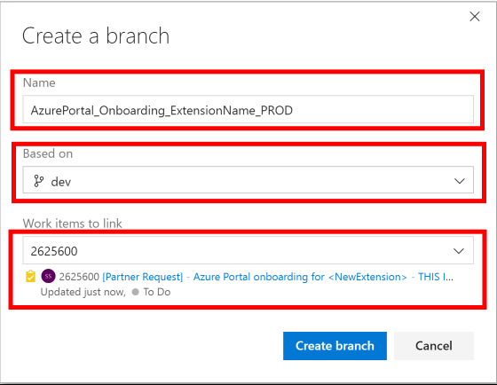
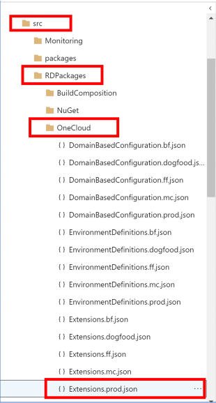
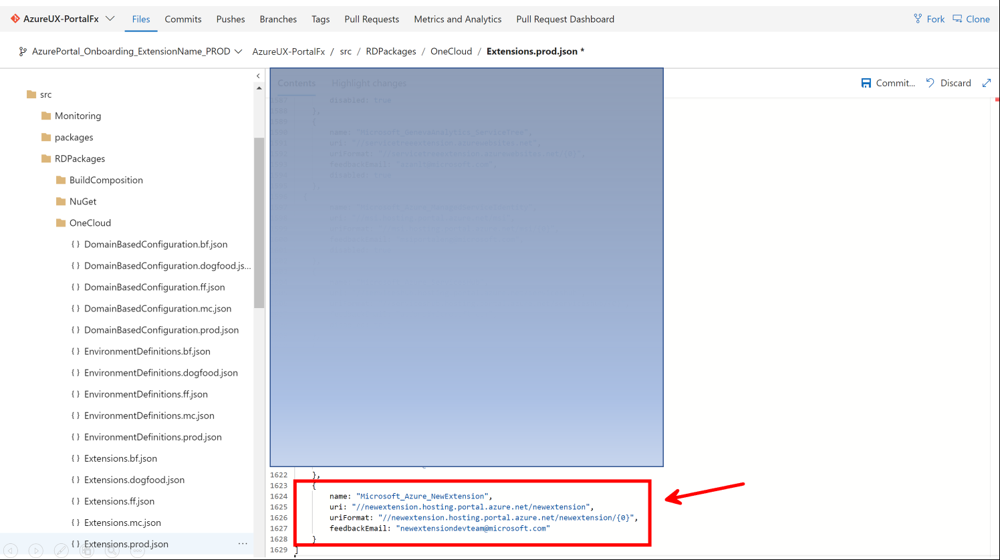
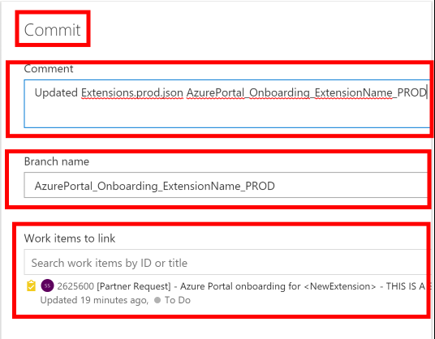
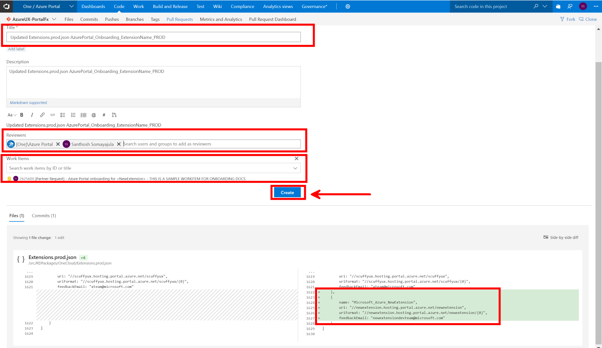

<a name="publishing-your-portal-extension"></a>
## Publishing your portal extension

* [Publicly available extensions](#publicly-available-extensions)

* [Extensions for the C Sharp test framework](#extensions-for-the-c-sharp-test-framework)

* [Another way to send a pull request](#another-way-to-send-a-pull-request)

* * * 

<a name="publishing-your-portal-extension-publicly-available-extensions"></a>
### Publicly available extensions

When an extension development team decides to make the extension publicly available, the Portal's configuration files are updated so that users other than the team can view the extension in the various Portal production and pre-production environments. 

The Portal is deployed in four different environments: `dev`, `Dogfood`, `MPAC`, and `PROD`. The deployments are from four branches in the Portal repository. Always make code changes to a branch forked out of the Dev branch.  Create  a Pull request to merge the changes into Dev branch. Pull requests are also used to cherry-pick extension configurations from one branch to the next one by updating the configuration files that govern each environment. This document assumes that the extension has been completely developed and tested, and is ready to be moved to the next branch, as specified in [portalfx-extensions-branches.md](portalfx-extensions-branches.md). This document encompasses extension configuration files in the Portal repository; the source code for the extension is out of the scope of this document.

As per the safe deployment mandate, all configuration changes are treated as code changes. Consequently, they use similar deployment processes. Changes that are checked in to the dev branch will be deployed in the following order: **Dogfood** -> **RC** -> **MPAC** -> **PROD** -> National Clouds (**BlackForest**, **FairFax**, and **Mooncake**).  The table in [top-extensions-svc-lvl-agreements.md](top-extensions-svc-lvl-agreements.md) specifies the amount of time allowed to complete the deployment.

**NOTE**: If the pull requests are not sent in the above specified order of environments, or if the commit message for the extension has changed, then the extension will experience a unit test failure and the changes can be reverted without any notice to the developer.  It is NOT guaranteed that the changes will get merged to top level branches automatically and may require extension owners to manually cherry-pick to top level branches in the order mentioned above. 

The configuration file for the extension that will be cherry-picked should be similar to the examples in [portalfx-extensions-configuration-overview.md](portalfx-extensions-configuration-overview.md). The relationship between the environments and the configuration files specified in [portalfx-extensions-branches.md](portalfx-extensions-branches.md).

 For permission to send pull requests, developers should join the **Azure Portal Partner Contributors - 19668(19668)** group as specified in [top-onboarding.md#join-dls-and-request-permissions](top-onboarding.md#join-dls-and-request-permissions).

All the pull requests should be sent first to the dev branch. To add or update or your extension's configuration, use the following process to send a pull request to the reviewers that you can specify in the request.

1. Open or locate the associated bug at [http://aka.ms/portalfx/exec/bug](http://aka.ms/portalfx/exec/bug). Then use the bug ID and bug title in the git commit message. 

1. In the framework repository, the extension configuration files for all Portal environments are located at `<repoRoot>\src\RDPackages\OneCloud`, where `<repoRoot>` is the root of the repository.  The developer can communicate with the remote repository by setting up a local git repository. To manage the extension's configuration, make a clone by using the following commands at the command line.

   ```js
    git clone https://msazure.visualstudio.com/DefaultCollection/One/_git/AzureUX-PortalFx
    cd AzureUX-PortalFx\
    git checkout dev
    init.cmd
    REM  The following directory contains the Environment.*.json files to which to add or update the extension
    cd <repoRoot>\src\RDPackages\OneCloud
  
    REM   fetch down all the branches from the Git remote
    git fetch
   ```
    
    When these commands complete successfully, the developer has a clone of the Portal configuration directories.

1.  The developer may need to modify the configuration file(s) to enable the extension, as specified in [portalfx-extensions-configuration-procedure.md#managing-the-configuration-of-the-extension](portalfx-extensions-configuration-procedure.md#managing-the-configuration-of-the-extension). The modified configuration files would then be staged, committed, and pushed to the developer's remote repository.

    **NOTE**: There should be one config file for every environment that will be affected by the pull request for this extension.

1.  Stage the changes in the local git repository so that the pull request will pick them up from the remote repository, as described in [https://git-scm.com/book/en/v2/Git-Basics-Working-with-Remotes](https://git-scm.com/book/en/v2/Git-Basics-Working-with-Remotes). Remember to include the bug ID or work item ID in the custom commit message. The commands for the staging process are as follows.

     ```js
    REM   Create a branch from which to issue a pull request in the Ibiza Git repository.
    git checkout -b myalias/extensionupdate

    REM   Commit the staged content. Possible values for this file are:
    REM     Extensions.dogfood.json, Extensions.prod.json, Extensions.bf.json,
    REM     and Extensions.ff.json, Extensions.mc.json
    git add <Modified_Extension.*.json_Files>

        
    REM   Include the Bug ID and title in the custom git commit message immediately after the pound sign.
    REM     Save the commit hash that is returned from this command for later reference.
    REM     The build will break immediately if the commit message is not well-formed 
    TEM       The developer will get a notification to update the commit message.
    git commit -m "#1234567 Add/ Enable the extension"

    REM   Push local branch commits to the remote repository branch
    git push origin myalias/extensionupdate

    cd %ROOT%\src\
    buildall

    REM   Test if all the test cases passed. If any test case fails,
    REM     re-verify the config
    testconfig 
     ```

    The build will break immediately if the commit message is in a different format, or the config changes are invalid.  The developer will receive a notification to update the commit message.

    **NOTE**:  Use the commit hash that was returned from the previous `git commit` command. It can also be found on the site that is located at [https://msazure.visualstudio.com/One/_git/AzureUX-PortalFx/commits](https://msazure.visualstudio.com/One/_git/AzureUX-PortalFx/commits).

1. Create a work item and associate it with the commit. Use the site located at [https://aka.ms/portalfx/pullrequest](https://aka.ms/portalfx/pullrequest). Click the `New pull request` button, then select the branch that contains the staged changes in the first dropdown box.  Select the target branch in the second dropdown box. In the following example, the developer is requesting to move configuration changes from their `extensionupdate` branch to the `dev` branch.

   

1. The pull request description should include the bug ID, the bug title, and optionally a short description of the solution, and any other items that the Ibiza team may need to update the Portal environment configuration files. Validate that the branches and reviewers are accurate, then click the `Create` button to email the pull request to the reviewers.

1. The Ibiza team will review the pull request to ensure that the changes you have made are correct and will not cause any live-site issues.  If the pull request successfully passes the review, they will complete it.  A list of Ibiza team contacts to select as reviewers is located at [portalfx-extensions-contacts.md](portalfx-extensions-contacts.md).  

When the changes are successfully deployed in any environment, the developer will receive an email.

<a name="publishing-your-portal-extension-extensions-for-the-c-sharp-test-framework"></a>
### Extensions for the C Sharp test framework

These instructions can be used to submit pull requests for C# Test Framework improvements, with the following additions.

1. The Test Framework uses a different `<repoRoot>`
1. The Test Framework is not associated with the production extension branches
1. You may or may not want to set up a new local git repository specifically for test framework improvements 
1. The configuration files must be modified to match the test framework environment

For more information about submitting improvements to the C# Test Framework, see [portalfx-csharp-test-publish.md](portalfx-csharp-test-publish.md).

<a name="publishing-your-portal-extension-another-way-to-send-a-pull-request"></a>
### Another way to send a pull request

For those of you who are already familiar with the environments and their processes may want to use the following steps instead of the steps that are located in [Publicly available extensions](#publicly-available-extensions).

1. Go to [https://msazure.visualstudio.com/One/Azure%20Portal/_git/AzureUX-PortalFx/branches](https://msazure.visualstudio.com/One/Azure%20Portal/_git/AzureUX-PortalFx/branches).

1. Click on "**New Branch**", as in the following image.

   

1. 	On the "**Create a branch**" dialog, enter the following information.

	1. **Name**: Name of the branch

	1. **Based on**: Set this to "dev" branch

    1. **Work items to link**: Create a workitem in the area named `One\Azure Portal\Onboarding` for onboarding the extension and set the appropriate title,  as in the following images.

       

       

    A sample branch is located at [https://msazure.visualstudio.com/One/Azure%20Portal/_workitems/edit/2625600](https://msazure.visualstudio.com/One/Azure%20Portal/_workitems/edit/2625600).

1. Switch to the new branch, as in the following image.

   

1. Open the file named `src/RDPackages/OneCloud/Extensions.prod.json`.

   

    There are multiple ways to navigate to the same location.

   

1. Click on the "**Edit**" button.

   

1. Update the configuration file with the section that was specified in the "**Create a branch**" workitem.

   

1. Click the "**Commit**" button to commit the changes.

   
   
1. Update the commit message and workitem in the "**Commit**" dialog box, as in the following image.

   

1. Click the "**Commit**" button at the bottom of the dialog. If you do not see the button, use the **Tab** key instead.

   

1. Click on the **Create a pull request** link.

   

1. Verify the details before the pull request is created.

   

1. Click the "**Create**" button to create the Pull Request.

1. Send email to <a href="mailto:ibiza-onboarding@microsoft.com?subject=Pull%20Request%20link&body=Hello,%20I%20need%20you%20to%20approve%20a%20pull%20request%20and%20expedite%20the%20associated%20request.%20The%20pull%20request%20link%20is%20.%20.%20.">ibiza-onboarding@microsoft.com</a> that contains a link to the Pull Request to get the approval and expedite the request.