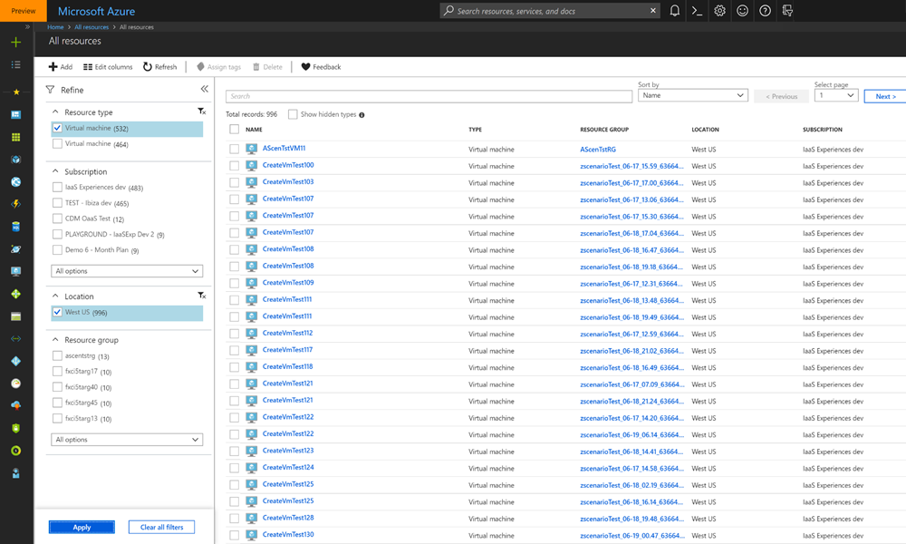

## Overview

The Resource Browse pattern provides resource discovery and management across resource groups. It allows users to view lists of resources of a single resource type, or multiple resource types, across regions, locations, and subscriptions.  The resource browse page, or the Browse blade, is typically the entry point into an Azure service.

The `All resources` service, as in the following example, is one of the most used services because it enables you to browse across all Azure resource types in a single list.  
  

  
Resource browse provides easy filtering, searching, sorting and grouping within the list.  The user can perform bulk actions to take action on selected resources directly from the list.  Selecting a resource from the browse experience will invoke the Resource Manage experience.

Some examples are as follows.

* All Resources for the RC portal are located at   [http://aka.ms/portalfx/allRCResources](http://aka.ms/portalfx/allRCResources)

* All Virtual Machines for the RC portal are located at  [http://aka.ms/portalfx/allRCVirtualMachines](http://aka.ms/portalfx/allRCVirtualMachines)

Resource facets can be collapsed, as in the following example, to allow more space for columns in the resource grid.

 Resources can also be filtered, so that only the ones most relevant to the current task are displayed. In the following image, resources are filtered by resource type and by location.
 

## Browse behaviors

The Resource Browse is a fullscreen experience, as in the following image.
 

The key items that are displayed are as follows.

* Title

    The title is typically a descriptive plural noun that reflects the items in the grid.  It does not change to reflect any filtering, searching or sorting. Some examples are: `All resources`, `Virtual machines`, and `Storage accounts`. 

    Remember to include the display name, including singular and plural forms, in addition to uppercase and lowercase variants for the resource, as specified in [portalfx-extensions-assets.md#define-the-asset-type](portalfx-extensions-assets.md#define-the-asset-type). Also remember to define keywords for the asset so that the service will be more discoverable.

* Toolbar

    The toolbar contains actions that operate against the grid. For more information, see [#toolbar](#toolbar).
    
* Filter panel

    The filter panel contains a list of properties that are common across all the resource types displayed in the grid. 

    <!-- TODO: Locate SDK reference for how the set of properties in the filter panel are specified  -->

    **NOTE**: Remember to include key filters for specified resource types.

* Search

    The following image displays a search of grid items in a filtered list. The search is for string  "HR".

    

* Sort
 
    Handled by the grid

* Pagination
 
    Handled by the grid

* Number of records

    Displays the record set being displayed and the total number of resources.

* Grid

    By default, no-code Browse displays the resource name, resource group, location and subscription.  It is recommended that you choose key resource properties to display as columns, so that your customer can differentiate the resources in the grid.  You can specify default columns and available columns, as specified in [top-extensions-browse.md#customize-columns](top-extensions-browse.md#customize-columns).

    **NOTE**: Typical columns that are included in a grid are Name, location, and subscription.

    * Drill-in links

    * Per-row actions

        Actions can be added on a per-row basis using context menu commands as specified in [top-extensions-browse.md#add-context-menu-commands](top-extensions-browse.md#add-context-menu-commands).

### Toolbar

The toolbar allows the user to add and delete resources from the grid, in addition to performing resource-specific actions for a limited set of resource types. An example toolbar is in the following image.
    
    
    
    The recommended actions for the toolbar are as follows.

    * Add

        Invokes the Resource Create experience for the resource types displayed in the "new" resource blade. Uses the `Add command` SDK as specified in [top-extensions-browse.md#the-add-command](top-extensions-browse.md#the-add-command).

    * Edit columns

        Change the columns in the grid. An example is in the following image.

        

        **NOTE**: Remember to include key columns for specified resource types. Do not offer a Resource Browse experience that does not contain any resource-specific properties.
  
    * Refresh

        Repopulate the grid with fresh data
        
    * Assign tags

        Assign tags to the selected grid items.  The option is disabled until grid items are selected.

    * Delete

        Delete the selected grid items.  The option is disabled until grid items are selected.

    * Feedback
        
        Allows users to give feedback about the Azure Portal Resource Browse experience.
