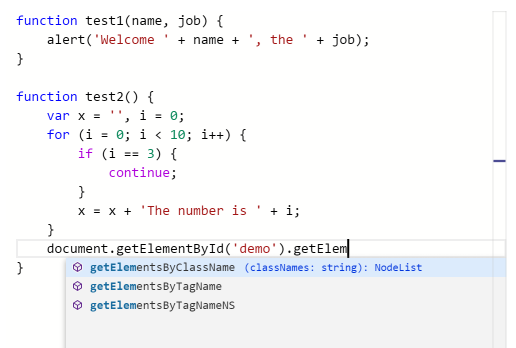

## Editor

The `Editor` control is a wrapper for the **Monaco** editor that supports various languages, syntax highlighting, **Intellisense**, real-time syntax checking and validation, as in the following example.



### Editor Basics

To use the editor, compose a part that hosts the editor control, then use it from the extension.

**NOTE**: In this discussion, `<dir>` is the `SamplesExtension\Extension\` directory, and  `<dirParent>`  is the `SamplesExtension\` directory, based on where the samples were installed when the developer set up the SDK. 

This example uses the following code.

* `<dir>\Client\V1\Controls\Editor\Templates\EditorInstructions.html`

  Contains the Html template for the part

* `<dir>\Client\V1\Controls\Editor\ViewModels\EditorViewModels.ts` 

  Contains the ViewModel to which to bind the control

* `<dir>\Client\V1\Controls\Editor\Editor.pdl`

  Connects the part to the extension by referencing it in the PDL

You can control the behavior and features of the editor via initialization options.

1. Define the Html template for the part.

1. Create a ViewModel to which to bind the control. The ViewModel for the editor control is included in the following code.

     {"gitdown":"include-section","file":"../Samples/SamplesExtension/Extension/Client/V1/Controls/Editor/ViewModels/EditorViewModels.ts","section":"editor#sampleEditorViewModel"} 

1. Now the part can be consumed from an extension by referencing it in the PDL, as in the following code.

     {"gitdown":"include-section","file":"../Samples/SamplesExtension/Extension/Client/V1/Controls/Editor/Editor.pdl","section":"editor#custompart"}

### Editor with Custom Language

Custom language can be used by declaring an inherited Editor control ViewModel with rules and suggestions. This example uses the following code.

* `<dir>\Client\V1\Controls\Editor\Templates\CustomLanguageEditor.html`

  Contains the Html template for the part

* `<dir>\Client\V1\Controls\Editor\ViewModels\CustomLanguageEditorViewModels.ts`

  Contains the ViewModel to which to bind the control

* `<dir>\Client\V1\Controls\Editor\Editor.pdl`

  Connects the part to the extension by referencing it in the PDL

1. Define the Html template for the part.

1. Create a ViewModel to which to bind the control, as in the following example.

    ```cs
    /**
    * ViewModel class for the custom language editor sample part.
    */
    export class CustomLanguageEditorPartViewModel {

        /**
        * ViewModel for the editor.
        */
        public editor: Editor.ViewModel;

        /**
        * Creates a new instance of the EditorInstructionsPartViewModel class.
        *
        * @param container The ViewModel for the part container.
        * @param initialState The initial state for the part.
        * @param dataContext The data context.
        */
        constructor(
            container: MsPortalFx.ViewModels.PartContainerContract,
            initialState: any,
            dataContext: ControlsArea.DataContext) {

            // Initialize the editor ViewModel.  If we were getting the data from teh data context, we would pass it in here.
            this.editor = new CustomLanguageEditorViewModel(container);

            // create the initial markers
            this.updateMarkers(this.editor.content());

            // whenever the code in the editor changes process it and set the markers
            this.editor.content.subscribe(container, this.updateMarkers.bind(this));

            // perform auto save every 500ms to update markers as the user edits the text
            this.editor.autoSaveTimeout(500);
        }

        /**
        * try to match the given pattern in the provided line, if matched construct a marker for that line
        */
        private processTerm(line: string, lineIndex: number, termPattern: string, severity: MsPortalFx.ViewModels.Controls.Documents.Editor.MarkerSeverity): MsPortalFx.ViewModels.Controls.Documents.Editor.EditorMarker {

            // try to match the pattern
            var termIndex = line.indexOf(termPattern);
            if (termIndex === -1) {
                return null;
            }

            // we found the pattern in the line so we create a marker which uses the defined severity and the rest of the text
            // from the pattern location in the line to the end as the message
            return <MsPortalFx.ViewModels.Controls.Documents.Editor.EditorMarker> {
                message: line.substring(termIndex + termPattern.length),
                severity: severity,
                range: <MsPortalFx.ViewModels.Controls.Documents.Editor.EditorRange> {
                    startLineNumber: lineIndex + 1,
                    startColumn: termIndex + 1,
                    endLineNumber: lineIndex + 1,
                    endColumn: termIndex + termPattern.length + 1
                }
            };
        }

        /**
        * updates the markers according to the text content
        */
        private updateMarkers(value: string): void {

            // split the text into lines and process each to add an annotation to it
            var markers = value
                .split("\n")
                .map((line: string, index: number): MsPortalFx.ViewModels.Controls.Documents.Editor.EditorMarker => {

                    var term = this.processTerm(line, index, "[error]", MsPortalFx.ViewModels.Controls.Documents.Editor.MarkerSeverity.Error);
                    if (term !== null) {
                        return term;
                    }

                    term = this.processTerm(line, index, "[notice]", MsPortalFx.ViewModels.Controls.Documents.Editor.MarkerSeverity.Warning);
                    if (term !== null) {
                        return term;
                    }

                    term = this.processTerm(line, index, "[info]", MsPortalFx.ViewModels.Controls.Documents.Editor.MarkerSeverity.Info);
                    if (term !== null) {
                        return term;
                    }

                    return null;
                })
                .filter(marker => marker !== null);

            // update the markers
            this.editor.markers(markers);
        }
    }
    ```

1. Now the part can be consumed from the extension by referencing it in the PDL, as in the following code.

    ```xml
    <CustomPart Name="b_EditorInstructions_part1"
                    ViewModel="{ViewModel Name=EditorInstructionsPartViewModel, Module=./Editor/ViewModels/EditorViewModels}"
                    InitialSize="FullWidthFitHeight"
                    Template="{Html Source='Templates\\EditorInstructions.html'}" />
    <PartReference Name="EditorApiReferencePart"
                    InitialSize="FullWidthFitHeight"
                    PartType="ModuleReferencePart">
        <PartReference.PropertyBindings>
            <Binding Property="moduleName"
                    Source="{Constant MsPortalFx.ViewModels.Controls.Documents.Editor}" />
        </PartReference.PropertyBindings>
    </PartReference>
    ```