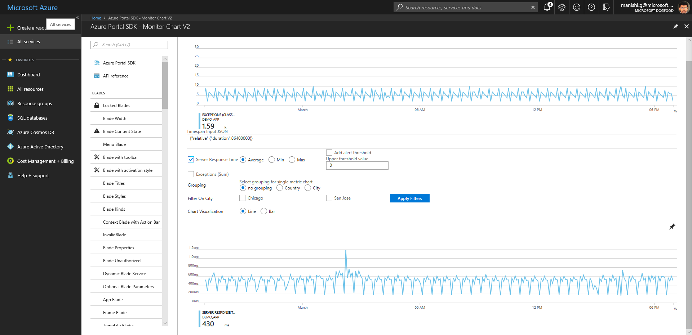
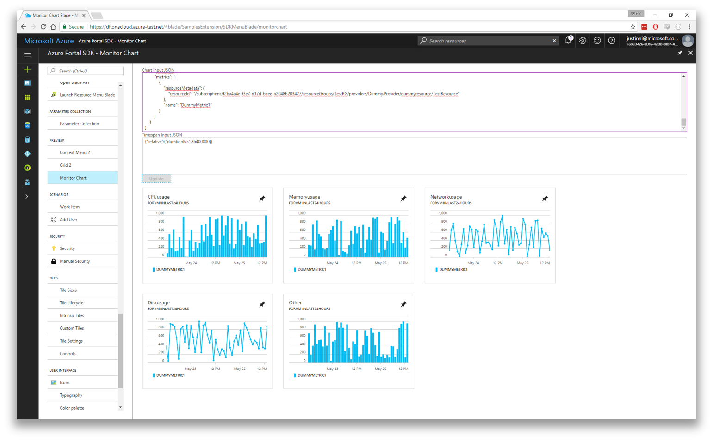
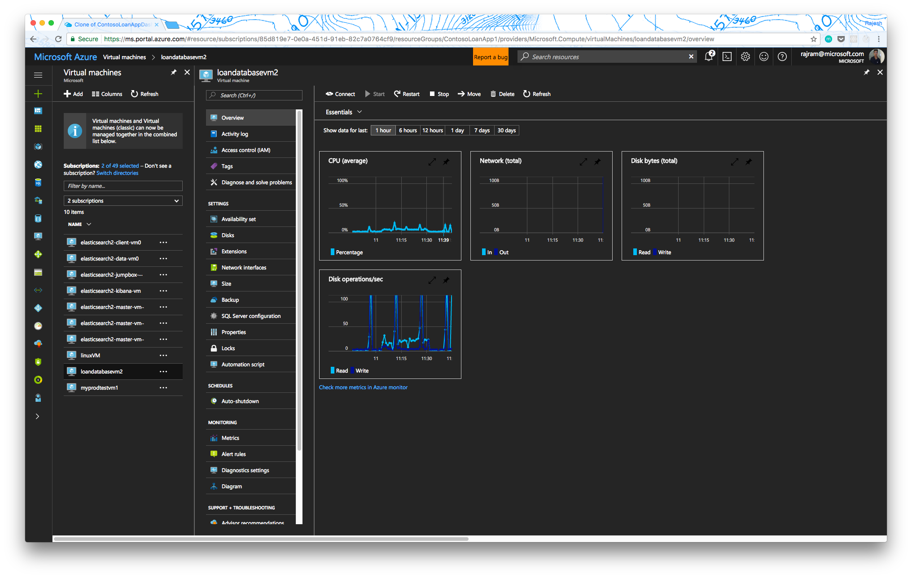
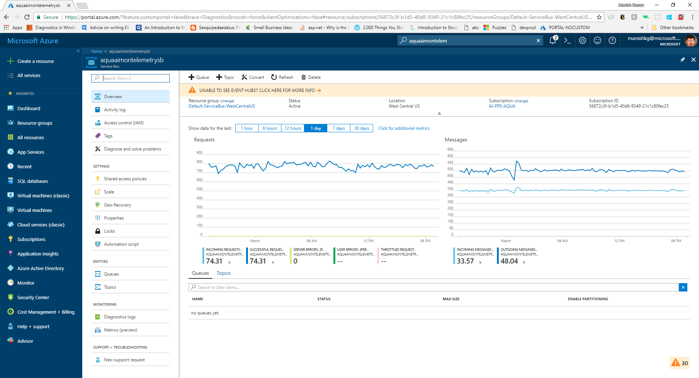
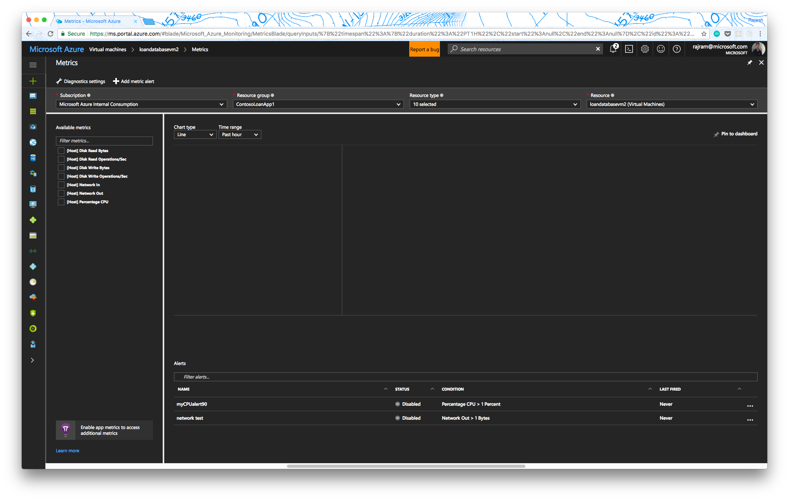

## Monitor Chart

The Monitor Chart control allows the plotting of metrics for an Azure resource. The Monitor Chart V2 control, which is a more recent edition, includes support for dimension based grouping and filters.
It is part of the Ibiza framework, and it inherently knows how to fetch data for a resource.

The Monitor Chart control is available in SDK version **5.0.302.731** and above. For more information about SDK versions, see [downloads.md](/portal-sdk/generated/downloads.md).

**NOTE**: In this discussion, `<dir>` is the `SamplesExtension\Extension\` directory, and  `<dirParent>`  is the `SamplesExtension\` directory, based on where the samples were installed when the developer set up the SDK. If there is a working copy of the sample in the Dogfood environment, it is also included.

Some of the benefits of using the Monitor Chart are as follows.

* Performance

    The charts are built to render quickly and make efficient network calls for data

* First class integration with Azure Monitor 

    When a chart is clicked, the metrics experience in Azure Monitor will be displayed

* Automatic responsive behavior

    An array of charts can be displayed responsively in the control

* Monitor Chart V2 control 

   The charts support grouping and filtering on the dimensions from multi-dimensional metric data.

If you are onboarding to Azure Monitor for the first time, please reach out to the <a href="mailto:monitoringcontrib@microsoft.com?subject=Azure Monitor Onboarding">Monitoring team</a>. The Monitoring team will add your resource type to a configuration which allows the Monitor Control to fetch metrics for your resources.

### Using the monitor chart control

Developers can add the monitor chart control to their extensions by using the following procedure.

1. Import the MonitorChart module.

1. Create the MonitorChart options and other items in the .ts file.

1. Create the ViewModel.

The monitor chart control can plot more than one chart while it is referenced.

For a complete list of the options that can be sent to the control, see  the `Fx/Controls/MonitorChart` and `Fx/Controls/MonitorChartV2` modules in the  `Fx.d.ts` file of the project.

You can view the monitor chart control interfaces directly in the PortalFx repository, which is located at [https://msazure.visualstudio.com/DefaultCollection/One/_git/AzureUX-PortalFX?path=%2Fsrc%2FSDK%2FFramework.Client%2FTypeScript%2FFx%2FControls%2FMonitorChart.ts&version=GBproduction&_a=contents](https://msazure.visualstudio.com/DefaultCollection/One/_git/AzureUX-PortalFX?path=%2Fsrc%2FSDK%2FFramework.Client%2FTypeScript%2FFx%2FControls%2FMonitorChart.ts&version=GBproduction&_a=contents) The monitor chart V2 control interface is located at [https://msazure.visualstudio.com/DefaultCollection/One/_git/AzureUX-PortalFX?path=%2Fsrc%2FSDK%2FFramework.Client%2FTypeScript%2FFx%2FControls%2FMonitorChartV2.ts&version=GBproduction&_a=contents](https://msazure.visualstudio.com/DefaultCollection/One/_git/AzureUX-PortalFX?path=%2Fsrc%2FSDK%2FFramework.Client%2FTypeScript%2FFx%2FControls%2FMonitorChartV2.ts&version=GBproduction&_a=contents). 

For a working copy, you can experiment with the monitor chart control sample located at [https://ms.portal.azure.com/?Microsoft_Azure_Playground=true#blade/Microsoft_Azure_Playground/ControlsIndex/MonitorChartPlayground](https://ms.portal.azure.com/?Microsoft_Azure_Playground=true#blade/Microsoft_Azure_Playground/ControlsIndex/MonitorChartPlayground) and the monitor chart V2 control located at [https://df.onecloud.azure-test.net/#blade/SamplesExtension/SDKMenuBlade/monitorchartv2](https://df.onecloud.azure-test.net/#blade/SamplesExtension/SDKMenuBlade/monitorchartv2).

### The monitorChart control

The monitor chart control sample code that adds the control to an extension is located at `<dir>\Client\V2\Preview\MonitorChart\MonitorChartBlade.ts`. It is also in the working copy located at [https://ms.portal.azure.com/?Microsoft_Azure_Playground=true#blade/Microsoft_Azure_Playground/ControlsIndex/MonitorChartPlayground](https://ms.portal.azure.com/?Microsoft_Azure_Playground=true#blade/Microsoft_Azure_Playground/ControlsIndex/MonitorChartPlayground) and in the following example.

    ```typescript
    import * as MonitorChart from "Fx/Controls/MonitorChart";
    ...

    // Create the MonitorChart options
    const timespan: MonitorChart.Timespan = {
        relative: {
            durationMs: 1 * 60 * 60 * 1000 // 1 hour
        }
    };
    const chartDefinition: MonitorChart.ChartDefinition = {
        metrics: [
            {
                name: "testMetric1",
                resourceMetadata: { resourceId: "test/resource/id" }
            }
        ]
    };
    const monitorChartOptions: MonitorChart.Options = {
        charts: [ chartDefinition ],
        timespan: timespan
    };

    // Create the MonitorChart viewmodel
    const monitorChartViewModel = MonitorChart.create(bladeOrPartContainer, monitorChartOptions);
    ```

### The monitorChart V2 control

The monitorChart V2 control can plot more than one metric on the chart while it is referenced. Also, it can plot multiple metrics for each chart. You can specify the dimensions by which to segment the data, and you can specify sets of filters with which to filter the data. The code sample that adds the V2 control to an extension is located at `<dir>\Client\V2\Preview\MonitorChart\MonitorChartBlade.ts`. It is also in the working copy located at [https://df.onecloud.azure-test.net/#blade/SamplesExtension/SDKMenuBlade/monitorchartv2](https://df.onecloud.azure-test.net/#blade/SamplesExtension/SDKMenuBlade/monitorchartv2) and in the following example.

    ```typescript
    import * as MonitorChart from "Fx/Controls/MonitorChart";
    ...

    // Create the MonitorChart options
    const timespan: MonitorChart.Timespan = {
        relative: {
            durationMs: 1 * 60 * 60 * 1000 // 1 hour
        }
    };
    const chartDefinition: MonitorChart.ChartDefinition = {
        metrics: [
            {
                name: "testMetric1",
                resourceMetadata: { resourceId: "test/resource/id" }
            }
        ]
    };
    const monitorChartOptions: MonitorChart.Options = {
        charts: [ chartDefinition ],
        timespan: timespan
    };

    // Create the MonitorChart viewmodel
    const monitorChartViewModel = MonitorChart.create(bladeOrPartContainer, monitorChartOptions);
    ```
### Legacy Blade Usage

**Using the MonitorChart control on a locked/unlocked blade**

If you are not using a template blade, you can reference the `MonitorChartPart` from the `HubsExtension` in the pdl file associated with the extension.

Ensure that the `HubsExtension.pde` file has been added to the extension. The `HubsExtension.pde` file and the `MonitorChartPart.d.ts` file are made available to the project when the `Microsoft.Portal.Extensions.Hubs.<<Build#>>.nupkg` package is installed.  For more information about NuGet and making packages available to Visual Studio, see [top-extensions-nuget.md](top-extensions-nuget.md) and [portalfx-extensions-create-blank-procedure.md](portalfx-extensions-create-blank-procedure.md).

#### Legacy Blade PDL

<!--TODO:  Add some content as to why this and the following 2 sections are legacy, and how they would be used today.   Is this V1? -->
The following is a pdl file for a legacy blade that uses the `MonitorChartPart`.

```xml
<Definition xmlns="http://schemas.microsoft.com/aux/2013/pdl"
            xmlns:azurefx="http://schemas.microsoft.com/aux/2013/pdl/azurefx"
            Area="MyArea">

  <AdaptedPart Name="MyMonitorChartPartAdapter"
    AdapterViewModel="{ViewModel Name=MonitorChartPartAdapter, Module=./MonitorChartPartAdapter}">

    <AdaptedPart.InputDefinitions>
      <InputDefinition Name="id" Type="MsPortalFx.ViewModels.ResourceId" />
    </AdaptedPart.InputDefinitions>

    <PartReference Name="MyMonitorChartPart" Extension="HubsExtension" PartType="MonitorChartPart">
      <PartReference.PropertyBindings>
        <Binding Property="options" Source="{Adapter options}" />
      </PartReference.PropertyBindings>
    </PartReference>

  </AdaptedPart>

  <Blade Name="MyBlade"
         ViewModel="{ViewModel Name=MyBladeViewModel, Module=./MyBlade}">
    <Lens Name="MonitoringLens">

      <PartReference Name="MyPart" PartType="MyMonitorChartPartAdapter" InitialSize="HeroWide">
        <PartReference.PropertyBindings>
            <Binding Property="id">
                <BladeParameter Property="id"/>
            </Binding>
        </PartReference.PropertyBindings>
      </PartReference>

    </Lens>
  </Blade>

</Definition>
```

#### Legacy Blade ViewModel

```typescript
import * as Blade from "Fx/Composition/Pdl/Blade";

export class MonitorChartTestBladeViewModel {
    constructor(container: Blade.Container, initialState: any, dataContext: any) {
    }

    public onInputsSet(inputs: any): Q.Promise<void> {
        return null;
    }
}
```

#### Legacy Adapted part ViewModel

```typescript
/// <reference path="../../_extensions/Hubs/Definitions/MonitorChartPart.d.ts />
import AggregationType = HubsExtension.MonitorChartPart.AggregationType;
import MonitorChartPartOptions = HubsExtension.MonitorChartPart.Options;

export class MonitorChartPartAdapter {
    public options: KnockoutObservable<MonitorChartPartOptions>;

    constructor(container: any, initialState: any, dataContext: any) {
        this.options = ko.observable({
            charts: [
                {
                    title: "My chart title",
                    metrics: [
                        {
                            name: "ActionLatency",
                            resourceMetadata: {
                                resourceId: "/subscriptions/1f3fa6d2-851c-4a91-9087-1a050f3a9c38/resourceGroups/Monitor-Test/providers/Microsoft.Logic/workflows/MonitorTestLogicApp"
                            },
                            // For best performance, be sure to include the default aggregation type with each metric:
                            aggregationType: AggregationType.Average
                        }
                    ],
                    timespan: {
                        relative: {
                            durationsMs: 1 * 24 * 60 * 60 * 1000 // 1 day in milliseconds
                        }
                    }
                }
            ]
        });
    }
}
```

**NOTE**: For a complete list of the options that can be sent to the `MonitorChartPart`, see the `MonitorChartPart.d.ts` file either in the Hubs Nuget package, or directly in the Hubs repository, as in the example located at 
You can also view the interfaces directly in the PortalFx repository, as in the example located at [https://ms.portal.azure.com/?Microsoft_Azure_Playground=true#blade/Microsoft_Azure_Playground/ControlsIndex/MonitorChartPlayground](https://ms.portal.azure.com/?Microsoft_Azure_Playground=true#blade/Microsoft_Azure_Playground/ControlsIndex/MonitorChartPlayground).

<!-- TODO: Determine whether the MonitorChartPart.d.ts contains the same information as the Fx.d.ts file from the previous section.
[7]
[https://msazure.visualstudio.com/DefaultCollection/One/_git/AzureUX-PortalFX?path=%2Fsrc%2FSDK%2FExtensions%2FHubsExtension%2FTypeScript%2FHubsExtension%2FForExport%2FMonitorChartPart.d.ts&_a=contents](https://msazure.visualstudio.com/DefaultCollection/One/_git/AzureUX-PortalFX?path=%2Fsrc%2FSDK%2FExtensions%2FHubsExtension%2FTypeScript%2FHubsExtension%2FForExport%2FMonitorChartPart.d.ts&_a=contents).
-->


### Monitor chart control samples

#### Plotting single charts with dummy data

 The following image has a static chart from a dummy app on above a configurable chart that has various options. You can add a single or multiple metrics to the chart, add a threshold on the first metric and adjust its value, add grouping or segmentation to the chart on selected dimensions, and add filters to the chart.
 
 Use the following input `Chart Input JSON` file to plot single charts with dummy data.

```json
[
    {
        "title": "CPU usage",
        "subtitle": "For VM1 in last 24 hours",
        "chartType": 0,
        "metrics": [
            {
                "resourceMetadata": {
                    "resourceId": "/subscriptions/f2ba4a4e-f3e7-d17d-beee-a2048b203427/resourceGroups/TestRG/providers/Dummy.Provider/dummyresource/TestResource"
                },
                "name": "DummyMetric1"
            }
        ]
    }
]
```


The monitorChart control results are in the following image.


The monitorChart V2 control results are in the following image.




#### Plotting multiple charts with dummy data

 Use the following input `Chart Input JSON` file to plot multiple charts with dummy data.

```json
[
    {
        "title": "CPU usage",
        "subtitle": "For VM1 in last 24 hours",
        "chartType": 1,
        "metrics": [
            {
                "resourceMetadata": {
                    "resourceId": "/subscriptions/f2ba4a4e-f3e7-d17d-beee-a2048b203427/resourceGroups/TestRG/providers/Dummy.Provider/dummyresource/TestResource"
                },
                "name": "DummyMetric1"
            }
        ]
    },
    {
        "title": "Memory usage",
        "subtitle": "For VM1 in last 24 hours",
        "chartType": 1,
        "metrics": [
            {
                "resourceMetadata": {
                    "resourceId": "/subscriptions/f2ba4a4e-f3e7-d17d-beee-a2048b203427/resourceGroups/TestRG/providers/Dummy.Provider/dummyresource/TestResource"
                },
                "name": "DummyMetric1"
            }
        ]
    },
    {
        "title": "Network usage",
        "subtitle": "For VM1 in last 24 hours",
        "chartType": 0,
        "metrics": [
            {
                "resourceMetadata": {
                    "resourceId": "/subscriptions/f2ba4a4e-f3e7-d17d-beee-a2048b203427/resourceGroups/TestRG/providers/Dummy.Provider/dummyresource/TestResource"
                },
                "name": "DummyMetric1"
            }
        ]
    },
    {
        "title": "Disk usage",
        "subtitle": "For VM1 in last 24 hours",
        "chartType": 0,
        "metrics": [
            {
                "resourceMetadata": {
                    "resourceId": "/subscriptions/f2ba4a4e-f3e7-d17d-beee-a2048b203427/resourceGroups/TestRG/providers/Dummy.Provider/dummyresource/TestResource"
                },
                "name": "DummyMetric1"
            }
        ]
    },
    {
        "title": "Other",
        "subtitle": "For VM1 in last 24 hours",
        "chartType": 1,
        "metrics": [
            {
                "resourceMetadata": {
                    "resourceId": "/subscriptions/f2ba4a4e-f3e7-d17d-beee-a2048b203427/resourceGroups/TestRG/providers/Dummy.Provider/dummyresource/TestResource"
                },
                "name": "DummyMetric1"
            }
        ]
    }
]
```

The results of the code are included in the following image.



### Overview blade

After the monitorChart control is referenced from the overview blade, it will look similar to the following image.



The monitorChart V2 control chart will look similar to the following image.




### Integration with Azure Monitor

When a user clicks one of the charts, the extensions will load the Azure Monitor metrics blade, as in the following image.



Users can explore other metrics, pin charts to dashboard, create an alert, or set the export options by using diagnostics settings.
