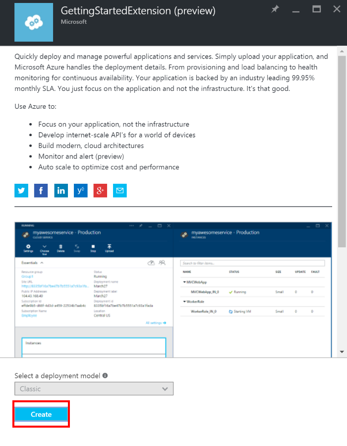
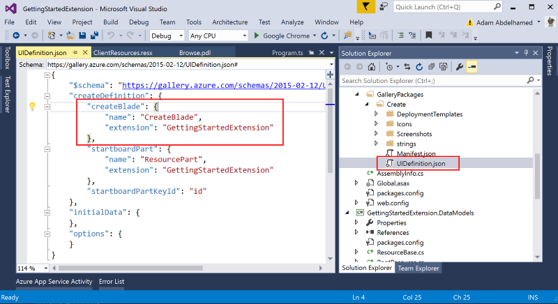
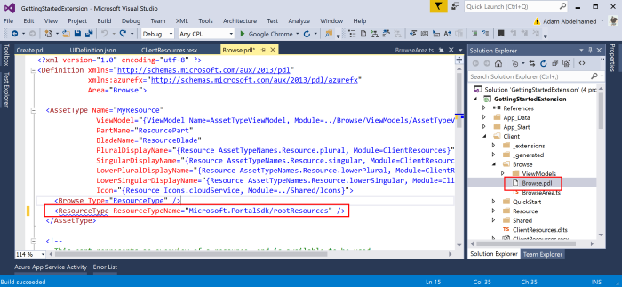
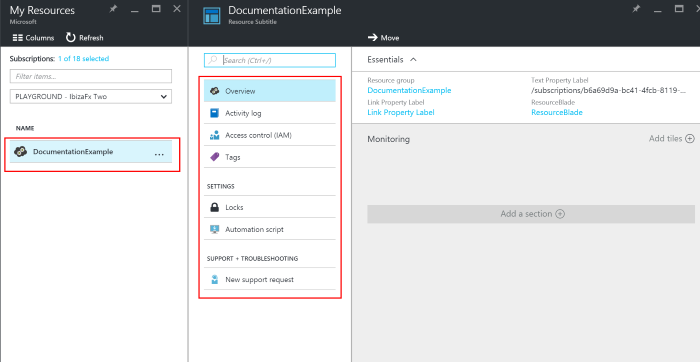
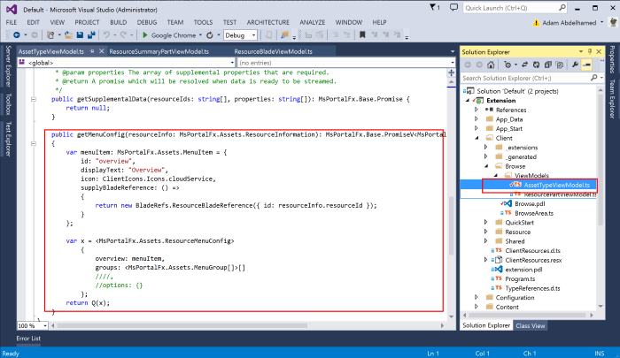

{"gitdown": "contents"}

## Getting started with the Portal SDK

### Prerequisites

- Microsoft Windows 10, Windows Server 2012 R2, or latest
- Visual Studio 2015 Update 3
- Latest version of the <a href="http://www.typescriptlang.org/#Download" target="_blank">TypeScript plugin for Visual Studio</a>
- Latest version of the <a href="../generated/downloads.md" target="_blank">Azure Portal SDK</a>

### Creating an Extension
The Azure Portal SDK includes everything you need to build extensions for the portal.  Included are variety of tools and samples that help developers build extensions on top of the framework.

To start, launch Visual Studio and navigate to File -> New -> Project.  In the new project template, select Installed -> Visual C# -> Azure Portal.  Select the `Azure Portal Extension` project type, give it a unique name, and click 'OK':


- Next, hit F5 to compile, and run your extension in IIS Express.   
- On first run you should see a request to install a certificate for localhost for IIS express Accept the certificate to continue

  

You may get a debugging not enabled warning.  Feel free to enable or disable debugging, depending on your preferences.


Your extension will now be side loaded into the production portal.  The portal will prompt you to allow your side loaded extension.  Click __allow__.


Congratulations!  You've just created your first extension.

You will find that the project template has implemented many of the key components of an extension.  

- Marketplace Gallery Integration (How people create your resources)
- Browse (How people browse resources they have created)
- Resource Menu Blade (How people use and manage resources they have created)

### Marketplace Gallery Integration and Create Experience

If you plan on selling things (like resources) in the portal then you probably want to integrate into the marketplace.  The marketplace offers users a consistent way to browse and search the set of curated items that they can purchase (or create).

You integrate into the marketplace by building and publishing a package to the marketplace service.  This section will walk you through the basics of the marketplace.

In your running portal, go to the marketplace by clicking __+New__ and then __See all__.


Then click the __Local Development__ category. A marketplace item will appear that matches the name you selected when creating your project.  The code to define the gallery package is located in the __GalleryPackages__ directory.


Click the gallery item to launch the item details blade. 



The gallery package includes all the categorization, text, and images that you've seen so far.  The code for all of this is located in the __GalleryPackages__ folder.

When you click the __Create__ button the portal will open the blade that is defined in __GalleryPackages/Create/UIDefinition.json__. 



The project template has implemented a basic create form that asks the user to specify the common Azure Resource properties.


The code that implements the create blade is located in __Client/Resource/Create__.  Note that the name "CreateBlade" in the __Create.pdl__ file matches the name in the __UIDefinition.json__ file.


Fill out the create form and click create to actually create a resource.

For more information on creating gallery packages and create forms see the [gallery documentation](/gallery-sdk/generated/index-gallery.md#Marketplace-Gallery-Integration-and-Create-Experience).

### Browse 

The portal exposes a common navigation experience, called 'Browse', that gives end users a list of all the different services and resource types offered by the portal.

You probably want your assets to be exposed in the navigation system. This section provides an overview.

In the running portal you can navigate to __Browse -> My Resources__ to see your extension's browse experience.  
  


If you have completed the marketplace and create tutorial above then you should see an item in the list.


The code for the browse implementation is located in __Client/Browse__.  You can replace the __Microsoft.PortalSdk/rootResources__ resource type name with your production Resource Provider (RP) type and your resources will show in the list on your next F5.



For more information on the browse experience see the [Browse documentation](#getting-started-with-the-portal-sdk-browse).

### Resource Menu Blade

If you are building an extension for an Azure service then it's likely you have built a resource provider that exposes a top-level resource (e.g. Virtual Machine, Storage account).

If that's the case then the resource menu blade is a great starting point. The idea is that after the user selects a particular resource from the browse experience they land on a menu blade that has a mixture of standard resource features (e.g. activity log, role based access control, Support, etc) and service-specific features (e.g. Tables in a storage account). This section walks through the basics. 

Click on your resource from within the browse list to open the resource menu blade.  Many of the standard Azure experiences such as __tags__, __locks__, and __acess control__ have been automatically injected into your menu.



The code for the resource menu blade is located in __Browse/ViewModels/AssetTypeViewModel__. You can extend the menu by modifying the __getMenuConfig__ function.



For more information on the resource menu blade see the [Resource menu blade documentation](/gallery-sdk/generated/index-gallery.md#resource-management-resource-menu).

### V1 versus V2 in the samples extension

You will probably notice that the samples extension is forked into V1 and V2 folders.  

V2 is our post-GA collection of new APIs that, when we're done, is meant to be the only set of APIs needed to develop a modern Ibiza extension.

Our V1 APIs are riddled with APIs that support old UX patterns that we either have or want to move extensions away from. The V1 APIs are also quite difficult to use in many places, as they were developed quickly and early in the project when there was a lot of trial/error in both the UX design and in the associated APIs.

So far, V2 covers these API areas, and we're adding more:

- New Blade variations -- TemplateBlade, FrameBlade, MenuBlade importantly
- Blade-opening/closing -- 'container.openBlade, et al'
- no-PDL TypeScript decorators -- to define all recommended Blade/Part variations
- Forms -- No V1 EditScope concept

As for V1 concepts, these are concepts we're asking extensions to avoid where there are V2 APIs that can be used:
- __PDL__
- __EditScope__
- __ParameterCollector/ParameterProvider__
- __"Blades containing Parts"__
- __Non-full-screen Blades__ -- that is, ones that open with a fixed width
- __V1 Blade-opening__ -- Selectable/SelectableSet APIs
- __V1 Forms__ -- using EditScope

Bear in mind that we don't have the V2 space entirely built out. In the meantime, you will have to use V1 APIs in places, even the V1 concepts listed above.

### Hello World for blades

Blades are the main unit of UX that can be built using the SDK. They are basically pages that can be loaded in the portal.

To create a blade add a single file to your project in `$ProjectRoot\Client\<Area>\<Blade>.ts` where `<Area>` is a logically named area of your choosing and `<Blade>` is the name of your blade. An area is basically a folder.  Name it however it makes sense for your team.

If you are defining a new area then you must add a file directly in the area folder called `<Area>Area.ts` where `<Area>` is your area name.  The contents of that file should be:

```
export class DataContext {
}
```

Your blade file has a few required parts.  At the top you will have some import statements.

```
import * as TemplateBlade from "Fx/Composition/TemplateBlade";
import { DataContext } from "./<Area>Area"; // todo - put your area name here
```

The next step is to add the template blade decorator.  This lets the framework discover your blade.  It is also where you define the html template.

This template shows a simple text data-binding (corresponding data-binding code is below).

```
@TemplateBlade.Decorator({
    htmlTemplate: `<div data-bind='text: helloWorldMessage'></div>`
})
export class <Name> // todo - put your blade name here
{
}
```

Next we'll implement the class. In this simple case we'll just set the title, subtitle, and bind the string 'Hello world!' to the UI.

```
export class <Name> // todo - put your blade name here
{
    public title = "My blade title";
    public subtitle = "My blade subtitle";
    public context: TemplateBlade.Context<void, DataContext>; // there are useful framework APIs that hang off of here
    public helloWorldMessage = ko.observable("Hello world!"); // this is bound to the template above

    public onInitialize()
    {
       // run any initialization code you need here
       return Q();   // if you load data then return a loading promise here
    }
}
```

That's it. After you compile your blade you can test it out by deep linking using this format:

`<PORTAL URI>#blade/<YOUR EXTENSION NAME>/<YOUR BLADE NAME>`

### Next Steps

Read more about [testing in production](portalfx-testinprod.md).

Next Steps: To debug issues loading an extension in the portal, go through the [Debugging extension failures](portalfx-debugging-extension-load-failures.md) guide.

### Questions?

Ask questions on: [https://stackoverflow.microsoft.com/questions/tagged?tagnames=ibiza](https://stackoverflow.microsoft.com/questions/tagged?tagnames=ibiza).