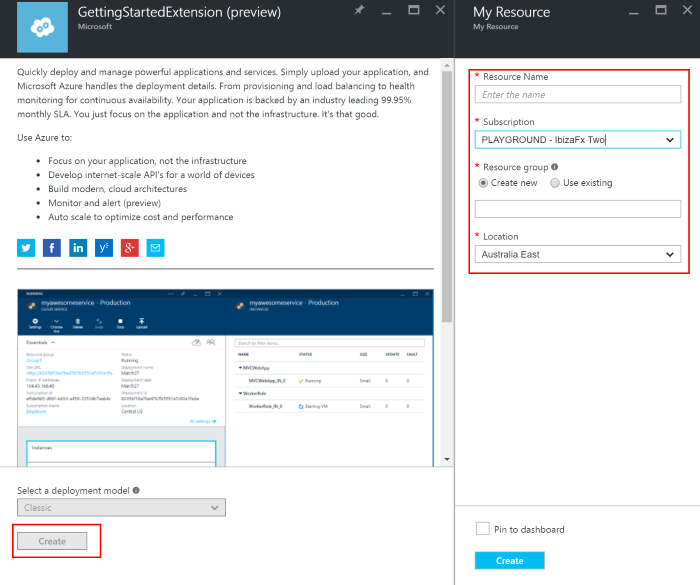

## Getting started with the Portal SDK

### Prerequisites

- Microsoft Windows 8, Windows Server 2012 R2, or latest
- Visual Studio 2013 Update 4
- Latest version of the <a href="http://www.typescriptlang.org/#Download" target="_blank">TypeScript plugin for Visual Studio</a>
- Latest version of the <a href="../generated/downloads.md" target="_blank">Azure Portal SDK</a>

### Creating an Extension
The Azure Portal SDK includes everything you need to build extensions for the portal.  Included are variety of tools and samples that help developers build extensions on top of the framework.

To start, launch Visual Studio and navigate to File -> New -> Project.  In the new project template, select Installed -> Visual C# -> Azure Portal.  Select the `Azure Portal Extension` project type, give it a unique name, and click 'OK':

- Next, hit F5 to compile, and run your extension in IIS Express.   
- On first run you should see a request to install a certificate for localhost for IIS express Accept the certificate to continue

  

You may get a debugging not enabled warning.  Feel free to enable or disable debugging, depending on your preferences.

Your extension will now be side loaded into the production portal.  The portal will prompt you to allow your side loaded extension.  Click __allow__.

Congratulations!  You've just created your first extension.

You will find that the project template has implemented many of the key components of an extension.  

- Marketplace Gallery Integration (How people create your resources)
- Browse (How people browse resources they have created)
- Resource Menu (How people use and manage resources they have created)

### Marketplace Gallery Integration and Create Experience

In your running portal, go to the marketplace by clicking __+New__ and then __See all__.

Then click the __Local Development__ category. A marketplace item will appear that matches the name you selected when creating your project.  The code to define the gallery package is located in the __GalleryPackages__ directory.

Click the gallery item to launch the item details blade. 

The gallery package includes all the categorization, text, and images that you've seen so far.  The code for all of this is located in the __GalleryPackages__ folder.

When you click the __Create__ button the portal will open the blade that is defined in __GalleryPackages/Create/UIDefinition.json__. 

The project template has implemented a basic create form that asks the user to specify the common Azure Resource properties.

The code that implements the create blade is located in __Client/Resource/Create__.  Note that the name "CreateBlade" in the __Create.pdl__ file matches the name in the __UIDefinition.json__ file.

Fill out the create form and click create to actually create a resource.

For more information on creating gallery packages and create forms see the [gallery documentation](/gallery-sdk/generated/index-gallery.md#Marketplace-Gallery-Integration-and-Create-Experience).

### Browse 

In the running portal you can navigate to __Browse -> My Resources__ to see your extension's browse experience.  
  

If you have completed the marketplace and create tutorial above then you should see an item in the list.

The code for the browse implementation is located in __Client/Browse__.  You can replace the __Microsoft.PortalSdk/rootResources__ resource type name with your production Resource Provider (RP) type and your resources will show in the list on your next F5.

For more information on the browse experience see the [Browse documentation](#browse).

### Resource Menu

Click on your resource from within the browse list to open the resource menu.  Many of the standard Azure experiences such as __tags__, __locks__, and __acess control__ have been automatically injected into your menu.

The code for the resource menu is located in __Browse/ViewModels/AssetTypeViewModel__. You can extend the menu by modifying the __getMenuConfig__ function.

For more information on the resource menu see the [Resource menu documentation](/gallery-sdk/generated/index-gallery.md#resource-management-resource-menu).

### Next Steps

Read more about [testing in production](/documentation/articles/portalfx-testinprod).

Next Steps: To debug issues loading an extension in the portal, go through the [Debugging extension failures](/documentation/articles/portalfx-debugging-extension-load-failures) guide.

### Questions?

Ask questions on: [https://stackoverflow.microsoft.com/questions/tagged?tagnames=ibiza](https://stackoverflow.microsoft.com/questions/tagged?tagnames=ibiza).