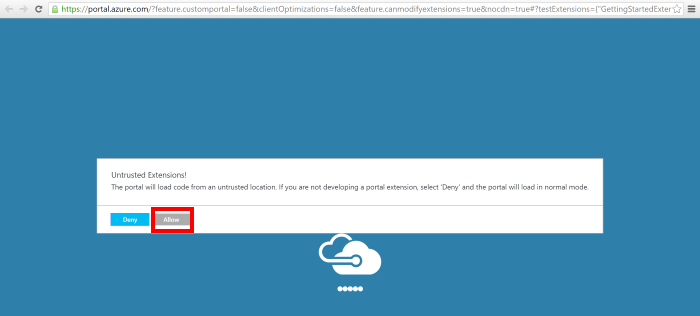

## Create a blank extension

This process validates that your development environment is set up correctly to develop extensions and blades, by creating an empty extension.  It also validates that the local extension can be loaded in the Azure Portal. The empty extension that is created by this process can be modified later for actual development. For more information about developing and testing extensions, see [top-extensions-debugging.md](top-extensions-debugging.md).

1. Launch **Visual Studio 2015** and navigate to `File -> New -> Project`. In the new project dialog, select `Installed -> Visual C# -> Azure Portal`. Select the `Azure Portal Extension` project type, and give it a unique name.  The name of the project typically matches the solution name. The location can be the same as any other **Visual Studio** project directory.  Then, click the checkbox next to ```Create directory for solution```.  Then, click the ```OK``` button, as described in the following image.

    

1. Use the F5 key to compile and run the new project extension in **IIS Express**.

1. On first run, a request to install a certificate for localhost for **IIS Express** may be displayed. Accept the certificate to continue, as in the following image.

    

1. The platform may display a "debugging not enabled" warning. You may enable or disable debugging.

    

1. The platform will sideload the application into a browser. For more information about sideloading extensions, see [top-extensions-sideloading.md](top-extensions-sideloading.md).

   If the  browser displays the message 'Server Error in '/' Application' instead, it is likely that the **NuGet** packages are not yet associated with **Visual Studio**. The **Visual Studio** Error List dialog may display the error message that is in the following image.

   

   If this message is displayed, the missing packages can be installed by using the **Nuget Package Manager**. The **Package Manager** can be started by selecting `Tools`  -> `Nuget Package Manager` -> `Package Manager Console`, as in the following image.

   

   When the **Package Manager** console is displayed, click on the `Restore` button that is associated with the error, as in the following image.
     
   

   You may want to validate that the **Content Unbundler** tool, which is a tool that ships with the VS Portal extension and that packages static files as zip file, was installed as one of the  **nuGet** packages.  Look for  `Microsoft.Portal.Tools.ContentUnbundler` in the `packages.config` file, as in the following image.
   
   

   Click on the F5 button to rebuild the application. When the build is successful, **Visual Studio** will proceed to the next step and sideload the application into the production Portal.

1. The Portal will prompt you to allow the sideloaded extension. Click the ```Allow``` button, as in the following image.

    
    
Congratulations! You have just created your first extension.

