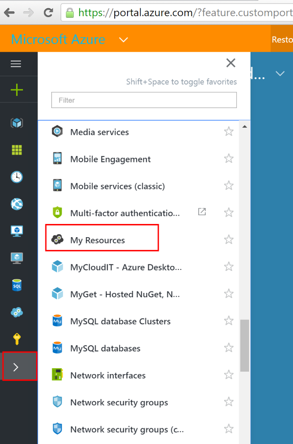

<a name="portalfxExtensionsKeyComponentsBrowse"></a>
<!-- link to this document is [portalfx-extensions-key-components-browse.md]()
-->

## Browse Experience
This section describes how to display an extension in the Azure Portal navigation system.

The portal's common navigation experience is named 'Browse', and it displays a list of all the different services and resource types that the portal offers.

In the running portal you can navigate using the  ``` Browse ``` menu to the left.  Click on the ```My services ``` arrow to display Azure services, and scroll to the  ``` My Resources ``` service and click on it, as in the following image.

   

The portal will display your extension's item in a list, as in the following image.

   

If you have not yet created any items, the portal will display a "No My Resources to display" message.
You can create a gallery item as specified in  [portalfx-extensions-key-components-mgCreate.md](portalfx-extensions-key-components-mgCreate.md), and it would be displayed in this list.

The code for the browse implementation is located in the ```Browse.pdl``` file in the  ```Client/Browse``` folder in Visual Studio (VS), as in the following image.


When you replace the  ```resourceType ``` name "Microsoft.PortalSdk/rootResources" with your production Resource Provider (RP) type,  your resources will be displayed in the list after you  click the  F5 button.

For more information on the Browse experience, see the document located at [portalfx-browse.md](portalfx-browse.md).