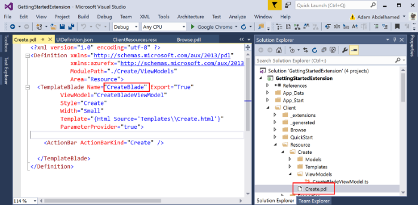

## Marketplace Gallery Integration and Create Experience

If your business intends to sell Portal resources, then you may want to integrate them into the Azure Marketplace. The Marketplace offers users a consistent way to browse and search items that they can create or purchase.

You can integrate an extension or a resource into the Marketplace by building and publishing a package to the Marketplace service. This section describes the basic pieces of the Marketplace.

1. In the running Portal, go to the Marketplace by clicking the ```+New```  button and then the ```See all``` button, as in the following image.

    

<!-- Determine whether only one is displayed in the blade.  -->

1. Then click the ```Local Development ``` category. The name of the Marketplace item that is  displayed in the ```Local Development ``` blade matches the name that was selected when creating its Visual Studio project. Click the gallery item to launch the item details blade.

    
 
1. The gallery package contains all the categories, content, and images that have been displayed so far.  The code that defines the gallery package is located in the GalleryPackages directory.

    

 1. Click the ```Create``` button in the item details blade, as in the following image.

    

    The portal will open the blade that is defined in VS as ``` GalleryPackages/Create/UIDefinition.json```, as in the following image.

    

    The portal displays a basic ```Create``` form that asks the user to specify the common Azure Resource properties, as in the following image.

       

    The code that implements the ```Create``` blade is located in the VS ```Client/Resource/Create``` directory, as in the following image.

    

    **NOTE**  The name "CreateBlade" in the ```Create.pdl``` file matches the name in the ``` UIDefinition.json```  file.
 
1. Return to the Portal and enter the common resource properties in the ``` Create ``` form, then  click the ```Create``` button  to create the resource.

<!-- TODO:  Locate a gallery doc that describes the common resource properties. -->
For more information on creating gallery packages and ```Create``` forms, see the    document in the gallery documentation.
<!-- TODO:  The previous sentence was:
For more information on creating gallery packages and create forms see the [gallery documentation](/gallery-sdk/generated/index-gallery.md#Marketplace-Gallery-Integration-and-Create-Experience).
Determine what the content was, and whether it has been included in the key components document.
-->

For more information about creating Portal experiences, see     [portalfx-create-overview.md#building-custom-create-forms](portalfx-create-overview.md#building-custom-create-forms).