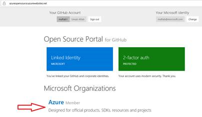

## Contributing

**MsPortalFx-Test** is an open source end-to-end test framework. Developers are encouraged to contribute features or API's. You can access the `msportalfx-test` repo as specified in [#Get user permissions](#get-user-permissions).

When your contribution is ready, you can submit a pull request to the repo as specified in [top-extensions-publishing.md](top-extensions-publishing.md).

After your request is approved, you can clone the repository and start contributing, as specified in [#Test the extension](#test-the-extension).

When the features are validated against the framework, your contribution can be added to the **msportalfx-test** tool by updating the pull request.

If you have questions about the **msportalfx-test** tool, you can reach out to the Ibiza team at [https://stackoverflow.microsoft.com/questions/tagged?tagnames=ibiza-test](https://stackoverflow.microsoft.com/questions/tagged?tagnames=ibiza-test).

### Get user permissions

Enlisting a contribution makes it available to other extensions within the Azure Portal. There are specific permissions necessary to enlist a contribution. You need to ensure that you have joined the groups specified in [top-onboarding.md#join-dls-and-request-permissions](top-onboarding.md#join-dls-and-request-permissions), including the  "msportalfx-test" group.  If you have not yet joined, you can do so by using the following steps.
   
1. Ensure that you enable 2FA on your github account, link your corporate account to your github account, and can access the Azure github org, as in the following image.
   
   
1. Request access to the `msportalfx-test` repo by clicking on the Azure button, as in the following image.

   
   
1. Click the `Join a Team` button, as in the following image.
   
   
   
1. Search for "msportalfx-test" and then click the "request to join" button, as in the following image.
   
   

### Test the extension 

The following steps are used to test an extension to validate that it is compatible with the **msportalfx-test** tools.


1. Download **msportalfx-test** tools by using the following command.

    `git clone https://github.com/azure/msportalfx-test.git`

1. Build the source

    Use **Visual Studio** or **Visual Studio Code** to build the source. Then run it by using `Run ./scripts/Setup.cmd`.
    
    Create a new Portal Extension from `File --> New Project --> Azure Portal --> Azure Portal Extension`. Name this project **LocalExtension** so that the extension itself is named `LocalExtension`, which is what many of the tests expect. Then click CTRL+F5 to host the extension in IIS Express.

1. Set up the tests by performing the following.

    1. Create a dedicated test subscription that is used for tests only

    1. Locate a user that has access to the test subscription only

    1. Create an AAD Application and service principal with access, as in the following code.

        ```powershell 
            msportalfx-test\scripts\Create-AdAppAndServicePrincipal.ps1 
                -TenantId "someguid" 
                -SubscriptionId "someguid" 
                -ADAppName "some ap name" 
                -ADAppHomePage "https://somehomepage" 
                -ADAppIdentifierUris "https://someidentiferuris" 
                -ADAppPassword $someAdAppPassword 
                -SPRoleDefinitionName "Reader" 
        ```

        <!-- TODO: Determine whether the dependency has been removed."We are working to remove this dependency." -->

        For more information about AAD Applications and Service Principals, see [https://aka.ms/portalfx/serviceprincipal](https://aka.ms/portalfx/serviceprincipal).  

    1. Run `setup.cmd` in the portal repo, or run `powershell.exe -ExecutionPolicy Unrestricted -file "%~dp0\Setup-OneCloud.ps1" -DeveloperType Shell %*`. You will use the details of the created service principal in the next steps.  

       **NOTE**: Store the password for the following procedures in **KeyVault**,  the secret store, or some other safe location, as specified in [top-extensions-hosting-service.md#configuring-contentunbundler-for-ev2-based-deployments](top-extensions-hosting-service.md#configuring-contentunbundler-for-ev2-based-deployments). It is not retrievable by using the commandlets. 

    1. Open **test\config.json** and enter appropriate values for the following parameters.

        ```
        "aadAuthorityUrl": "https://login.windows.net/TENANT_ID_HERE",
        "aadClientId": "AAD_CLIENT_ID_HERE",
        "subscriptionId": "SUBSCRIPION_ID_HERE",
        "subscriptionName": "SUBSCRIPTION_NAME_HERE",
        ```

        The account specified in `aadClientId` should have at least contributor access to the subscription specified in the `subscriptionId` parameter. The account must be a Live Id account, and cannot require two-factor authentication.