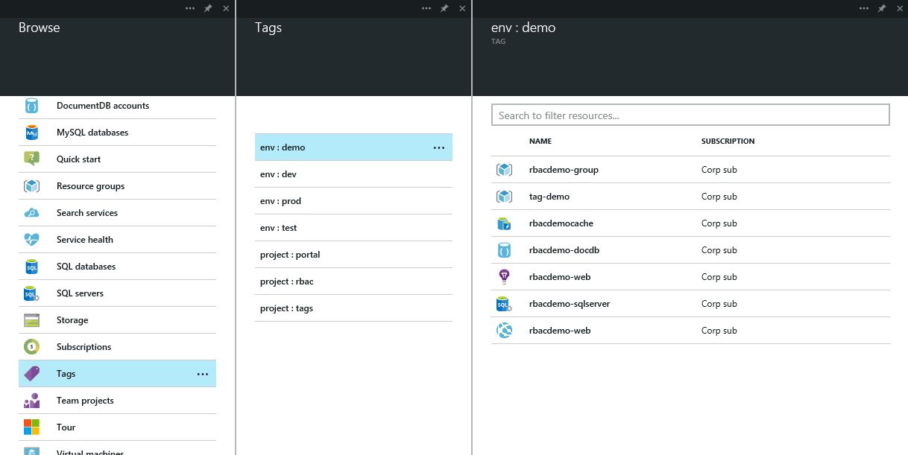

## Resource Tags

 In the Preview Portal, resource groups manage related resources as a single unit, which can be coordinated with role-based access control, as specified in [portalfx-permissions.md](portalfx-permissions.md). Extensions can tag resources with name/value pairs to categorize and view them across resource groups and across subscriptions. In the Portal, subscriptions are the only way that extensions can organize and group resources.

To view all resources and resource groups that are categorized with the same tag, you can open a resource in the Preview Portal, click the tag icon in `Essentials` that adds or removes tags for that resource, and click the appropriate tag.

You can also pin the tag blade to the Startboard for quick access, or you can use the Browse Hub to navigate to any tags across all your subscriptions. The following image demonstrates how to categorize and organize resources by using tags.



For more information about resource groups, see [http://aka.ms/portalfx/resourcegroups](http://aka.ms/portalfx/resourcegroups).

For more information about managing tags using Azure PowerShell, see [http://aka.ms/portalfx/managingtags](http://aka.ms/portalfx/managingtags).

For more information about tags, see [http://aka.ms/portalfx/usetags](http://aka.ms/portalfx/usetags).

For more information about managing tags, see the ARM Tags REST API reference located at [http://aka.ms/portalfx/ARMreference](http://aka.ms/portalfx/ARMreference).

**NOTE:** The Tags blade uses an HTTP PATCH operation to save tags to the resource provider (RP), by using the last API version defined in your RP manifest for that resource type. To use an explicit API version, the extension includes it in the resource id that is specified in the part or blade .  An example of a tag is   ```/subscriptions/###/resourceGroups/xxx/providers/Microsoft.Cache/redis/xxx?api-version=2015-01-01```.
