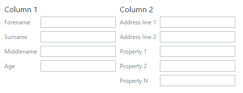

## Designing and Arranging the Form

### The section ViewModel

While blade templates allow manual layout of controls as specific **DOM** elements, the generally recommended approach is to bind a section `viewModel` into the **DOM** and then add control `viewModels` to the `children` observable array of the section. For example, the following image contains two sections with varying numbers of child objects in their respective arrays.

The section `viewModel` provides default styling for spacing and margins and is an easy way to dynamically add and remove controls.

### The CustomHtml control

The `CustomHtml` control can be used to author `HTML` in an autogenerated layout. Many extensions use these two controls to avoid large amounts of `HTML` in the blade template. However, placing the controls in the DOM manually is always an option if needed.

<!-- TODO:  Determine whether "two controls" means the section viewModel and the customHtml control.
-->

A working copy of a basic Portal form is located at [http://aka.ms/portalfx/samples#blade/SamplesExtension/SDKMenuBlade/formsallup](http://aka.ms/portalfx/samples#blade/SamplesExtension/SDKMenuBlade/formsallup). Click on 'Basic Create Form'.

#### Procedure

To add a section to an extension, use the following three steps.

1. Import the module to make the section available to the extension.
	
1. Change the link element in the HTML template to a control container.

    Use a `pcControl` binding handler to link the ViewModel to the HTML.

1. Then, create the section `ViewModel` in the code.

    Bind the section `ViewModel` into the **DOM** in the blade template. Then add all the controls that should be displayed into the `children` observable array of the section. This positions the controls sequentially on a blade, by default. 

    The section's `style` property can be used to achieve other layouts. This includes table layouts that display controls in multiple rows and columns, as a list of tabs, or as a combination of layouts.

    **NOTE**: In this discussion, `<dir>` is the `SamplesExtension\Extension\` directory and  `<dirParent>`  is the `SamplesExtension\` directory. Links to the Dogfood environment are working copies of the samples that were made available with the SDK. 

1. The code to create the section is located at  `<dir>\Client\V1\Forms\Samples\BasicCreate\ViewModels\Parts\FormsSampleBasicCreatePart.ts`. It is also in the following code.

    {"gitdown": "include-section", "file":"../Samples/SamplesExtension/Extension/Client/V1/Forms/Samples/BasicCreate/ViewModels/Parts/FormsSampleBasicCreatePart.ts", "section": "forms#section"}

1. The HTML template located at `<dir>\Client\V1\Forms\Samples\BasicCreate\Templates\FormSampleBasicCreate.html` binds the section into the DOM, and will autogenerate the layout for all of the child objects.  It is included in the following example.

    {"gitdown": "include-file", "file":"../Samples/SamplesExtension/Extension/Client/V1/Forms/Samples/BasicCreate/Templates/FormSampleBasicCreate.html"}
