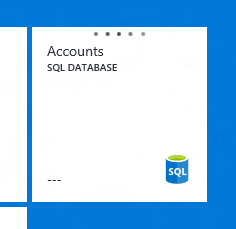
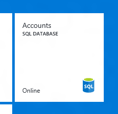

## Improving Part Performance

When a Part loads, the user is presented with the default **blocking loading** indicator that is in the following image.

 

By default, the lifetime of this indicator is controlled by the promise that is returned from the `onInputsSet` method of the part, as in the following example.

```ts
public onInputsSet(inputs: Def.InputsContract): MsPortalFx.Base.Promise {
	// When this promise is resolved, the loading indicator is removed.
    return this._view.fetch(inputs.websiteId);
}
```

With large amounts of data, it is good practice to reveal content while the data continues to load.  When this occurs, the **blocking loading** indicator can be removed previous to the completion of the data loading process. This allows the user to interact with the part and the data that is currently accessible.

Essential content can be displayed while the non-essential content continues to load in the background, as signified by the  **status** marker on the bottom  left side of the tile.

A **non-blocking loading** indicator is displayed at the top of the part.  the user can activate or interact with the part while it is in this state. A part that contains the status marker and the **non-blocking loading** indicator is in the following image.

 

The `container.revealContent()` API that is located in the ViewModel can add this optimization to the part that is being developed. This method performs the following.

* Remove the **blocking loading** indicator
* Reveal content on the part
* Display the **non-blocking** loading indicator
* Allow the user to interact with the part

The `container.revealContent()` method can be called from either the ViewModel's `constructor` method or the ViewModel's `onInputsSet` function. These calls are located either in a `.then(() => ...)` callback, after the essential data has loaded, or they are located in the `onInputsSet` method, previous to the code that initiates data loading.

### Calling from the constructor

If the part contains interesting content to display previous to loading any data, the extension should call the `container.revealContent()` method from the ViewModel's `constructor` .  The following example demonstrates  a chart that immediately displays the X-axis and the Y-axis.

```ts
export class BarChartPartViewModel implements Def.BarChartPartViewModel.Contract {

    public barChartVM: MsPortalFx.ViewModels.Controls.Visualization.Chart.Contract<string, number>;

    constructor(container: MsPortalFx.ViewModels.PartContainerContract, initialState: any, dataContext: ControlsArea.DataContext) {
        // Initialize the chart view model.
        this.barChartVM = new MsPortalFx.ViewModels.Controls.Visualization.Chart.ViewModel<string, number>(container);

        // Configure the chart view model (incomplete as shown).
        this.barChartVM.yAxis.showGridLines(true);
		
		container.revealContent();
	}
}
```

### Calling from onInputsSet

 Calling the `onInputsSet` method to return a promise behaves consistently, whether or not the part makes use of the  `container.revealContent()` method. Consequently, the  `container.revealContent()`method can optimize the behavior of the part that is being developed. There are two methodologies that are used to call the `container.revealContent()` method.
 
It is common to call the  `container.revealContent()` method after some essential, fast-loading data is loaded, as in the following example.

```ts
public onInputsSet(inputs: MyPartInputs): Promise {
    // This larger Promise still controls the lifetime of all loading indicators (the
    // non-blocking one in this case, since 'container.revealContent()' has been called).
    return Q.all([
        this._essentialDataView.fetch(inputs.resourceId).then(() => {
            // Show the Part content once essential, fast-loading data loads.
            this._container.revealContent();
        }),
        this._slowLoadingNonEssentialDataView.fetch(inputs.resourceId)
    ]);
}
```

It is less common to call the `container.revealContent()` method when the essential data to display can be computed synchronously from other inputs, as in the following example.

```ts
public onInputsSet(inputs: MyPartInputs): Promise {

    // In this case, the 'resourceGroupName' is sufficient to allow the user to interact with the Part/Blade.
    var resourceDescriptor = ResourceTypes.parseResourceManagerDescriptor(inputs.resourceId);
    this.resourceGroupName(resourceDescriptor.resourceGroup);
    this._container.revealContent();

    // This Promise controls the lifetime of all loading indicators (the
    // non-blocking one in this case, since 'container.revealContent()' has been called).
    return this._dataView.fetch(inputs.resourceId);
}
```

The promise returned from `onInputsSet` still determines the visibility of the loading indicators.  After the promise is resolved, all loading indicators are removed, as in the following image.



Also, if the promise that was returned from `onInputsSet` is rejected, the part displays the default error UX.  The promise that was returned from `onInputsSet` could be rejected if either the fast-loading data promise or the slow-loading data promise was rejected. The customizable error UX is in the following image.


