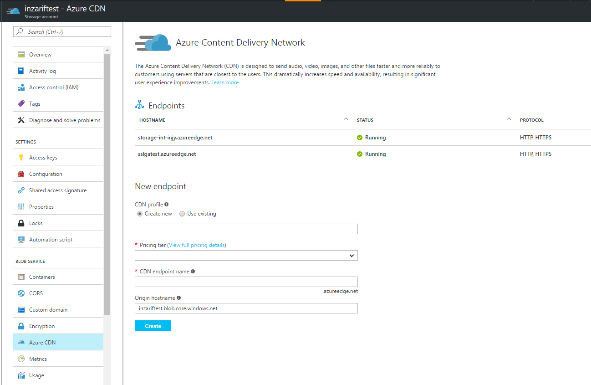

<properties title="" pageTitle="Getting started with Azure CDN" description="" authors="inzarif" />

<tags
    ms.service="portalfx"
    ms.workload="portalfx"
    ms.tgt_pltfrm="portalfx"
    ms.devlang="portalfx"
    ms.topic="azure-cdn-integration-doc"
    ms.date="04/05/2017"
    ms.author="inzarif"/>


# Getting started with Azure CDN

The Azure Content Delivery Network (CDN) is designed to send audio, video, images, and other files faster and more reliably to customers using servers that are closest to the users. This dramatically increases speed and availability, resulting in significant user experience improvements.

>**The benefits of using the CDN to cache web site assets include:**
>- Better performance and user experience for end users, especially when using applications where multiple round-trips are required to load content.
>- Large scaling to better handle instantaneous high load, like at the start of a product launch event.
>- Less traffic is sent to the origin by distributing user requests and serving content from edge servers.

CdnIntegrationBlade allows customers to create and manage CDN endpoints for their existing Azure resources.


Through the simple integration explained in this document, your customers can enable CDN on their Azure resources within your extension without having to leave and go to the CDN extension. The CDN integration blade can be embedded in your own extension if you follow the below steps.

## 1. Importing CDN Extension NuGet Package

To be able to use the CDN integration blade, you will need to reference Microsoft.Portal.Extensions.Cdn nuget package in your **corext.config** or **packages.config** file.

```xml
<package id="Microsoft.Portal.Extensions.Cdn" version="1.0.13.177" />
```

*Note:* you will need to update the version with the latest from [here](https://msazure.visualstudio.com/DefaultCollection/One/_apps/hub/ms.feed.feed-hub?feedName=Official&protocolType=NuGet&packageName=microsoft.portal.extensions.cdn)

## 2. Referencing CDN PDE

In your extension *.csproj file, you will need to add a reference to the Microsoft_Azure_Cdn.pde similar to this:
```xml
<ExtensionReference Include="$(PkgMicrosoft_Portal_Extensions_Cdn)\content\Client\_extensions\Cdn\Microsoft_Azure_Cdn.pde" />
```

## 3. Referencing CDN Integration Blade

For the CdnIntegrationBlade to show up in your extension, you may reference it in one of the following ways:

 - You can add it as an item in your resource menu similar to the code blow: 
```ts
{
    id: "cdnIntegration",
    displayText: "Azure CDN",
    enabled: ko.observable(true),
    visible: ko.observable(true), //Shouldn't be visible in national clouds
    keywords: [
        "cdn",
        "endpoint",
        "profile",
        "domain"
    ],
    icon: MsPortalFx.Base.Images.Polychromatic.Cdn(),
    supplyBladeReference: () => {
        return new CdnBladeReferences.CdnIntegrationBladeReference(
            {
                resourceId: <your resource Id>,
                location: <your resource location>,
                originHostname: <your resource hostname>
            });
    }
}
```

 - You can alternatively open the CdnIntegrationBlade as a DynamicBladeSelection, which doesn't require importing the CDN nuget package, as shown in this example:

```ts
this._container.selectable.selectedValue(<MsPortalFx.ViewModels.DynamicBladeSelection>{
        extension: "Microsoft_Azure_Cdn",
        detailBlade: "CdnIntegrationBlade",
        detailBladeInputs: {
            resourceId: this.resourceUri(),
            location: this._siteView.item().Location(),
            originHostname: this._siteView.item().DefaultHostName()
        }
    });            
```

### Blade Inputs
The CdnIntegrationBlade takes the following inputs:

1. **resourceId**:
This is the id of your ARM resource. For example, if you are calling the Azure CDN blade from Storage resource menu, this is what the resourceId looks like for a storage account
"/subscriptions/93456ca3-e4aa-4986-ab1c-98afe7a12345/resourceGroups/rg1/providers/Microsoft.ClassicStorage/storageAccounts/storagetest1"

2. **location**:
The AzureLocation of your resource, like *"West US"*, *"East Asia"*, etc.

3. **originHostname**:
The hostname of your service which is used as an origin for the created CDN endpoints. This shouldn't include any slashes or protocols, only the domain name, like *"storagetest1.blob.core.windows.net"* or *"webapptest2.azurewebsites.net"*.


### Notes and Tips
1.  Please use *"cdnIntegration"* for the resource menu item *id* because we use this id to track blade loads and create telemetry on CDN Integration Blade.
2.  The *displayText* "Azure CDN" needs to be localized and should come from your Resources.resx.
3.  The CdnIntegrationBlade *only* works in public Azure and is NOT available in national clouds like MoonCake, BlackForst, etc. 
4.  You can set the *visible* property on this menu item to true or choose to conditionally show this blade based on a feature flag  in your extension.
	```ts
	visible: ko.observable(MsPortalFx.isFeatureEnabled("cdnintegration"))
	```

## 4. Telemetry and Monitoring
We are tracking the usage and actions on CDN integration blade through following metrics:

 - Number of CDN Endpoints created from partner extensions vs. CDN extension.
 - Number of customers clicking Azure CDN from partner extension.
 - Number of customers managing CDN from partner extension.
 - Percentage of customers initiating a CDN create operation after landing into the Azure CDN blade. 
 - Percentage of success and failure of create operations from the Azure CDN blade.

You shouldn't need to add any extra telemetry on your side.

### Contact Us
You can start development today! Create a code review and add "inzarif" and "cdneng" as reviewers.
Don't hesitate to contact us for any questions, concerns, or bug reports.