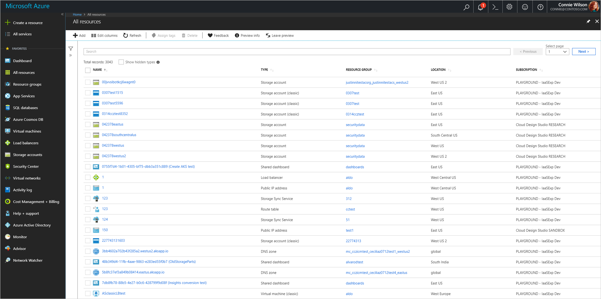
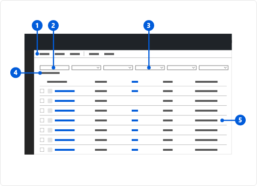

Resource Browse 
================

The resource browse pattern provides resource discovery and management across resource groups and subscriptions.
  

Also known as 
--------------

-   Resource list

-   Browse
  

Examples 
---------

These Azure resources are good examples of this design pattern 

-   [All resources](https://rc.portal.azure.com/#blade/HubsExtension/ArtBrowseBlade/resourceType/Microsoft.Resources%2Fresources)

-   [Virtual Machines](https://rc.portal.azure.com/#blade/HubsExtension/Resources/resourceType/Microsoft.Compute%2FVirtualMachines) 

Usage guidance 
---------------

The Resource Manage pattern is used to configure and manage a single ARM resource.  The resource manage page is typically opened from a Resource
Browse experience where the user is seeing a list of resources and needs to see more details or make a change to a specific resource.  The resource manage page can also be opened from related resources that show the resource name as a link.

Anatomy  
---------
f
The resource manage pattern is a full screen experience composed
of a resource menu and corresponding resource blades.  

A resource manage experience usually contains (EW - need to fix abstracted anatomy):

2. Resource menu
3. Resource pages opened from the menu items, command bar, commands or links

Getting started with resource manage
---------
  
How to create the resource manage
experience 
1. Use the ResourceMenu SDK building block 
2. Design resource menu to include the common items and resource specific items 
   - Enable the recommended flags to show typical menu items linked to common pages 
   - Add resource-specific menu items to built in groups as necessary 
   - Add resource-specific menu groups and items, provided you are not creating menu groups with fewer than 3 items   
   - Add keywords to your menu items to help the user find menu items by searching the resource menu 
3. Design and Build an Overview page, which serves as the home page for the resource 

Behavior 
---------
###Title
The title of a browse page is generally a descriptive, plural noun that reflects the items on the grid. The title does not change to reflect any filtering, searching or sorting. Examples: “All resources”, “Virtual machines”, “Storage accounts”.
Read in the SDK
###Toolbar commands
The toolbar contains actions that operate against a grid, i.e. add and delete a resource, as well as resource-specific actions (for a limited set of resource types). 
There are two sets of actions on the toolbar. The first set is applicable to for all items on the grid or generic page level actions like ‘Add’, Refresh’. The second set separated by a pipe is enabled only when one or more resource items are selected on the grid. 
The recommended actions for the toolbar are:
* Add invokes the resource create experience
* Edit columns changes the columns in the grid
* Refresh repopulates the grid with fresh data
* Assign tags enables tagging for the selected grid items
* Delete will permanently remove the selected grid items

###Filtering
The filter panel contains properties that are common across all resource types displayed in the grid.
Coming soon: Additional sets of filters pertaining to each selected resource type will be available in the filter panel. This allows for narrowing down results based on attributes related to a resource type. For example, filter a virtual machine based on IP address, location and availability set.
###Grid content
By default, browse shows the resource name, resource group, location and subscription. We recommend you choose key resource properties to display as columns so that your customer can differentiate the resources in the grid. You can specify default columns and available columns that user can add using the Edit columns command. 
###Read in Github
You can also group the content of the grid by resource type, subscription, resource group or location. This would switch the contents to a grouped grid. Read more on the grid pattern page.
Leveraging the context menu
Actions can be performed on a specific resource using context menu commands. Read in Github
###Empty state
When the resource list has no items to display, provide the user with information on how to get started, i.e help links. The icon, message and link come from your asset definition.
* AssetType icon Icon=”{Resource CommonImages.snowmobile,
Module=V1/ResourceTypes/Common/CommonLogos}”
* AssetType description Description=”{Resource AssetTypeNames.Snowmobile.linkTitle, Module=ClientResources}”
AssetType link <Link Title=”{Resource AssetTypeNames.Snowmobile.linkTitle, Mobile=ClientResources}” Uri=”http://www.bing.com”/>
* Empty message/link 
 

Do 
---

* Do  

Don't 
------

* Don’t    

Related design patterns
===============
* Resource Create [top-designpatterns-resource-create.md](top-designpatterns-resource-create.md)
* Resource Manage [top-designpatterns-resource-manage.md](top-designpatterns-resource-manage.md)

Research and telemetry
===============

For developers 
===============

Tips and tricks 
----------------

* Tip

Related documentation
----------------
Assets https://github.com/Azure/portaldocs/blob/f4ef78eb74a996675c33daa413d7bd43b0e6e573/portal-sdk/generated/portalfx-assets.md
AssetType, asset display name, asset icon, asset keywords 
Building browse experiences https://github.com/Azure/portaldocs/blob/f4ef78eb74a996675c33daa413d7bd43b0e6e573/portal-sdk/generated/portalfx-browse.md
Current browse, upgrading to the new browse with no code 
Title https://github.com/Azure/portaldocs/blob/f4ef78eb74a996675c33daa413d7bd43b0e6e573/portal-sdk/generated/portalfx-browse-upgrade.md#start-with-no-code
Display name for resources 
Add command https://github.com/Azure/portaldocs/blob/f4ef78eb74a996675c33daa413d7bd43b0e6e573/portal-sdk/generated/portalfx-browse.md#add-command
Customizing columns https://github.com/Azure/portaldocs/blob/f4ef78eb74a996675c33daa413d7bd43b0e6e573/portal-sdk/generated/portalfx-browse.md#add-command
Context menu commands https://github.com/Azure/portaldocs/blob/f4ef78eb74a996675c33daa413d7bd43b0e6e573/portal-sdk/generated/portalfx-browse.md#adding-context-menu-commands
Empty state messaging https://github.com/Azure/portaldocs/blob/f4ef78eb74a996675c33daa413d7bd43b0e6e573/portal-sdk/generated/portalfx-assets.md#assets-defining-your-asset-type
Link asset description, asset link
