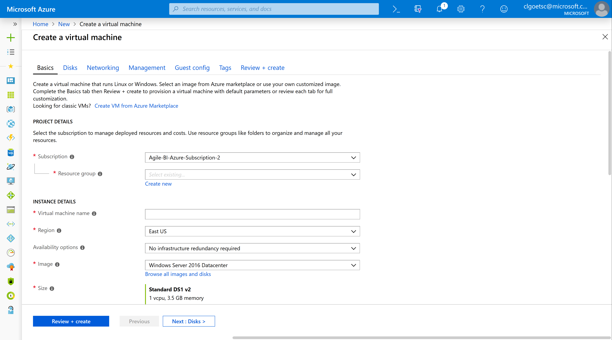

# Resource Create 
The resource create pattern allows for the creation of Azure resources leveraging the full screen create pattern.

# Context
Users need to create Azure resources 

# Problem
Creating a resource in Azure can vary from a simple form with a few required fields to a complex experience with many fields, concepts and related resources.

# Solution
The resource create pattern enables quick configuration of a new resource using minimal parameters. The experience uses discoverable tabs to separate related configuration steps and guide the user who wants to do more complex configuration during the create process.

## Also known as 

- Fullscreen create
- Tabbed create  

# Examples 
---------

## Example image

## Example uses
These Azure resources are good examples of this design pattern 

* [Free account virtual machine](https://rc.portal.azure.com/#create/microsoft.freeaccountvirtualmachine)
* [IoT hub](https://rc.portal.azure.com/#create/Microsoft.IotHub)
* [Kubernetes service](https://rc.portal.azure.com/#create/microsoft.aks)

# Use when
Creating a resource in Azure

## Anatomy  
The resource create pattern is full screen experience

1. Tabs
2. Input fields
3. Sub create within a context menu
4. Footer navigation
5. Deployment status page

## Getting started with resource manage

## Behavior 

### Tabs
Tabs help to separate required fields from optional fields.
The first tab should contain all required fields for faster configuration. Subsequent tabs surface optional fields for customizing the resource. The Review + create tab enables the user to review all input, and the portal will inform the user if they haven’t completed any required steps.

**Basics**
The first tab contains fields required for creating the resource.

**Optional tabs**
Additional tabs are used to organize optional settings specific to your resource.

**Tags**
This tab allows users to
give tags to the resource using key/value pairs.

**Review + create**
The final tab summarizes the settings across all tabs and validates the inputs against Azure before creating the resource.
Resource menu

### Explanatory text 
Adding one or two descriptive sentences at the top of each tab gives the user content at a highly visible part of the page. Here’s an example of how you can structure your text:
Configure <this feature> to allow your resource to perform <this action>. Learn more
### Grouped input fields
When creating a form that includes several fields pertaining to a certain subject, you can group them with a header that gives the user a clear indication of what they’re being asked for.
### Sub create
Context panes are used for sub creates within create flow. The sub create allows users to create a necessary resource for the resource they’re currently creating without taking them out of context.
Info balloons
If you have input fields that may not be immediately familiar to your customers, include an info balloon that gives them more information.
### Footer navigation
This control contains two to three buttons used for moving between tabs as well as the CTA for creating the resource.

## Post create
The deployment status shows realtime deployment status and improving troubleshooting with improved error display. You can also include additional resources information to help the user learn more about the resource being created and related Azure resources.  

TODO - screen shot and anotomy of post-create

## Do 

-   Do put all the required fields on the first tab so the user has the option to quickly create your resource

## Don't 

-   Don’t just map each of your existing create experience to separate tabs  

# Related design patterns

-   Full screen
    [top-designpatterns-page-fullscreen.md](top-designpatterns--page-fullscreen.md)

-   Resource Browse
    [top-designpatterns-resource-browse.md](top-designpatterns-resource-browse.md)

-   Resource Manage
    [top-designpatterns-resource-manage.md](top-designpatterns-resource-manage.md)

# Research and usability 
Coming soon

# Telemetry
Coming soon

# For developers 

## Tips and tricks 

-   Use the ResourceMenu blade to get started building your resource manage
    experience
-   Screen resolution - If screen resolution is less than 700px, set left aligned = false.

## Related documentation

-   Resource Create
    [top-extensions-create.md](./top-extensions-create.md)

