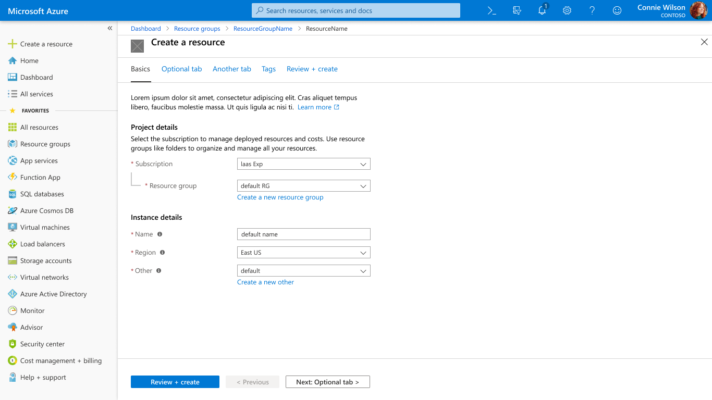
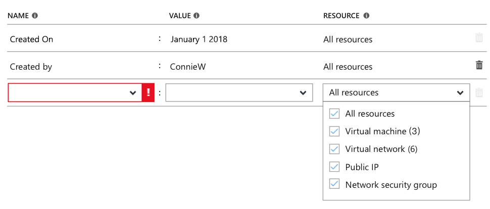

# Resource Create 
The resource create pattern enables a simple, intuitive, and quick customer experience for creating resources.

# Context
Users need to create Azure resources.

# Problem
Creating a resource in Azure can vary from a simple resource with a few required fields to a complex one with many fields, concepts and related resources.

# Solution
The resource create pattern enables quick configuration of a new resource using minimal fields and default values. The pattern also enables users to walk through detailed configuration options in order to manually set many resource options.  The experience uses a fullscreen page with tabs to separate related configuration steps and guide the user during the create process.

## Also known as 

- Full screen create
- Tabbed create  

# Examples 
---------

## Example image

## Example uses
These Azure resources are good examples of this design pattern 

* [Free account virtual machine](https://rc.portal.azure.com/#create/microsoft.freeaccountvirtualmachine)
* [IoT hub](https://rc.portal.azure.com/#create/Microsoft.IotHub)
* [Kubernetes service](https://rc.portal.azure.com/#create/microsoft.aks)

# Use when
Creating a resource in Azure

## Anatomy  

A resource create experience usually contains:
1. Tabs with descriptive text and learn more links to switch between logical input steps
2. Input fields divided into logical sections with concise, instructional, descriptive text for each section
3. Footer navigation with buttons to navigate tabs and submit form

### Design Principles

Follow these recommendations when designing your Create form:

1. Single, full screen blade.
2. Logical steps using the existing Tabs control.
3. Allow customers to easily and freely navigate between tabs.
4. Include descriptive and supportive text.
5. Ability to quickly deploy resources with minimal input.

### Navigation

Use the tabs & sections to organize content. The `Basics` tab should be the starting point for all creates and contain essential configuration info. The design should allow for quick resource creation at any time with unrestricted navigation between tabs. Enabling customers to freely navigate the tabs reduces the friction for customers looking to learn about your resource.  The combination of quick creates and tab exploration can lead to additional resource deployments over time.

## Behavior 

### Tabs
Tabs group sections of the create experience into manageable categories. Tabs also separate required information from optional information for simpler configuration.

Most creates should have a minimum of 3 tabs; `Basics`, `Tags`, `Review + create`.  All other tabs are optional.

#### Basics
The first tab contains fields required for creating the resource. Set default values when possible to eliminate additional time spent on create.

**Project Details**: Represents the collection of Subscription and Resource Group controls.  To include the visual connector between Subscription and RG, set `Nested = True` on the RG control.  The default text for Project Details is `Select the subscription to manage deployed resources and costs. Use resource groups like folders to organize and manage all your resources.`

The `Basics` tab should contain the typical fields for Azure resources
* `Subscription` + `Resource group`
* `Name`
* `Region` - this field used to be referred to as Location, now we use the term Region
* SKU/Cost/Pricing tier 

#### Optional tabs
Additional tabs are used to organize optional settings specific to your resource.  Tabs should have short names, typically a noun.

#### Tags
Many enterprise customers are starting to create subscription and resource group polices that require tagging resources at create time.  Not including the `Tags` tab will block those users from deploying resources using the portal.  The `Tags` tab contains the tags control, which allows users to assign key value pairs to the selected Resource Types.	

#### Review + Create
Allowing the user to verify all settings prior to submission ensures accuracy and reduces the need for user redeployments.  Use the summary control to help organize content from multiple tabs.  Disable the create button until validation succeeds.

### Tab Layout

**Descriptions**: The top of each tab should include a brief description about the content to follow. When possible include `Learn more` links to relevant docs.

**Section Headers**: Used to separate common settings within a tab.

**Alignment**: Stack labels above controls if the screen resolution < 700px.
	
**Info Bubbles**: If you have input fields that may not be immediately familiar to your customers, include an info bubble that shows more information.

### Grouped input fields
When creating a form that includes several fields pertaining to a certain subject, you can group them with a header that gives the user a clear indication of what they’re being asked for. You can also add explanatory text just below the group header if the task may not be immediately clear to the user.

### Sub create in a context pane
Context panes can be used for sub creates within the create flow. The sub create allows users to configure services or to create resources that are related to the main resource that's being created, without losing the overall context.

### Footer navigation
The footer nav contains the call to action (CTA) for creating the resource, as well as two buttons used for navigating between tabs. If your resource supports created templates, you can include an affordance for that in the footer nav.

## Post create
The post create page provides realtime deployment status, help with troubleshooting, and improved error display. Best practice is to include additional information here to help the user learn more about the resource being created, as well as related Azure resources.

## Do 
-   Do put all the required fields on the first tab so the user has the option to quickly create your resource

-   Mark required fields with the red asterisk

 - Include info bubbles if there are input fields that may not be
   immediately familiar to your customers

## Don't 
-   When moving your resource to full screen, don’t just map your existing create experience to separate tabs.

-   Don't include lengthy and unclear explanatory text. It should be used to clarify and set expectations in a few short sentences

# Related design patterns

-   Forms [top-designpatterns-page-forms.md](top-designpatterns--page-forms.md)
-   Full screen [top-designpatterns-page-fullscreen.md](top-designpatterns--page-fullscreen.md)
-   Resource Browse [top-designpatterns-resource-browse.md](top-designpatterns-resource-browse.md)
-   Resource Manage [top-designpatterns-resource-manage.md](top-designpatterns-resource-manage.md)
-   Design patterns readme [portalfx-designpatterns-readme.md](portalfx-designpatterns-readme.md)

# Research and usability 
Coming soon

# Telemetry
Coming soon

# For developers 

## Tips and tricks 

-   Set a maximimu width of 600px for the tab content area that contains input fields
-   Screen resolution - If screen resolution is less than 700px, set left aligned = false

## Related documentation

-   Resource Create [top-extensions-create.md](./top-extensions-create.md)
-   Tabs control
-   Subscription + resource group control
-   Region control
-   Tags control

