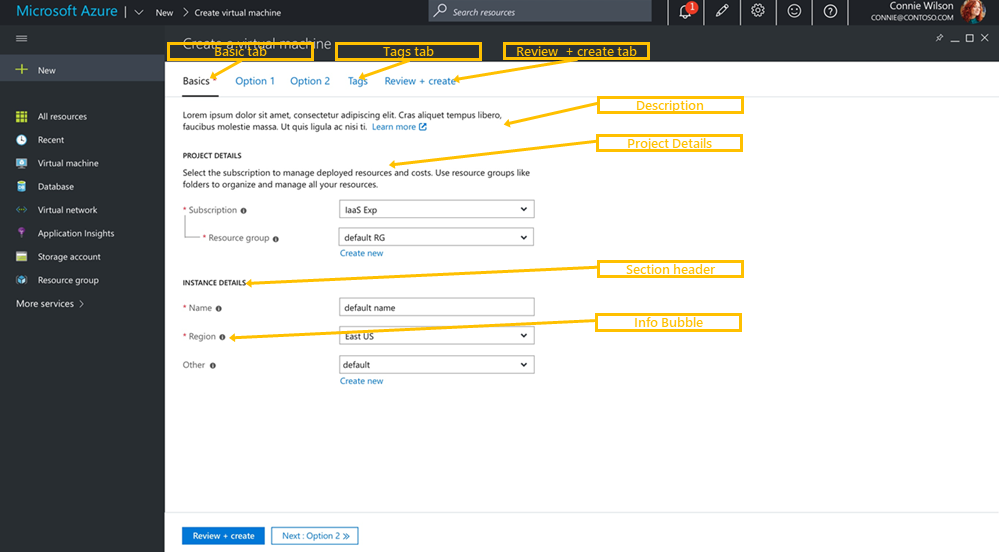
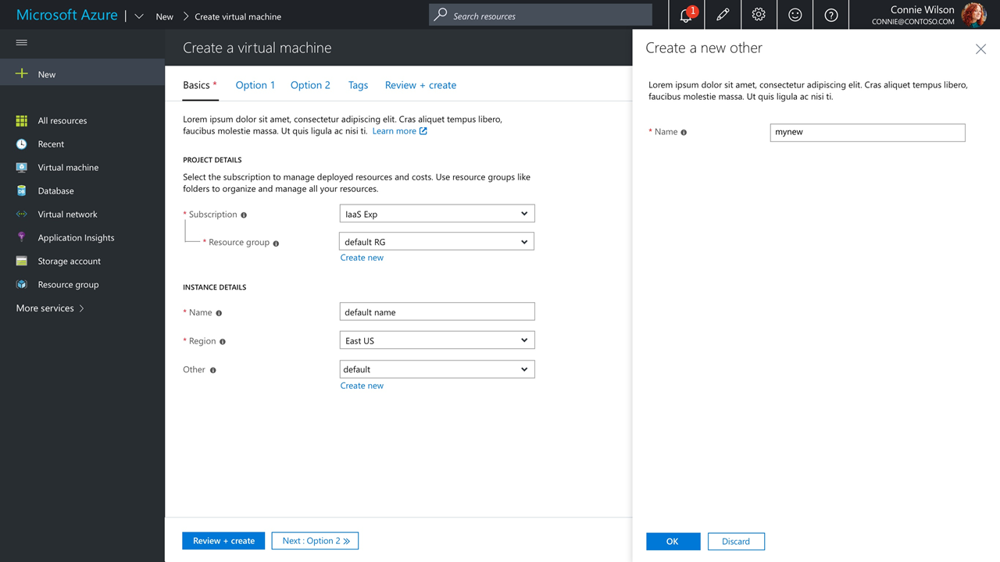
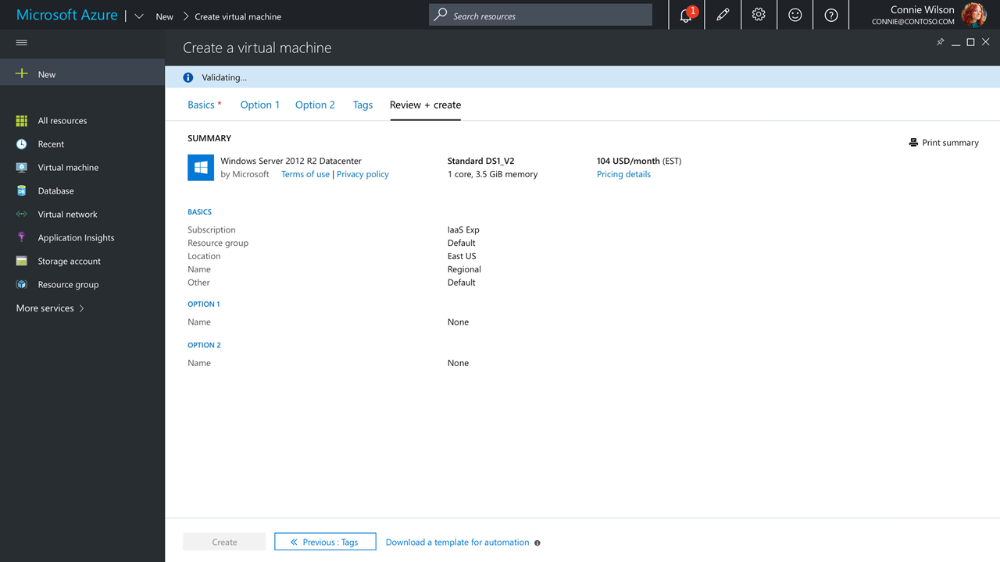

## Overview

The create experience is one of the most important customer journeys within the Portal, which is why our designers  have spent many months testing and validating different design patterns.    Our most recent design incorporates a full screen blade and uses horizontal tabs to help organize different configuration settings into sections.  The goal is to develop a consistent, simple, intuitive, and quick customer experience across resources. 

[Ask a ‘create’ question on stackoverflow](https://stackoverflow.microsoft.com/questions/tagged/ibiza-create)

## Getting Started

**NOTE**: In this discussion, `<dir>` is the `SamplesExtension\Extension\` directory, and  `<dirParent>`  is the `SamplesExtension\` directory, based on where the samples were installed when the developer set up the SDK. 

The  most recent Portal SDK located at [http://aka.ms/portalfx/downloads](http://aka.ms/portalfx/downloads) contains a sample create in `<dir>/Client/V2/Create/Engine/CreateArmEngineBlade.ts`. This sample uses NoPDL and includes three essential tabs and two optional tabs.  All the styling and validation patterns are included and can be easily augmented to meet your needs.  The remainder of this document is intended to help you understand the key design principles and create a consistent experience.

## Design Principles

Here are the top five guidelines you should follow when designing your Create form.

* Full screen single blade with no side blades

* Horizontal wizard using existing Tabs control

* Allow customers to easily and freely navigate between tabs

* Be descriptive and supportive

* Ability to quickly deploy resources with minimal input

## Navigation

Use the tabs control, and sections to organize content.  The Basics tab should be the starting point for all Creates and where essential configurations should be placed.    The design should allow for quick deployments at any time with unrestricted navigation between tabs.  Enabling customers to freely navigate reduces the friction for customers looking to learn about your resource which can lead to additional deployments.  

The following image is an example of Create tab navigation pattern.

## Tabs

Most creates should have a minimum of three tabs: Basics, Tags, Review + create.  All other tabs are optional. The extension should align labels above controls if the screen resolution < 700px.

* [Basics](#basics-tab-layout)

    The Basics tab contains most of the required elements needed to deploy a resource successfully.   Set default values when possible to eliminate additional time spent on create.
	
* [Tags](#tags)
    
    Tagging resources during creates is now supported when using the Tags control.  Subscription and Resource Group level policies may require users to tag resources during create.  Not including the Tags control may block users from deploying resources.
	
* [Review + create](#review-create)

    The Review + create tab allows customers to review configured and defaulted settings before procuring resources.  Use the Summary control to organize and display key/value pairs before create.  Validations are performed before users can successfully submit.  For more information, see [#validations](#validations). 

### Basics tab layout

* Descriptions
    
    The top of each tab should include a brief description about the content on the page.  When possible,  include 'Learn more' links to relevant docs.
	
* Project Details

    The project details section represents the collection of Subscription and Resource Group controls.  To include the visual connector between Subscription and the resource group, set `Nested = True` on the resource group control.  The default text for Project Details is 'Select the subscription to manage deployed resources and costs. Use resource groups like folders to organize and manage all your resources.'
	
* Section Headers

    These separate common settings within a tab.

* Info Bubbles

    All form controls should include help text inside info balloons.

#### Sub Creates

When creating a sub resource, use the sub label property to add a 'Create new' link to open a new blade within a context pane, as in the following image.   Avoid using side blades.

The sample that builds this blade  is in the following code.

<!--
Un-comment this when the new code source is available.

gitdown": "include-section", "file": "../Samples/SamplesExtension/Extension/Client/V2/Create/Engine/CreateArmEngineBlade.ts", "section": "docs#SubCreate"}
-->

### Tags

The Tags control allows users to assign key value pairs to selected Resource Types, as in the following image.

Include the `tagMap` of a resource from the `TagsByResource` control when constructing the parameters required by the ARM template, as in the following example.

<!--
Un-comment this when the new code source is available.

gitdown": "include-section", "file": "../Samples/SamplesExtension/Extension/Client/V2/Create/Engine/CreateArmEngineBlade.ts", "section": "docs#AddTagMapToARMParameters"}
-->

**NOTE**:  `tagMap` must be converted from an array to a `StringMap`.

### Review create

This tab allows the user to verify all settings prior to submission, which ensures accuracy and reduces the need for user redeployments.  Use the summary control to help organize content from multiple tabs, as in the following image.

	
The extension should set up the create button, as in the following code.
	
<!--
    Un-comment this when the new code source is available.

gitdown": "include-section", "file": "../Samples/SamplesExtension/Extension/Client/V2/Create/Engine/CreateArmEngineBlade.ts", "section": "docs#CreateButton"}
-->

#### Validations

Validating the form and template is an essential part of the create process.  When the 'Review + create' tab is loaded, validations begin and a status bar is used to communicate status.  The first step evaluates the form for incomplete fields or invalid entries.  The second step validates the ARM template.   If validation succeeds, the 'Create' button is enabled for submission.

