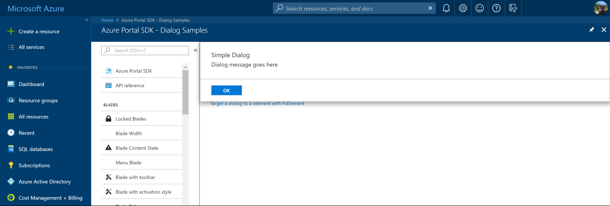

{"gitdown": "contents"}

# Dialogs

Dialogs allow the developer to display information to the user with very little navigation. Dialogs may be as simple as a short confirmation, or as complex as a form. They can be both targeted and non-targeted, such that they either display at the top of the blade or they display in context of another piece of UI. The following is an image of a non-targeted dialog.



The following is an image of a targeted dialog.


## When to use dialogs

Dialogs are great to use in cases where an extension requests a confirmation from the user, or if it needs the user to update a small piece of information. Dialogs are more lightweight than context blades; however, if the dialog becomes overloaded, you may want to use a context blade instead.

> NOTE: In this discussion, `<dir>` is the `SamplesExtension\Extension\` directory, and `<dirParent>`  is the `SamplesExtension\` directory, based on where the samples were installed when the developer set up the SDK.

## The dialog API

Dialogs expose various options that allow developers to customize the dialog experience. To open a dialog, the extension should specify `dialogOptions`. The simplest form of those options is illustrated here:

{"gitdown": "include-section", "file":"../Samples/SamplesExtension/Extension/Client/V2/Dialogs/DialogSamplesBlade.ts", "section": "top-extensions-dialogs-open"}

The properties for this implementation of the dialog are as follows.

| Property | Definition |
| -------- | ---------- |
| buttons | The buttons to surface to the user. These can be the predefined button combinations that the framework offers, or you can specify your own custom labels, as specified in [#dialogs-with-custom-buttons](#dialogs-with-custom-buttons). |
| content | The string or `htmlContent` to display to the user. |
| onClosed | A callback function that is called when the user closes the dialog by selecting a button. |
| telemetryName | The name that is logged for any telemetry events that occur while the user interacts with the dialog. |
| title | The string that is shown to the user as the title of the dialog. |

This `options` object will be passed by the extension to `container.openDialog(yourDialogOptions)` to open the dialog.

## Dialogs with custom buttons

To specify a dialog with custom buttons, send an array to the `buttons` property in the `dialogOptions`, illustrated here:

```typescript
/**
* Describes a custom button in a dialog
*/
export interface CustomDialogButton {
    /**
    * Display text of the button
    */
    displayText: string;
    /**
    * Button identifier that is programatically passed back
    */
    button: DialogButton;
}
```

{"gitdown": "include-section", "file":"../Samples/SamplesExtension/Extension/Client/V2/Dialogs/DialogSamplesBlade.ts", "section": "top-extensions-dialogs-custom-buttons"}

## Displaying complex scenarios in dialogs

In a dialog, if you want to allow the user to pick a value from a slider or interact with some other custom UI, make use of a custom HTML template. You can achieve that by providing an object of type `HtmlContent` to the `content` property in the dialog options.

Here we define our custom dialog `ViewModel`, which only contains a slider control. We then define a simple html template, which is only the control, and specify our `dialogViewModel`:

The sample is located at `<dir>\Client\V2\Dialogs\DialogSamplesBlade.ts` and in the following code.

{"gitdown": "include-section", "file":"../Samples/SamplesExtension/Extension/Client/V2/Dialogs/DialogSamplesBlade.ts", "section": "#top-extensions-dialogs-slider-dialog"}

## Targeting the dialog at a specific element or cssSelector

If you want to provide context to which the dialog applies, for example, confirming a delete of a certain item, you can supply a CSS selector string or an `FxElement` as the 'target' property on your 'DialogOptions':

When the `fxClick` element is clicked, it generates a `FxElement` which is sent as a parameter to the callback function supplied to `fxClick`:

{"gitdown": "include-section", "file":"../Samples/SamplesExtension/Extension/Client/V2/Dialogs/DialogSamplesBlade.ts", "section": "top-extensions-dialogs-targeting"}

To target the location of the `fxClick` the extension defines the `target` property on the `dialogOptions` as `evt.target`, the parameter defined by the `fxClick` onClick handler. The dialog will then open within the context of the element.

To target elements by using `cssSelectors`, send the specific `cssSelector` as a string to the `target` property on the `dialogOptions`.

## Positioning the dialog when targeting

When the extension specifies a target, it should also specify where the dialog is displayed,  relative to that target. To do so, you can send a `positionHint` to the `dialogOptions`. The screen positioning will be honored if the space is available; otherwise, it will fallback to an available space.

```typescript
/**
* option hint for requested dialog position. Defaults to BottomLeftEdge.
*/
export const enum DialogPosition {
    TopLeftEdge = 1,
    RightTopEdge = 2,
    BottomLeftEdge = 3,
    LeftTopEdge = 4,
}
```

## Handling the dialog result (onClosed)

There are two reasons why the dialog would be closed;

  1. The user has interacted with something else and the framework needs to close it (Auto close)
    - The button result will always be `cancel`
  1. The user has interacted with one of the buttons on the dialog
    - The button result will be the button which the user clicked

When handling the `onClosed` callback you will receive a `DialogResult` object. Within that object is a `button` property, that button property will map to the buttons you previously defined as your button options.

The easiest way to process the options is to use a switch case and have a case for each of the buttons you declared and cancel (due to the auto close). In the example below we have custom buttons declared but they map to the standard button enums. Then in the onClosed callback we will receive the corresponding button as the result.

{"gitdown": "include-section", "file":"../Samples/SamplesExtension/Extension/Client/V2/Dialogs/DialogSamplesBlade.ts", "section": "#top-extensions-dialogs-on-closed"}
