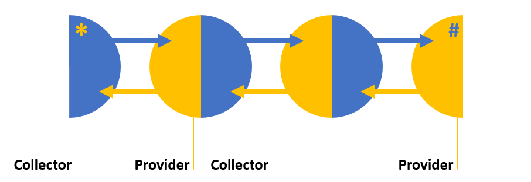

# Introduction to Parameter Collection

## Overview

The Parameter Collection Framework provides the platform and building blocks for user experiences that collect data from the user. The sequence of UI elements consists of forms, wizards, pickers, buttons, commands, and other elements,  and are referred to as parameter collection flows. The framework simplifies the development of flows and enables  developers to focus on extension business logic.

Parameter collection is a dialog process between two entities.  The collector asks the provider a question and expects it to return some data. The provider can also behave as a collector if it collects data from a third entity, and so on. The following diagram illustrates this process.

This series of dialogs can also be perceived as a tree, where the root node is the initial point where the dialog starts.  The root node can  behave only as a collector.  Leaf nodes can  behave only as providers that return data up the tree to the appropriate collector. Inner nodes are both collectors and providers, because they request data from other providers, and return it to  the collector that requested the data. Parameter Collection framework simplifies the internal communication between these pieces.

There are three roles in the Parameter Collection Framework.  The primary roles of collector and provider have already been described. The role of provisioner is a secondary role. If a UI element provisions a  specific  action, then its `ViewModel` has a provisioner role. You can implement custom provisioning logic, or you can leverage the default Framework logic if the provisioning action creates resources by using ARM, as specified in   [http://aka.ms/portalfx/gallerycreate](http://aka.ms/portalfx/gallerycreate).

A `ViewModel` can play more than one role. Depending on the UI element, specific roles are either optional or required. You will define which roles that the `ViewModel` for the  UI element can play, and develop the logic that will be executed when UI element is playing that role. 

The framework provides interfaces, base classes, and blade templates to simplify implementation. It includes classes for forms, wizards, pickers, buttons, commands, and other items that the `ViewModel` will extend. The framework also includes PDL templates that correspond to each object that the extension will display on the UI. To implement any of the roles, create a class that extends the corresponding interface, and send an instance of that role implementation to the base class in your constructor.

## More details
* *Inputs and Outputs:* More details about inputs, outputs and communication between the UI elements.
* *Role Implementation:* More details about how to implement roles.
* *Base Classes:* More details about base classes and PDL templates.
* PCv2 (Obsolete), located at [portalfx-parameter-collection-v2.md](portalfx-parameter-collection-v2.md).

{"gitdown": "include-file", "file": "../templates/portalfx-extensions-parameter-procedures.md"}