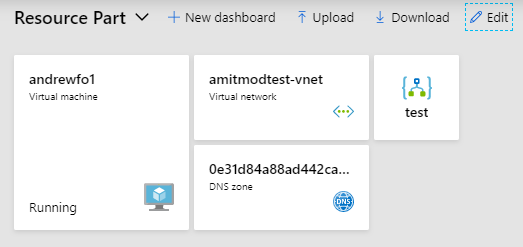

## ResourcePart
The ResourcePart is a part provided by the portal framework for the purpose of pinning ARM resources to dashboards.  Using the resource part to represent pinned resources improves the load times for customer dashboards because the extension which owns the resource is not loaded. For example if 5 resources of different types are pinned using extension provided parts then when the dashboard loads the portal must load 5 different extensions.   However if all 5 extensions are using the resource part which is located in the HubsExtension then the only extension required to be loaded is the Hubs.  

Extensions can use this part for pinning their resource blades and parts with very little investment. There is the additional benefit that this reduces the amount of code that extensions need to maintain.



### Pinning resources from browse
The browse experience can use this part for pinning resources.   This simply requires that the PartName in a AssetType in PDL be "{ResourcePart}".   

```xml
  <AssetType Name="Author"
             ViewModel="{ViewModel Name=AuthorViewModel, Module=./Document/AssetViewModels/AuthorViewModel}"
             CompositeDisplayName="{Resource AssetTypeNames.Author, Module=ClientResources}"
             Icon="{Svg IsLogo=true, File=../../../Svg/Documents/author.svg}"
             BladeName="AuthorBlade"
             PartName="{ResourcePart}">
```

### Pinning a blade
Blades which represent a resource can also be pinned with the resource part.  This is supported for both noPDL blades and legacy blades.  The blades only required parameter must be named 'id' and a string type.  To pin a modern noPDL blade simply return a part reference for the ResourcePart from the onPin method as in this example:

```typescript
    public onPin() {
        const { parameters } = this.context;
        return PartReferences.forExtension("HubsExtension").forPart("ResourcePart").createReference({ parameters: parameters });
    }
```

The blade must also have the @Pinnable decorator declared.

Legacy blades which were writting in PDL can also be pinned with the ResourcePart.  As with noPDL blades there must be 1 paramter named 'id'.

```xml
       <TemplateBlade Name="AuthorBlade" .. Pinnable="True".. >
          ..
           <PinnedResourcePart />     
```

### Redirecting existing parts on dashboards
If this is a existing asset type for which the ResourcePart is replacing a custom part then a redirect will also need to be added.   The redirect will change these custom part instances on dashboards to be the new ResourcePart type.  The redirect is declared in PDL.   It can be located in any PDL file though for organizational purposes it would best to place it in the same file which the AssetType is declared.   The PDL to redirect existing pinned parts to the new ResourcePart looks like this:

```xml
  <RedirectPart Name="AuthorPart">
    <ResourcePart />
  </RedirectPart>
```
